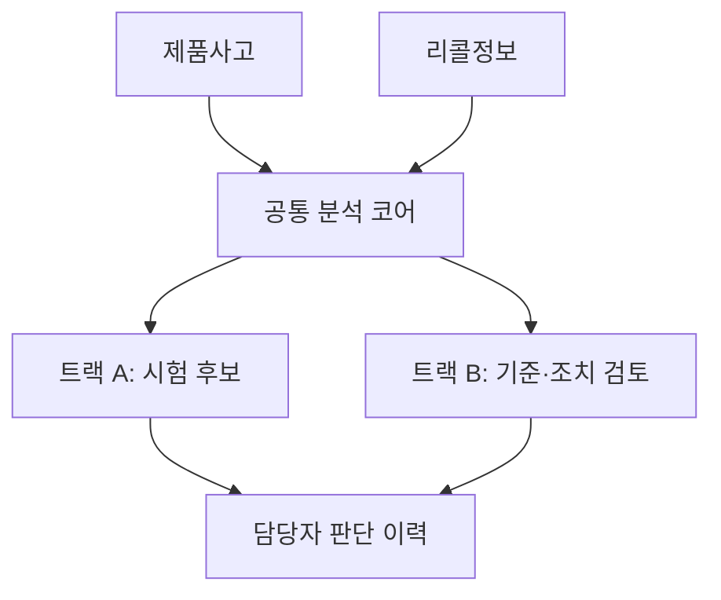
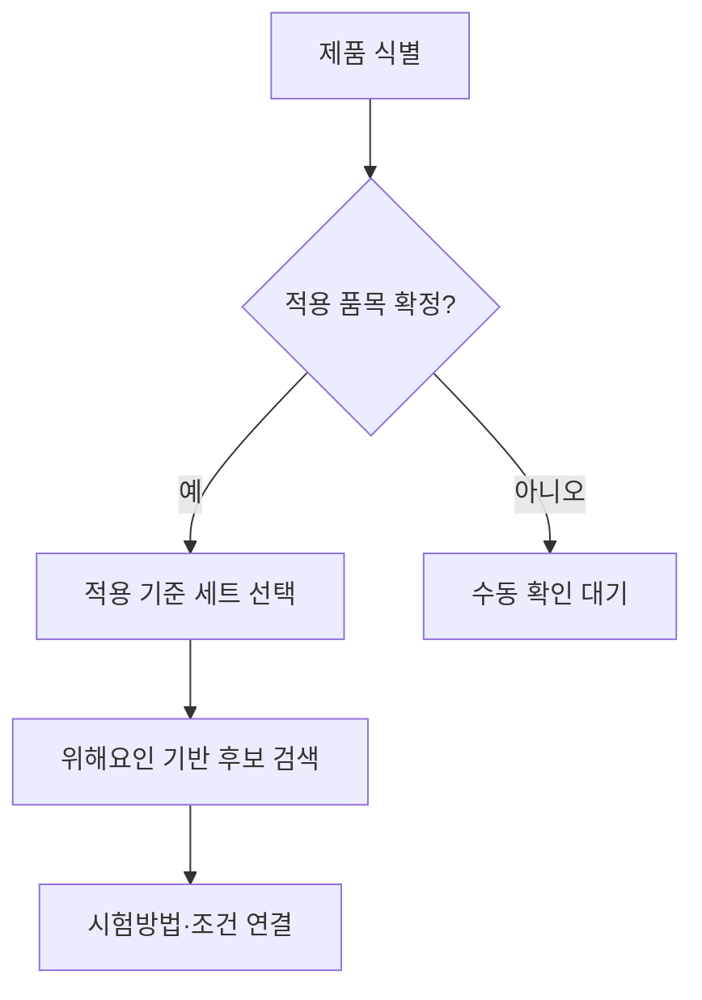
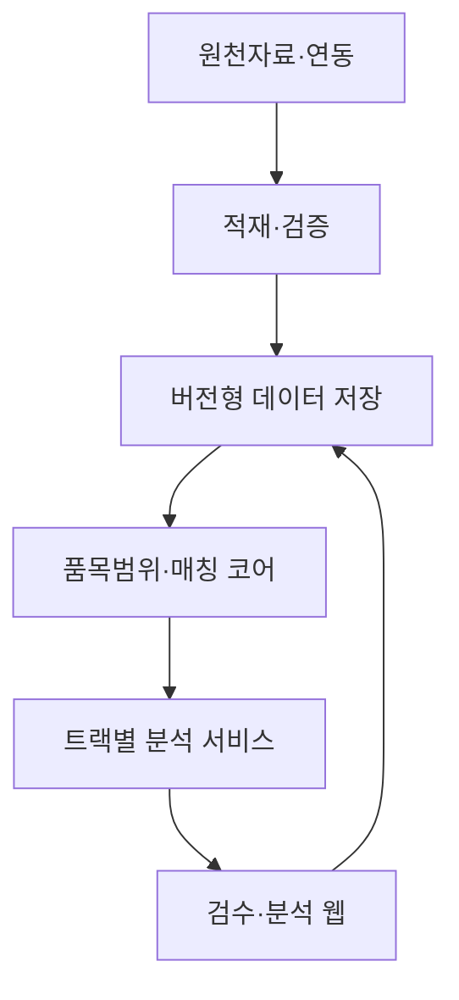
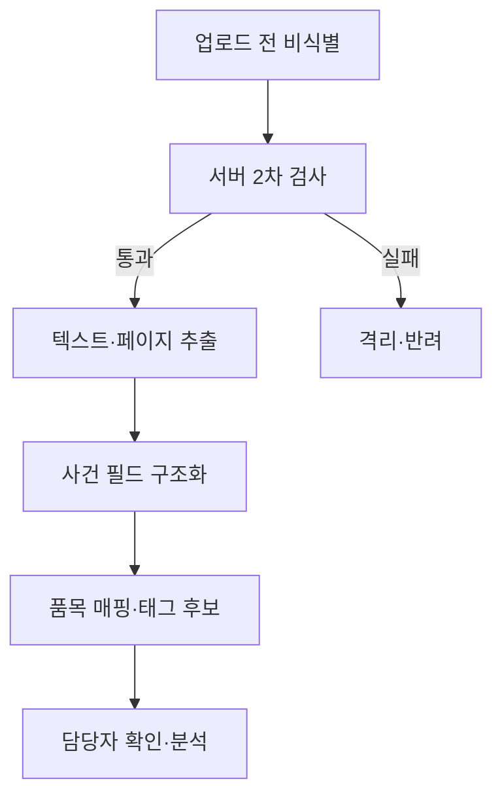

# 01(보완) 사전분석 — 구현설계
## KC안전기준 기반 제품위해 심층분석 체계

| 항목 | 내용 |
|---|---|
| 문서 버전 | v0.7 보완안 |
| 작성일 | 2026-08-31 |
| 기준 문서 | `00. 컨셉_KC안전기준 기반 제품위해 심층분석 체계_v0.4.md` |
| 검토 대상 | `01_사전분석_구현설계_KC안전기준_제품위해_심층분석_v0.6.md` |
| 문서 성격 | 구현 착수 전 구조 검증 및 보완 설계 |
| 적용 범위 | 0단계 개념검증부터 트랙 A·B 단계 확장까지 |

> 이 문서는 00 컨셉의 목적을 유지하면서 01 v0.6의 오류·충돌·누락·과설계를 바로잡은 보완본이다.
>
> 특정 솔루션이나 모델을 확정하는 기술명세서가 아니라, 구현 전에 반드시 합의해야 할 데이터·업무·품질·보안 구조를 정하는 문서다.

---

## 0. 검토 결론

### 0.1 총평

01 v0.6의 기본 방향은 타당하다.

- 안전기준 조항, 사고, 리콜을 공통 위해요인 코드로 연결한다.
- 원본·파생 결과·사람의 판단 이력을 구분해 저장한다.
- 시스템이 위반 여부를 판정하지 않고 후보와 근거를 제시한다.
- 코드 검색만으로 부족한 구간을 키워드·의미 검색으로 보완한다.

다만 현재 문서 그대로 구현하면 다음 문제가 발생할 가능성이 높다.

1. 품목 범위가 확정되기 전에 모든 안전기준 조항을 검색해 다른 품목의 시험이 섞일 수 있다.
2. 트랙 B가 트랙 A와 같은 검색 화면 수준으로 축소되어 국내 유통 동일성, 외국 기준 근거, 국가 간 요구 수준 차이, 후속 조치 검토가 구현되지 않는다.
3. 검색 결과가 0건이라는 이유만으로 기준 사각지대로 분류하면 데이터 누락을 정책 신호로 오인할 수 있다.
4. 1~2건으로 재현율·오탐률을 계산하고 시스템 결과를 본 담당자의 검토 기록을 정답지로 쓰는 평가는 신뢰하기 어렵다.
5. “판단은 SQL”이라는 원칙과 LLM 리랭킹이 실제 순위를 정하는 구조가 충돌한다.
6. 독립 코드북 Project, 업로드 화면, 리랭커 비교, 하이브리드 검색 전체를 0단계에 넣어 개념검증 범위가 과도하다.
7. 개인정보를 제외한 PDF만 받는다는 전제와 업로드 후 비식별·외부 LLM 처리 흐름이 명확히 분리되어 있지 않다.
8. 코드북을 별도 Project로 분리하면서 본 DB의 태그 테이블이 코드북 테이블을 외래키로 참조하는 것처럼 표현되어 물리 구조가 맞지 않는다.

따라서 **핵심 개념은 유지하되, 품목 범위 결정 → 데이터 완전성 확인 → 후보 검색 → 시험방법 연결 → 사람 검토** 순으로 재설계해야 한다.

### 0.2 반드시 수정할 사항

| 우선순위 | 문제 | v0.6의 상태 | 보완 방향 |
|---|---|---|---|
| 필수 | 품목·적용기준 관문 누락 | 검색 함수에 `target_item` 문자열만 존재 | GPC·KC 품목·공통안전기준 관계를 구조화하고 검색 전에 적용기준 범위를 확정 |
| 필수 | 검색 0건의 오해 | 0건을 기준 사각지대 산출물로 저장 | 범위 미확정, 미태깅, 조항연결 누락, 원천자료 누락과 **진짜 사각지대 후보**를 구분 |
| 필수 | 트랙 B 구현 누락 | 리콜도 사건 테이블에 넣어 조항 검색 | 제품 동일성·국내 유통근거·외국 기준근거·수치 비교·조치 검토를 별도 모듈로 추가 |
| 필수 | 평가 설계 오류 | 검토 기록을 정답지로 간주 | 시스템 결과를 보기 전에 전문가가 만든 독립 정답셋으로 평가하고 운영 로그는 사후 개선용으로 분리 |
| 필수 | 개인정보 처리 모순 | 업로드 후 추출·외부 LLM 호출 중심 | 외부 전송 **전** 비식별 검증·차단·격리 절차를 명시 |
| 필수 | DB 관계 오류 | 독립 Project의 코드북이 태그 FK인 것처럼 표현 | 본 DB에는 버전 고정 스냅샷을 두고 원격 코드북과 논리적으로만 연결 |
| 중요 | HF·DT 한 행 결합 | `clause_tag`에 `hf_code`, `dt_code` 동시 저장 | 축별 태그 행으로 분리해 존재하지 않는 HF–DT 쌍이 만들어지는 것을 방지 |
| 중요 | 공통안전기준 처리 부족 | 0단계 설명에만 언급 | 부속서·공통안전기준·인용표준의 적용 관계를 `standard_applicability`로 관리 |
| 중요 | 재현성 표현 부정확 | 저장된 결과를 재현성으로 설명 | 결과 보존과 재실행 재현성을 구분하고 실행 매니페스트를 저장 |
| 중요 | 0단계 과설계 | 별도 코드북 서비스·화면 2종·벡터·리랭킹 동시 구현 | 데이터 가능성, 기본 매칭, 고도화 실험을 0A·0B·0C로 분리 |
| 중요 | 생성 신호의 상관성 | 코드·키워드·요약을 같은 LLM 호출에서 생성 후 3갈래로 융합 | 원문 기반 어휘검색과 임베딩을 독립 신호로 두고 LLM 생성 요약은 선택적 보강으로 격하 |
| 중요 | 적용 기준시점 누락 | 안전기준 버전만 저장 | 사건·리콜 분석에 사용할 `basis_date`와 적용 버전 선택 근거를 저장 |

### 0.3 유지할 사항

- 원본층·파생층·판단층의 3계층 저장 원칙
- 조항 단위 구조화와 성능요건↔시험방법 연결
- 자동 결과를 채택·반려·수정하는 HITL 구조
- 미태깅 품목에 대한 보조 검색 경로
- 매칭 경로·모델·버전·점수·근거 기록
- 트랙 A의 시험 후보군과 트랙 B의 기준 대응 여부 산출
- 장기적으로 기준 개선 검토 신호를 집계하는 방향

### 0.4 삭제하거나 후속 단계로 이관할 사항

| 항목 | 처리 | 이유 |
|---|---|---|
| 0단계 독립 코드북 Supabase Project | 후속 이관 | 공용 코드 거버넌스가 확정되지 않았고 개념검증 필수요소가 아님 |
| 0단계 코드북 업로드 전용 화면 | 삭제 | 관리자 스크립트·검증 리포트로 충분 |
| 전 조항 3~5회 반복 LLM 호출 | 축소 | 비용이 크고 반복 일치도가 정확도 보증은 아님. 위험 기반 재호출이 적절 |
| LLM 리랭커 기본 채택 | 선택 실험으로 이관 | 후보 순위에 확률적 판단이 개입하므로 기본 경로와 분리해야 함 |
| 특정 모델·업체 후보 목록 | 부록 또는 기술선정 기록으로 이관 | 제품 변화가 빠르고 핵심 구현 원칙이 아님 |
| Netlify·Streamlit 확정 표현 | 삭제 | 배포망·보안·운영 주체 확인 전 특정 호스팅을 확정할 근거가 없음 |
| n8n 노드 상세 | 후속 이관 | 초기 수기 적재 결정과 맞지 않으며 본 문서 핵심 범위를 벗어남 |
| 0단계 집계 대시보드 | 삭제 | 데이터가 쌓이기 전에는 검증 가치가 없음 |
| L4 리포트 자유문장 생성 | 후속 이관 | 초기에는 구조화된 결과와 고정 문구만으로 충분 |
| HNSW 인덱스 튜닝 | 후속 이관 | 1개 품목 규모에서는 정확 검색으로 충분 |

---

## 1. 목적과 범위

### 1.1 시스템 목적

본 체계는 제품사고·리콜 위해정보를 해당 제품에 적용되는 KC안전기준과 대조하여 다음을 지원한다.

- **트랙 A — 제품사고 분석:** 원인 규명을 위해 검토할 성능요건·시험방법·시험조건 후보 제시
- **트랙 B — 리콜제품 분석:** 국내 기준 대응 여부, 확인 가능한 시험항목, 국내외 요구 수준 차이 검토자료, 후속 안전조치 검토대상 제시
- **공통 2차 산출물:** 반복 사고·리콜 대비 대응 조항 부재, 국가 간 요구 수준 차이, 반복 반려되는 시험 후보 등 기준 개선 검토 신호 축적

### 1.2 시스템이 하지 않는 일

- 제품의 KC안전기준 위반 여부 자동 판정
- 사업자의 법적 의무 위반 여부 자동 확정
- 리콜·안전성조사·소비자 주의보 등 조치 자동 결정
- 외국 기준과 국내 기준의 동등성 자동 인정
- 시험기관이 수행해야 할 실제 시험·판정 대체
- 원문 확인 없이 생성된 요약·수치만으로 시험의뢰서 확정

### 1.3 공통 엔진과 트랙별 업무의 경계

두 트랙은 **품목 범위 결정, 위해요인 태그, 관련 조항 검색, 시험방법 연결**까지 공통으로 사용한다. 그 이후 산출물과 검토 절차는 다르다.



> “입구는 둘, 엔진은 하나”는 공통 검색 코어에 한정한다. 트랙 B의 국내 유통 동일성·외국 기준 비교·조치 검토까지 트랙 A와 같은 것으로 취급해서는 안 된다.

---

## 2. 전제, 확정사항, 착수 관문

### 2.1 현재 확정사항

| 항목 | 현재 결정 | 보완 해석 |
|---|---|---|
| 안전기준 파싱 데이터 | 초기 JSON 수기 업로드, 추후 API | 초기에는 검증 가능한 배치 스크립트 사용 |
| 위해요인 코드 | 2차원 위해요인 분류 코드 사용 | 화면 용어는 통일하되 내부 필드명 `hf`, `dt` 사용 여부는 코드북 실물 확인 후 결정 |
| 리콜 데이터 | 해외 리콜은 Recall Hub 태그 사용, 국내 리콜은 별도 태깅 필요 | 실제 스키마·승인 상태·버전·품목 식별정보를 연동계약서로 확인해야 함 |
| 저장소 | 신규 Supabase Project | Recall Hub와 직접 FK·JOIN 불가. API/스냅샷 연동 필요 |
| LLM | 외부 API 사용 가능 | 개인정보·영업비밀·보존정책 검토가 끝났다는 뜻은 아님 |
| 사고보고서 | 개인정보 제외 PDF 수기 업로드 | 업로드 전 비식별을 원칙으로 하고 서버에서 2차 검증 |
| 태깅 검수 | 우선 자동, 여력 시 사람 검수 | 자동 태그는 `미검수`로 명확히 표시하고 증거수준을 낮게 적용 |
| 산출물 | 웹 우선 | 원문 링크·버전·근거 위치를 함께 제공해야 함 |
| n8n | 후속 | 초기에는 스크립트·워커로 충분 |
| 배치망 | 인터넷망 | 외부 API 사용이 자동 허용되는 것은 아니므로 보안심의 별도 |

### 2.2 구현 착수 전 관문

아래 자료를 확인하지 않은 상태에서는 정식 스키마와 일정 산정이 불가능하다.

| 관문 | 확인자료 | 통과 기준 | 미통과 시 영향 |
|---|---|---|---|
| G1 파싱 JSON | 실제 파일 1종 | 계위, 조항유형, 표·그림, 원문 위치, 버전 식별 가능 | 시험조건·조항연결 설계 보류 |
| G2 조항 관계 | 성능요건↔시험방법 연결 데이터 | 기계적으로 연결되거나 구축 규칙이 합의됨 | `clause_relation` 별도 구축 필요 |
| G3 공통기준 | 부속서와 공통안전기준 관계 | 품목별 적용기준 세트 확정 가능 | 시험 후보 누락 위험 |
| G4 사고보고서 | 비식별 실물 5~10건 | 파일당 사건 수, 필드, 스캔 여부, 페이지 위치 확인 | 입력·추출 스키마 확정 불가 |
| G5 코드북 | 실제 MD·버전·운영 규칙 | 코드 계위, 축, 폐지·대체, 조합 제약 확인 | 태그 스키마·검증 규칙 확정 불가 |
| G6 Recall Hub | API·스키마·샘플 | 승인 조건, 변경 추적, 페이지네이션, 태그 버전, 제품 식별정보 확인 | 트랙 B 착수 불가 |
| G7 보안 | 외부 API·저장소 검토 결과 | 전송 가능 필드, 보존기간, 로그 범위, 키 관리 확정 | 외부 LLM 사용 보류 |

### 2.3 문서 자체의 정합성 확인사항

- 00 파일명은 v0.4이나 본문 표의 문서 버전은 v0.3으로 되어 있다. 최종 기준 버전을 하나로 맞춰야 한다.
- 00의 안전기준 대상 수와 다른 프로젝트 문서의 대상 수가 다를 수 있으므로 `329종` 등 숫자는 원천 목록으로 재확인한다.
- Recall Hub가 “해외 리콜만 태깅 완료”인지 “국내외 모두 적재”인지 01 내부 표현이 일치하지 않는다. 해외·국내 상태를 분리해 확정한다.
- `저녁 4시` 같은 고정 동기화 시각은 요구사항이 아니라 운영 설정값으로 둔다.

---

## 3. 설계 원칙

### 3.1 최종 판단은 사람, 후보 생성은 추적 가능한 규칙

v0.6의 “LLM은 번역만, 판단은 데이터베이스”는 다음처럼 수정한다.

1. **법적·기술적 최종 판단은 담당자와 전문가가 한다.**
2. **데이터베이스는 범위 제한, 코드 교집합, 점수 계산, 상태 전이, 이력 보존을 담당한다.**
3. **어휘·벡터·리랭킹은 후보를 찾거나 정렬하는 보조기술이며 판정 근거 그 자체가 아니다.**
4. **LLM 생성 문장은 증거가 아니라 파생 설명이다. 근거는 원문 조항·사건 원문·코드 정의·시험조건이다.**

### 3.2 품목과 적용기준을 먼저 결정한다

위해요인 코드가 같아도 제품이 다르면 관련 시험이 다르다. 따라서 검색 순서는 반드시 다음과 같다.



- 사건의 품목을 GPC, KC 품목, 인증번호, 모델명 등으로 식별한다.
- 품목별 부속서, 공통안전기준, 인용표준을 적용기준 세트로 묶는다.
- 품목이 불명확하면 전 품목 검색을 자동 실행하지 않고 `SCOPE_UNRESOLVED`로 보낸다.
- 유사 기준 준용은 기본 검색과 분리하고 담당자가 명시적으로 요청한 경우에만 실행한다.

### 3.3 원본·파생·판단을 분리한다

| 계층 | 내용 | 원칙 |
|---|---|---|
| 원본 | 승인된 파싱 JSON, 비식별 사고 원문, 리콜 스냅샷, 코드북 원문 | 내용 변경 금지. 정정은 새 버전으로 추가 |
| 파생 | 추출 텍스트, 태그, 키워드, 임베딩, 검색점수, 리랭킹 결과 | 모델·규칙 버전을 붙여 재생성 가능 |
| 판단 | 담당자 채택·반려·수정·확정, 사유, 결재·검토 상태 | 덮어쓰지 않고 이력 누적 |

> 원본 불변은 무기한 보관을 뜻하지 않는다. 개인정보·보존기간 정책에 따른 삭제는 가능해야 하며 삭제 사실과 근거만 감사로그에 남긴다.

### 3.4 결과 보존과 재실행 재현성을 구분한다

- **결과 보존:** 과거 화면을 다시 열었을 때 당시 결과를 그대로 보여 주는 것
- **재실행 재현성:** 같은 입력과 실행조건으로 다시 계산했을 때 같은 결과가 나오는 것

LLM 리랭킹 결과를 저장하면 결과 보존은 가능하지만 재실행 재현성이 보장되는 것은 아니다. 따라서 분석 실행마다 다음 매니페스트를 저장한다.

- 안전기준 버전·코드북 스냅샷 버전
- 입력 원문 해시와 적용 품목·기준 세트
- 태깅 프롬프트·모델·설정·출력 스키마 버전
- 임베딩 모델 식별자와 실제 저장 벡터
- 검색 함수·가중치·후보 수·필터 설정 버전
- 리랭커 모델·설정·원응답·실행시각
- 애플리케이션 배포 버전

---

## 4. 권고 아키텍처

### 4.1 논리 구조



### 4.2 구성요소

| 구성요소 | 역할 | 0단계 | 정식단계 |
|---|---|---|---|
| 적재 검증기 | JSON·PDF·코드북 형식, 해시, 중복, 필수필드 검증 | 로컬/서버 스크립트 | 관리자 API·배치 워커 |
| 추출기 | PDF 텍스트·페이지·표 구조 추출, OCR 폴백 | 라이브러리 우선 | 비동기 작업 |
| 태깅 워커 | 조항·사건의 코드 후보 생성과 검증 | 배치 스크립트 | 큐 기반 워커 |
| 매칭 코어 | 품목 제한, 코드·어휘·의미 검색, 시험방법 연결 | SQL·스크립트 | 버전형 DB 함수·서비스 |
| 트랙 A 서비스 | 시험 후보와 근거 제공 | 간이 결과표 | 정식 분석 화면 |
| 트랙 B 서비스 | 동일성·기준대응·수준차이·조치 검토 | 제외 또는 소규모 실험 | 별도 업무흐름 |
| 웹/API | 인증, 작업등록, 검수, 조회 | 필수 아님 | 정식 구현 |
| 오케스트레이터 | 정기 수집·스케줄·알림 | 사용하지 않음 | 필요 시 n8n 등 도입 |

### 4.3 배치 실행 위치

- 수천 조항의 LLM 호출·임베딩 생성은 웹 요청이나 짧은 서버리스 함수에 넣지 않는다.
- 0단계는 재실행 가능한 Python/Node 배치와 체크포인트 파일로 충분하다.
- 정식단계는 작업 큐, 재시도, 속도제한, 비용한도, 중단·재개가 가능한 워커를 사용한다.
- 배포 제품은 보안·운영환경 확인 후 결정한다. 특정 호스팅 서비스는 본 문서에서 확정하지 않는다.

### 4.4 Recall Hub 연동

별도 Project이므로 직접 JOIN을 전제로 하지 않는다. 권고 순서는 다음과 같다.

1. Recall Hub API 또는 승인된 내보내기 파일에서 대상 리콜을 조회한다.
2. 분석에 사용한 리콜의 원문·제품정보·태그·승인상태·원본 갱신시각을 `recall_snapshot`으로 보존한다.
3. 원본이 변경되면 새 스냅샷을 추가하고 기존 분석은 당시 스냅샷을 유지한다.
4. 3단계 통계를 시작할 때 전체 또는 증분 동기화가 필요한지 다시 결정한다.

연동 계약에는 최소한 다음이 포함되어야 한다.

- 고유 ID와 중복 기준
- 승인 상태의 정의
- 생성·수정·삭제·철회 표현 방식
- 페이지네이션·증분 커서·오류 재시도
- HF/DT 코드북 버전
- GPC·모델명·브랜드·인증번호 등 제품 식별 필드
- 원문 URL과 해외 조치 근거 표준 필드

---

## 5. 데이터 설계

### 5.1 핵심 엔터티

| 영역 | 테이블 | 주요 역할·필드 |
|---|---|---|
| 적재 | `source_file` | 파일 해시, 파일종류, 원본명, 저장위치, 비식별 확인, 보존기한 |
| 적재 | `import_batch` | 배치 ID, 스키마 버전, 성공·실패 건수, 오류 리포트 |
| 기준 | `standard` | 기준 식별자, 기준명, 소관, 품목군 |
| 기준 | `standard_version` | 공고·시행일, 유효기간, 원문 해시, 상태, 상위 버전 |
| 기준 | `clause` | 버전 FK, 조항번호, 계위, 조항유형, 원문, 페이지·오프셋, 부모 조항 |
| 기준 | `clause_relation` | 출발 조항, 도착 조항, 관계유형, 출처, 검수상태 |
| 기준 | `test_condition` | 시험방법 조항, 항목명, 값, 단위, 방향·시료·환경, 원문 위치 |
| 품목 | `product_scope` | KC 품목, GPC, 인증체계, 별칭, 유효기간 |
| 품목 | `standard_applicability` | 품목↔부속서·공통기준·인용표준 관계, 적용조건 |
| 코드 | `codebook_snapshot` | 코드북 버전, 시행일, 원문 해시, 현재 사용 여부 |
| 코드 | `code_definition` | 축, 코드, 상위코드, 정의, 예시, 제외·조합규칙, 대체코드 |
| 태그 | `clause_tag` | 조항, 축(HF/DT), 코드, 주·부 구분, 근거 위치, 출처, 신뢰도, 검수상태, 버전 |
| 사건 | `case_event` | 사고/리콜 구분, 사건일, 분석 기준일, 품목, 비식별 원문, 출처 |
| 사건 | `case_tag` | 사건, 축, 코드, 주·부 구분, 근거 위치, 검수상태, 버전 |
| 리콜 | `recall_snapshot` | Recall Hub ID, 스냅샷 시각, 제품정보, 승인상태, 태그, 원문 근거 |
| 분석 | `analysis_run` | 사건, 트랙, 기준 세트, 상태, 실행 매니페스트, 시작·종료시각 |
| 분석 | `candidate_result` | 조항, 검색경로, 원점수, 융합점수, 증거수준, 노출순위, 탈락사유 |
| 판단 | `review_decision` | 채택·반려·수정·추가, 사유코드, 의견, 담당자, 시각, 이전 결정 |
| 트랙 B | `product_identity_evidence` | 동일·유사 제품 판단 근거, 식별 필드 일치·불일치, 검토상태 |
| 트랙 B | `requirement_comparison` | 외국·국내 근거 조항, 비교항목, 값·단위, 비교가능 여부, 전문가 확인 |
| 트랙 B | `action_review` | 보고의무·안전성조사·주의보 등 **검토대상**, 법령버전, 담당자 판단 |

### 5.2 태그는 축별로 저장한다

v0.6처럼 한 행에 `hf_code`와 `dt_code`를 함께 두면 복수 태그가 있을 때 실제로 존재하지 않는 코드 쌍이 만들어질 수 있다.

권고 형태는 다음과 같다.

```text
clause_tag
- entity: clause_id
- axis: HF | DT
- code
- role: PRIMARY | SECONDARY
- evidence_start / evidence_end / page
- source: AUTO | HUMAN | IMPORTED
- review_status
- codebook_version
- tagging_run_id
```

HF와 DT는 검색 단계에서 각 축별로 계산한다. 조합 자체가 의미가 있을 때만 별도 `tag_relation`을 둔다.

### 5.3 조항 유형과 관계

조항을 모두 같은 검색 대상으로 취급하지 않는다.

| 조항 유형 | 검색 대상 | 처리 |
|---|---:|---|
| 적용범위·정의 | 직접 후보 제외 | 품목 범위·용어 해석에 사용 |
| 성능요건 | 주 검색 대상 | 위해요인과 대조 |
| 시험방법 | 원칙적으로 관계 확장 | 연결된 성능요건에서 이동 |
| 시험조건·표·그림 | 직접 후보 제외 | 시험방법의 상세 근거로 제공 |
| 표시·주의사항 | 트랙별 선택 | 사고원인이 경고·표시와 관련될 때 별도 후보 |
| 부록·참고 | 기본 제외 | 담당자 선택 시 표시 |

`clause_relation` 관계유형 예시는 다음과 같다.

- `REQUIREMENT_TESTED_BY`: 성능요건 → 시험방법
- `METHOD_HAS_CONDITION`: 시험방법 → 시험조건
- `APPLIES_WITH`: 부속서 → 공통안전기준
- `CITES_STANDARD`: 조항 → 인용표준
- `SUPERSEDES`: 개정 전 조항 → 개정 후 조항

### 5.4 적용 버전

사건 발생일과 분석일이 다르므로 기준 버전 선택 규칙을 명시한다.

- 트랙 A: 제품 제조·유통·사고시점 중 어떤 날짜를 적용기준일로 볼지 담당자가 선택하고 근거를 기록한다.
- 트랙 B: 국내 유통 조치 검토는 원칙적으로 분석 시점의 유효 기준을 사용하되 필요하면 유통·제조시점 기준도 함께 본다.
- 시스템은 자동 선택한 버전을 화면에 표시하고 담당자가 변경할 수 있게 한다.
- 분석이 확정된 뒤 기준이 개정되어도 기존 결과는 당시 버전을 유지한다.

### 5.5 코드북 운영

0단계에서는 별도 서비스 대신 **버전이 고정된 로컬 스냅샷**을 본 DB에 적재한다.

- 원문 MD와 파싱 결과를 함께 보존한다.
- 저장 전에 코드 존재, 계위, 폐지·대체, 조합 제약을 검증한다.
- 다른 시스템이 실제로 공동 사용하고 운영 주체가 정해지면 독립 서비스로 분리한다.
- 독립 서비스로 분리해도 각 이용 시스템은 분석 당시 스냅샷을 보존한다.
- 서로 다른 DB Project 사이에는 FK를 두지 않고 `codebook_version + code`로 논리 참조한다.

---

## 6. 적재·태깅 파이프라인

### 6.1 안전기준 적재

1. 파일 해시·스키마 버전·기준 식별자를 확인한다.
2. 원본 JSON을 보존하고 조항·표·그림·원문 위치를 정규화한다.
3. 조항 유형과 부모·자식 관계를 생성한다.
4. 성능요건↔시험방법, 부속서↔공통기준 관계를 적재한다.
5. 품목·적용기준 매핑을 검증한다.
6. 조항 태그 후보를 생성하고 코드북으로 유효성을 검증한다.
7. 원문 기반 검색 텍스트와 임베딩을 선택적으로 생성한다.
8. 오류·누락 리포트를 만든 뒤 승인된 버전만 검색대상으로 공개한다.

### 6.2 사고보고서 적재



- PDF 텍스트 추출은 일반 파서가 1순위이고 OCR은 스캔본에만 사용한다.
- LLM은 PDF 자체를 읽는 기본 추출기가 아니라, 추출된 텍스트에서 사건 필드를 구조화하는 보조수단으로 둔다.
- 모든 추출 필드는 페이지·문자 위치 또는 원문 구절을 함께 저장한다.
- 외부 LLM 호출 전 이름, 연락처, 주소, 주민번호·생년월일, 의료기관 식별정보 등 정책상 제외 필드를 탐지한다.
- 탐지 실패나 불확실한 파일은 외부 전송하지 않고 격리한다.
- 파일 1개에 사건 여러 건이 있으면 `source_file 1:N case_event`로 분리한다.

### 6.3 리콜 적재

- 해외 리콜은 Recall Hub의 승인된 태그를 가져오되 코드북 버전을 함께 저장한다.
- 국내 리콜은 동일한 태깅 경로를 사용할 수 있으나 원문 구조가 사고보고서와 다르므로 별도 프롬프트·평가셋을 사용한다.
- 원본이 수정·철회되면 기존 스냅샷을 덮어쓰지 않는다.
- 트랙 B 분석 전에 제품 동일성 또는 유사성의 근거를 구조화한다.
- 브랜드·모델명·바코드·인증번호·제조자·사진 등 식별정보가 부족하면 “동일 제품”으로 자동 표현하지 않는다.

### 6.4 태깅 출력

태깅의 필수 출력은 다음으로 제한한다.

| 필드 | 필수 | 설명 |
|---|:---:|---|
| `axis`·`code` | O | 코드북에 존재하는 값 |
| `role` | O | 주 코드·부 코드 |
| `evidence_locator` | O | 페이지·오프셋·원문 구절 |
| `reason_code` | O | 코드 선택의 구조화된 사유 |
| `model_confidence` | 선택 | 모델 자기평가로 참고만 사용 |
| `keywords` | 선택 | 검색 보강용. 핵심 근거로 사용하지 않음 |
| `summary` | 선택 | 화면 미리보기용. 원문 대체 금지 |

Structured Outputs 또는 동등한 JSON Schema 강제 기능은 **선정한 모델이 실제 지원할 때** 사용한다. 출력 후에는 서버가 코드북·필드·근거 위치를 다시 검증한다.

### 6.5 자동 태그 사용 정책

| 검수상태 | 사용 | 화면 표시 | 검색 가중치 |
|---|---|---|---|
| `REVIEWED` | 정식 근거 | 검수완료 | 높음 |
| `AUTO_UNREVIEWED` | 후보 검색 가능 | 자동·미검수 | 낮춤 |
| `DISPUTED` | 자동 확정 금지 | 이견 있음 | 보조만 사용 |
| `REJECTED` | 사용하지 않음 | 반려 | 0 |

v0.6의 “검수 확정분만 정식 태깅 사용”과 “검수는 여력 시”는 동시에 성립하기 어렵다. 보완안은 미검수 태그를 사용하되 증거수준과 가중치를 낮추고 담당자에게 명확히 알린다.

### 6.6 재호출과 신뢰도

- 모든 조항을 3~5회 반복 호출하지 않는다.
- 1회 호출 후 형식오류, 근거 없음, 상충 코드, 낮은 확신, 중요 조항 등에만 재호출한다.
- 반복 일치도는 검수 우선순위의 보조지표일 뿐 정확도 보증으로 쓰지 않는다.
- 자동 확정 임계값은 독립 평가셋에서 정밀도를 확인하기 전에는 사용하지 않는다.

---

## 7. 매칭 엔진

### 7.1 처리 순서

1. **품목 식별:** 사건의 KC 품목·GPC·인증정보 확정
2. **적용 기준 선택:** 부속서·공통기준·인용표준과 버전 확정
3. **데이터 완전성 확인:** 태깅·조항관계·시험조건·원문 위치 존재 확인
4. **후보 생성:** 코드·어휘·의미 검색 실행
5. **후보 융합:** 검증된 설정으로 점수·순위 생성
6. **관계 확장:** 성능요건에서 시험방법·시험조건으로 이동
7. **증거수준 부여:** 검수상태와 매칭경로에 따라 구분
8. **담당자 검토:** 채택·반려·수정·수동추가
9. **결과 확정:** 실행 매니페스트와 판단 이력 보존

### 7.2 세 검색 갈래의 역할

| 갈래 | 입력 | 역할 | 주의점 |
|---|---|---|---|
| 코드 | 검수 또는 자동 HF/DT 태그 | 구조화 근거와 통계 | HF를 주 근거, DT를 보조로 사용. 계위관계는 코드북 트리로 계산 |
| 어휘 | 사건 원문·조항 원문·관리 동의어사전 | 전문용어·수치·정확 표현 탐색 | LLM 생성 키워드만 쓰면 코드 갈래와 오류가 중복됨 |
| 의미 | 원문 + 결정론적 문서·계위 머리말 | 표현 차이 보완·미태깅 폴백 | 점수는 관련성 보조이며 법적 근거가 아님 |

#### 독립 신호 원칙

v0.6은 같은 LLM 호출에서 코드·키워드·요약을 모두 만들고 이를 세 갈래 검색에 사용한다. 이 경우 하나의 잘못된 해석이 세 갈래에 반복되어 RRF가 오히려 오류를 증폭할 수 있다.

따라서 기본 검색은 다음처럼 분리한다.

- 코드 갈래: 코드북에 의해 검증된 태그
- 어휘 갈래: 원문과 별도 관리하는 동의어사전
- 의미 갈래: 원문과 `품목·기준명·계위`처럼 사실로 확인 가능한 머리말
- LLM 요약·생성 키워드: 0단계 실험에서 효과가 확인될 때만 추가

### 7.3 HF와 DT의 가중

- HF는 결함 원인·시험항목 연결의 주 축으로 사용한다.
- DT는 피해결과·심각도·보강 근거로 사용한다.
- HF가 없고 DT만 있는 사건은 결과만으로 특정 시험을 단정하지 않고 폭넓은 후보 또는 수동검토로 보낸다.
- 상위 코드 일치는 문자열 접두사 비교가 아니라 코드북의 부모·자식 관계로 계산한다.
- 사용자 오용 관련 제약은 코드값 하드코딩이 아니라 코드북의 조합규칙으로 검증한다.

### 7.4 검색 텍스트

권고 기본형은 다음과 같다.

```text
[확정 메타데이터]
품목 / 기준명 / 조항 계위 / 조항유형

[원문]
조항 원문 또는 사고·리콜 원문

[연결 데이터]
검증된 시험조건 또는 관리 동의어
```

- 코드분류명과 LLM 요약을 기본 머리말에 섞지 않는다. 검색 신호의 독립성을 해칠 수 있기 때문이다.
- 시험조건의 수치·단위는 결과 설명에는 중요하지만 사건에 해당 수치가 없으면 검색 가중치를 과도하게 높이지 않는다.
- 생성 요약은 별도 컬럼에 두고 원문과 구분한다.

### 7.5 후보 융합

0단계에서는 단순하고 설명 가능한 기준선부터 시작한다.

1. 품목·기준 범위 필터
2. 검수된 HF 코드 일치 우선
3. DT·어휘·의미 점수로 보강
4. 관계가 확인된 성능요건↔시험방법 후보 우선

RRF는 서로 다른 점수체계를 합치는 후보 방식으로 유지하되 다음을 실험으로 정한다.

- 갈래별 후보 수
- RRF 상수와 코드 가산치
- 미검수 코드 감점
- 의미검색 단독 후보의 최대 노출순위
- 동점 정렬 기준

설정값은 코드에 하드코딩하지 않고 버전형 구성으로 저장한다.

### 7.6 리랭킹

- 0A·0B의 필수 구성요소가 아니다.
- 코드+어휘+의미 검색의 상위 후보가 너무 넓거나 세부 조건을 구분하지 못할 때 0C에서 비교한다.
- 전용 리랭커와 LLM 리랭커를 모두 후보로 둘 수 있으나 외부 반출·비용·재현성·근거 품질을 별도 평가한다.
- 리랭커는 후보 ID 목록 밖의 조항을 추가하지 못한다.
- 리랭커 점수는 순위 보조이며 조항 원문·코드 근거를 대체하지 않는다.
- LLM 리랭킹을 사용하면 “결과 보존”은 가능하지만 “동일 재실행”이 보장되지 않는다고 표시한다.

### 7.7 증거수준

| 수준 | 조건 예시 | 표시 |
|---|---|---|
| A | 품목·기준 확정 + 검수 태그 일치 + 조항관계 검수완료 | 구조화 근거 강함 |
| B | 품목 확정 + 자동 미검수 태그 또는 어휘·의미 복수 일치 | 담당자 확인 필요 |
| C | 미태깅 상태의 의미검색 단독 또는 유사 기준 준용 | 탐색 후보 |
| X | 품목·기준 미확정, 원천 누락, 조항연결 누락 | 분석 보류 |

### 7.8 검색 0건 상태

검색 결과가 없을 때는 다음 원인을 먼저 구분한다.

| 상태 | 의미 | 사각지대 집계 |
|---|---|:---:|
| `SCOPE_UNRESOLVED` | 품목·적용기준 미확정 | 제외 |
| `STANDARD_DATA_MISSING` | 적용기준 원문·버전 누락 | 제외 |
| `TAGGING_INCOMPLETE` | 관련 조항 미태깅 | 제외 |
| `CLAUSE_LINK_MISSING` | 성능요건은 있으나 시험방법 연결 누락 | 제외·데이터 품질 이슈 |
| `NO_RELEVANT_CLAUSE` | 완전성 확인 후에도 관련 조항 없음 | 전문가 검토 대상 |
| `POTENTIAL_STANDARD_GAP` | 전문가가 조항 부재 신호로 확인 | 포함 |

**검색 0건 자체를 기준 사각지대로 집계하지 않는다.** `POTENTIAL_STANDARD_GAP`으로 사람 확인을 받은 건만 정책 신호에 포함한다.

---

## 8. 트랙별 산출물

### 8.1 트랙 A — 시험 후보군

| 항목 | 내용 |
|---|---|
| 사건·제품 | 사건 ID, 제품 식별 근거, 적용 품목 |
| 적용 기준 | 기준명·버전·시행일·선택 근거 |
| 관련 성능요건 | 조항번호, 원문, 원문 위치 |
| 시험방법 | 연결된 시험방법 조항과 관계 검수상태 |
| 시험조건 | 값·단위·방향·시료·환경과 원문 위치 |
| 위해요인 근거 | 사건 태그·조항 태그·일치 계위 |
| 검색 근거 | 코드·어휘·의미·리랭킹 경로와 증거수준 |
| 담당자 판단 | 채택·반려·수정·추가와 사유 |

시험조건은 원문에서 구조화된 값으로 제공하되 다음 문구를 고정한다.

> 본 결과는 시험 검토 후보이며, 실제 시험의뢰 전 해당 KC안전기준 원문과 적용 버전을 확인해야 한다.

### 8.2 트랙 B — 리콜제품 분석

트랙 B는 다음 네 블록을 모두 갖춰야 한다.

#### 1) 제품 동일성·국내 유통 근거

- 해외 리콜 제품과 국내 제품의 브랜드·모델명·바코드·제조자·인증번호·사진 비교
- 일치·불일치·미확인 필드 표시
- 동일제품 / 유사제품 / 판단불가를 사람이 확정

#### 2) 국내 기준 대응

- 적용 KC안전기준과 관련 조항
- 확인 가능한 시험항목과 조건
- 대응 조항 부재 여부와 데이터 완전성 상태

#### 3) 국가 간 기준 차이

- 해외 리콜 공고에 위반 표준·조항이 명시된 경우에만 직접 비교
- 양쪽의 요구값·단위·시험조건을 구조화하고 단위 변환 근거 저장
- 외국 근거가 서술형이거나 조항이 불명확하면 `COMPARISON_NOT_POSSIBLE`로 표시
- LLM 요약만으로 “국내 기준이 더 낮다/높다”를 확정하지 않음

#### 4) 후속 조치 검토

- 사업자 즉시보고, 안전성조사, 유통차단, 소비자 주의보·홍보 등의 **검토대상** 제시
- 법령 조항·시행일·사실관계 필드를 함께 표시
- 의무 해당 여부와 조치 선택은 담당 부서가 확정

제품안전기본법 제13조 제3항의 외국 수거등 조치 보고의무는 현행 조문 근거로 유지할 수 있다. 다만 시스템은 “해당”을 자동 확정하지 않고 동일제품 여부와 보고 사실 등 필요한 사실관계를 정리한다.

### 8.3 2차 산출물

| 산출물 | 포함 조건 | 제외 조건 |
|---|---|---|
| 기준 사각지대 후보 | `POTENTIAL_STANDARD_GAP` 전문가 확인 | 범위·태깅·원천 누락 |
| 국가 간 수준 차이 | 양국 근거 조항·시험조건·단위가 확인되고 전문가 검토 | 외국 근거 불명확 |
| 저활용 시험항목 | 충분한 기간·사건량·실제 시험채택 이력 확보 | 단순 사고 0건만으로 판단 |
| 코드체계 개선 신호 | 수동 추가 태그·미분류가 반복 | 단일 모델의 낮은 신뢰도만 존재 |
| 데이터 품질 이슈 | 조항연결·품목매핑·원문 위치 누락 | 정책 사각지대로 혼합 금지 |

---

## 9. LLM·검색기술 사용 원칙

### 9.1 사용 지점

| 지점 | 기본 방식 | LLM 역할 | 필수 방어 |
|---|---|---|---|
| PDF 처리 | 파서·OCR | 사건 필드 구조화 보조 | 비식별 선행, 페이지 근거 |
| 조항 태깅 | 구조화 출력 | 코드 후보·근거 구절 제시 | 코드 enum/서버 검증, 미검수 표시 |
| 사건 태깅 | 구조화 출력 | 원인·피해 코드 후보 | 원문에 없는 추정 금지 |
| 임베딩 | 선정 모델 | 의미 벡터 생성 | 모델·벡터·차원 기록 |
| 리랭킹 | 선택 기능 | 후보 순서 보조 | 후보 밖 생성 금지, 원응답 저장 |
| 리포트 문장 | 후속 | 구조화 결과를 고정 문구로 변환 | 단정어 필터, 원문 근거 링크 |

### 9.2 프롬프트·출력 보안

- 업로드 문서는 명령이 아니라 데이터로만 취급하고 프롬프트 경계를 명확히 한다.
- 모델에 도구 실행·외부 URL 접근 권한을 주지 않는다.
- 출력은 허용된 JSON Schema와 후보 ID·코드 목록으로 제한한다.
- 원문에 없는 수치·조항번호·코드를 생성하면 저장을 거부한다.
- 프롬프트·모델 변경은 버전으로 관리하고 독립 평가셋으로 회귀시험한다.

### 9.3 한국어 어휘검색

- PGroonga는 Supabase 공식 문서상 다국어 전문검색 후보로 사용할 수 있다.
- 다만 실제 Project에서 확장 활성화·운영지원 여부를 먼저 확인한다.
- 사용할 수 없으면 `keywords[]`, 관리 동의어사전, `pg_trgm` 등을 비교한다.
- 초기 데이터 규모에서는 인덱스보다 검색 정확성과 근거 설명을 우선한다.

### 9.4 벡터 검색

- `vector(1536)`처럼 차원을 미리 고정하지 않고 선정한 임베딩 모델의 차원으로 마이그레이션한다.
- 모델별 벡터를 같은 컬럼에 섞지 않는다.
- 0단계는 정확 최근접 검색으로 충분하다.
- HNSW·IVFFlat은 근사 검색이므로 데이터가 커진 뒤 속도·재현율을 측정해 도입한다.

---

## 10. API·작업 상태 설계

### 10.1 최소 API 영역

| 영역 | 예시 | 비고 |
|---|---|---|
| 적재 | `POST /imports`, `GET /imports/{id}` | 파일·스키마 검증, 오류 리포트 |
| 기준 | `GET /standards`, `GET /clauses/{id}` | 버전·원문 위치 포함 |
| 사건 | `POST /cases`, `GET /cases/{id}` | 비식별 확인 필수 |
| 태깅 | `POST /tagging-jobs`, `GET /tagging-jobs/{id}` | 비동기 |
| 분석 | `POST /analysis-runs`, `GET /analysis-runs/{id}` | 멱등성 키 지원 |
| 검토 | `POST /candidate-results/{id}/decisions` | 결정 이력 추가 방식 |
| 트랙 B | `POST /identity-reviews`, `POST /requirement-comparisons` | 사람 확정 포함 |
| 집계 | `GET /insights/*` | 3단계 이후 |

### 10.2 공통 규칙

- 목록 API는 페이지네이션·필터·정렬을 지원한다.
- 등록·분석 요청은 멱등성 키로 중복 작업을 방지한다.
- 모든 변경은 사용자·시각·이전값·사유를 감사로그에 남긴다.
- 긴 작업은 `QUEUED → RUNNING → SUCCEEDED | PARTIAL | FAILED | CANCELLED` 상태를 사용한다.
- 파일별 부분 실패를 허용하고 재시도 횟수와 마지막 오류를 저장한다.
- LLM·임베딩 호출량과 비용한도를 작업별로 설정한다.

---

## 11. 화면 설계

### 11.1 0단계

정식 화면을 만들지 않고 **하나의 개념검증 작업대**로 충분하다.

- 안전기준·코드북·사고보고서 샘플 적재
- 품목·적용기준 확인
- 추출 원문과 페이지 위치 확인
- 자동 태그와 근거 확인·수정
- 코드 기준선과 보조검색 결과 비교
- 후보 채택·반려 기록
- 실험별 평가표 출력

간이 UI가 필요하면 한 화면에서 처리하고, 코드북 업로드·사고업로드를 별도 제품 화면으로 만들지 않는다.

### 11.2 1단계 정식 화면

| 화면 | 핵심 기능 |
|---|---|
| 적재·품질관리 | 파일·배치 상태, 스키마 오류, 중복, 비식별 검증, 조항연결 누락 |
| 태깅 검수 | 원문·근거 하이라이트, 코드 후보, 일괄검수, 단축키, 이견 처리 |
| 트랙 A 분석 | 품목·기준 버전, 시험 후보, 원문·조건, 채택·반려·수동추가 |
| 트랙 B 분석 | 제품 동일성, 국내 기준 대응, 국가 간 비교, 조치 검토 |

### 11.3 3단계 화면

- 기준 사각지대 후보
- 국내외 요구 수준 차이
- 저활용 시험항목
- 미분류·수동추가 코드
- 데이터 품질과 검수 적체

정책 신호와 데이터 품질 이슈를 같은 그래프에 섞지 않는다.

### 11.4 UI 문구

- 사용: `관련 가능성`, `확인 권고`, `검토 후보`, `근거 미확인`, `자동·미검수`
- 금지: `위반`, `미달`, `의무 위반`, `리콜 필요`, `기준이 잘못됨`
- 후보마다 적용 기준 버전, 원문 위치, 검색경로, 증거수준, 검수상태를 노출한다.
- 의미검색 단독 결과와 유사 기준 준용 결과는 별도 배지로 표시한다.

---

## 12. 평가 설계

### 12.1 v0.6 평가안의 문제

- 사고 1~2건은 기능 시연에는 쓸 수 있지만 재현율·정밀도를 판단할 표본이 아니다.
- 시스템이 제시한 후보를 본 담당자의 채택·반려 기록만으로 정답지를 만들면 시스템이 애초에 보여 주지 않은 누락 후보를 알 수 없다.
- `제시했으나 버려진 비율`은 통상적인 거짓양성률보다 **1-정밀도 또는 후보 반려율**에 가깝다.
- 하이브리드·맥락결합·리랭킹을 전부 0단계 필수로 넣으면 기본 코드 매칭의 가치가 가려진다.

### 12.2 평가셋 작성

1. 시스템 결과를 보기 전에 담당자 또는 전문가 2인이 사건별 예상 품목·관련 성능요건·시험항목을 독립 작성한다.
2. 불일치는 합의 또는 제3자 검토로 확정한다.
3. 원문에 정보가 부족해 정답을 정할 수 없는 사건은 별도 상태로 둔다.
4. 평가셋과 개발·튜닝셋을 분리한다.
5. 운영 `review_decision`은 새로운 오류유형 발견과 모니터링에 활용하되 기존 평가셋을 조용히 바꾸지 않는다.

### 12.3 단계별 데이터 규모

| 단계 | 데이터 | 목적 | 해석 |
|---|---|---|---|
| 0A | 기준 1종, 사고보고서 5~10건, 실제 분석 1~2건 | 파싱·스키마·업무흐름 확인 | 기능검증만 가능 |
| 0B | 주요 위해유형을 포함한 사고 20~30건 이상 권고 | 방향성 있는 검색 비교 | 통계적 확정이 아닌 예비평가 |
| 1단계 | 품목·위해유형을 층화한 확대 표본 | 채택 여부와 운영성 평가 | 목표 임계값 합의 필요 |
| 운영 | 신규 사건과 검수 이력 | 드리프트·누락·검수부담 모니터링 | 기준선과 주기 비교 |

표본을 확보할 수 없으면 정확도 수치를 만들지 말고 정성 검토 결과로 표시한다.

### 12.4 지표

| 지표 | 의미 |
|---|---|
| 적용품목 정확도 | 품목·기준 세트를 올바르게 선택한 비율 |
| Recall@k | 전문가 정답 조항·시험이 상위 k개 후보에 포함된 비율 |
| Precision@k | 상위 k개 후보 중 전문가 정답인 비율 |
| 후보 반려율 | 제시 후보 중 담당자가 반려한 비율 |
| 수동 추가율 | 시스템이 누락해 담당자가 직접 추가한 비율 |
| 근거 완전성 | 후보에 원문·버전·시험방법 관계가 모두 있는 비율 |
| 처리시간 | 수동 방식 대비 사건당 분석·검수 시간 |
| 일관성 | 같은 실행 매니페스트에서 결정론적 단계가 같은 결과를 내는지 |

### 12.5 비교 순서

1. 품목 필터 + 검수 코드 매칭
2. 1 + 어휘검색
3. 2 + 의미검색
4. 3 + 생성 요약 또는 생성 키워드
5. 3 또는 4 + 리랭킹

각 단계의 효과와 비용을 따로 측정한 뒤 실제 개선이 확인된 기능만 남긴다.

### 12.6 1단계 진입 기준

수치 임계값은 담당기관이 사전에 합의해야 한다. 최소한 다음 질문에 답할 수 있어야 한다.

- 품목·적용기준을 안정적으로 제한할 수 있는가?
- 담당자가 실제 검토할 시험항목을 놓치지 않는가?
- 원문·버전·시험방법 연결 근거가 후보마다 제시되는가?
- 자동 미검수 결과가 화면에서 명확히 구분되는가?
- 수동 방식보다 시간이 줄어드는가?
- 오류가 생겼을 때 어느 단계에서 발생했는지 추적 가능한가?

---

## 13. 보안·개인정보·운영

### 13.1 접근권한

| 역할 | 권한 |
|---|---|
| 적재 관리자 | 원천자료 등록·배치 재처리·오류 확인 |
| 태깅 검수자 | 태그 승인·수정·반려 |
| 사고조사 담당자 | 트랙 A 분석·후보 판단 |
| 리콜 담당자 | 트랙 B 동일성·기준·조치 검토 |
| 기준 담당자 | 기준 개선 신호 조회·확정 |
| 감사·조회자 | 원문과 이력 읽기 전용 |

- 프론트엔드가 DB에 직접 접근하지 않는 구조를 기본으로 한다.
- 서비스 계정과 사용자 계정을 분리한다.
- 비밀키는 코드·브라우저·워크플로 문서에 저장하지 않는다.

### 13.2 개인정보

- 외부 LLM에는 최소한의 비식별 텍스트만 전송한다.
- 원본 PDF에 개인정보가 있을 가능성이 있으면 클라우드 원본 저장도 별도 승인 대상이다.
- 외부 제공자의 학습 사용 여부, 보존기간, 저장지역, 하위처리자, 삭제정책을 계약·설정으로 확인한다.
- 로그에 원문 전체나 민감정보가 남지 않게 한다.
- 원본·파생자료별 보존기간과 삭제절차를 정한다.

### 13.3 감사와 변경관리

- 데이터·프롬프트·모델·검색설정·코드북·기준 버전 변경을 모두 이력화한다.
- 관리자 수정도 원값과 수정값을 남긴다.
- 법령·기준 개정 시 영향받은 과거 분석을 식별하되 자동으로 덮어쓰지 않는다.
- 장애 시 중복 적재·중복 비용이 발생하지 않도록 멱등성과 체크포인트를 둔다.

---

## 14. 단계별 구현안

### 14.1 0A — 데이터 가능성 검증

**목표:** 이 사업의 핵심 전제가 실제 데이터에서 성립하는지 확인한다.

- 유아용 의자 부속서와 공통안전기준 실물 적재
- 조항유형·계위·원문 위치·표·그림 확인
- 성능요건↔시험방법 연결 가능성 확인
- 코드북 스냅샷 파싱과 태그 유효성 검증
- 사고보고서 5~10건의 서식·비식별·텍스트 추출 확인
- 품목↔적용기준 매핑 작성

**만들지 않음:** 정식 API, 별도 코드북 서비스, 리랭커, 대시보드, n8n, 정식 웹

### 14.2 0B — 기본 매칭 검증

**목표:** 사고 → 위해요인 → 성능요건 → 시험방법 경로가 담당자 판단과 맞는지 확인한다.

- 독립 전문가 정답셋 작성
- 검수 코드 매칭 기준선
- 원문 어휘검색 보강
- 결과 0건 원인상태 분리
- 구조화된 후보표와 검토 기록
- Recall@k, Precision@k, 수동 추가율, 근거 완전성 측정

### 14.3 0C — 검색 고도화 선택실험

**목표:** 기본 매칭보다 실제로 나아지는 기능만 선택한다.

- 의미검색
- 결정론적 맥락 머리말
- 생성 요약·생성 키워드
- RRF 및 코드 가산치
- 리랭킹
- 비용·지연·정확도 비교

### 14.4 1단계 — 트랙 A MVP

- 적재·품질관리 화면
- 태깅 검수 콘솔
- 사건 분석 화면
- 역할 기반 접근권한
- 작업 큐·재시도·감사로그
- 품목 우선순위에 따른 순차 확대

### 14.5 2단계 — 트랙 B 연결

- Recall Hub 연동계약 구현
- 제품 동일성·유사성 검토
- 국내 기준 대응과 시험후보
- 외국 기준 근거 확보분의 요구 수준 비교
- 법적 의무·안전조치 검토 워크플로

### 14.6 3단계 — 기준 개선 신호

- 전문가 확인된 사각지대 후보
- 근거가 확보된 국가 간 수준 차이
- 충분한 데이터가 쌓인 시험항목 활용도
- 데이터 품질·미분류 신호 분리
- 기준 담당부서의 검토·종결 상태 관리

---

## 15. 미결정 사항

| # | 결정 항목 | 권고 |
|---:|---|---|
| 1 | 안전기준 파싱 JSON 실제 스키마 | 실물 1종으로 0A에서 확정 |
| 2 | 성능요건↔시험방법 연결 구축 주체 | 기존 데이터에 없으면 별도 작업량 산정 |
| 3 | 품목↔GPC↔KC 기준 매핑 주체 | 도메인 담당자 지정 |
| 4 | 공통안전기준·인용표준 적용규칙 | 품목별 적용기준 세트로 관리 |
| 5 | 사고 분석의 기준일 선택규칙 | 업무 담당부서와 확정 |
| 6 | 자동 미검수 태그 사용 범위 | 증거수준·가중치와 함께 합의 |
| 7 | Recall Hub API·승인·변경 규칙 | 연동계약서 작성 후 착수 |
| 8 | 외부 LLM 제공자와 데이터 처리조건 | 보안·개인정보 검토 후 확정 |
| 9 | 한국어 어휘검색 방식 | 실제 Project와 샘플 데이터로 비교 |
| 10 | 임베딩 모델·차원 | 0C에서 선택, 모델 혼용 금지 |
| 11 | 리랭커 도입 여부 | 기본 검색 개선 효과가 부족할 때만 검토 |
| 12 | 정량 평가 임계값 | 0B 착수 전에 담당기관 합의 |
| 13 | 코드북 공용 서비스 운영주체 | 다기관 공동사용이 확정될 때 별도 추진 |
| 14 | 원본·파생·판단 데이터 보존기간 | 정보보안·개인정보 정책과 연계 |
| 15 | 트랙 B 후속 조치 결재·종결 절차 | 국가기술표준원·관계기관 업무협의 필요 |

---

## 16. 참고자료와 적용 주의

| 자료 | 확인 내용 | 적용 시 주의 |
|---|---|---|
| [제품안전기본법 제13조](https://www.law.go.kr/LSW//lsLawLinkInfo.do?chrClsCd=010202&lsId=011150&lsJoLnkSeq=1000892729&print=print) | 외국에서 동일 제품의 수거등 조치가 있는 경우 사업자 보고의무 근거 | 동일 제품·인지·기보고 여부 등 사실관계 판단은 사람이 수행 |
| [Supabase PGroonga 공식 문서](https://supabase.com/docs/guides/database/extensions/pgroonga) | 다국어 전문검색 확장 사용 가능성 | 실제 Project 지원·운영조건 확인 필요 |
| [pgvector 공식 저장소](https://github.com/pgvector/pgvector) | 기본은 정확 검색, HNSW·IVFFlat은 근사 검색 | 소규모 0단계에서는 근사 인덱스 불필요 |
| [Anthropic Contextual Retrieval](https://www.anthropic.com/engineering/contextual-retrieval) | 맥락결합·어휘검색·리랭킹의 검색 개선 실험 | 해당 수치는 안전기준 데이터 성능이 아니므로 자체 평가 필수 |
| `00. 컨셉_KC안전기준 기반 제품위해 심층분석 체계_v0.4.md` | 목표·두 트랙·산출물·비판정 원칙 | 문서 표기 버전 v0.3/v0.4 정합화 필요 |
| `01_사전분석_구현설계_KC안전기준_제품위해_심층분석_v0.6.md` | 기존 구현 선택지와 상세 설명 | 본 보완안의 오류·범위 조정 사항 우선 적용 |

---

## 17. 최종 권고

이 체계의 성공 여부는 하이브리드 검색이나 특정 LLM 모델보다 다음 세 가지에 달려 있다.

1. **사건의 제품을 정확히 식별하고 적용 KC안전기준 세트를 먼저 확정할 수 있는가**
2. **성능요건에서 실제 시험방법·시험조건까지 원문 근거와 함께 연결할 수 있는가**
3. **시스템이 제시하지 않은 누락 후보까지 포함하는 독립 전문가 평가셋을 만들 수 있는가**

따라서 첫 구현은 별도 코드북 서비스나 리랭커가 아니라 **품목·기준 매핑, 조항관계, 원문 위치, 평가셋**에 집중한다. 이 네 가지가 확인된 뒤 코드·어휘·의미 검색을 순서대로 추가하는 것이 가장 안전하고 비용 효율적인 추진 순서다.

---

*본 문서는 구현 착수 전 보완 설계안이며, 실제 파싱 JSON·사고보고서·코드북·Recall Hub 스키마 확인 결과에 따라 데이터 정의와 일정이 변경될 수 있다.*
