# 사전 분석 — 구현 설계 (KC안전기준 기반 제품위해 심층분석 체계)

| 항목 | 내용 |
|---|---|
| 문서 버전 | v0.6 (사전 분석) |
| 작성일 | 2026-08-31 |
| 성격 | **구현 관점 사전 분석** — 어떻게 만들 것인가, 그 기술 선택지 정리 |
| 상위 문서 | [[00. 컨셉_KC안전기준 기반 제품위해 심층분석 체계_v0.4]] |
| 다음 문서 | [[99 (참고) 협회 PRD_KC안전기준 기반 제품위해 분석 체계 구축_v0.1]] |

> **이 문서의 목적**
> 컨셉 문서가 정한 "무엇을 왜"를 받아, **DB·API·LLM·태깅 적용 시점·저장·프론트엔드**의 구조를 다이어그램 중심으로 미리 그려 본다.
> 확정안이 아니라 **의사결정을 위한 선택지와 그 근거**를 제시하는 문서다.

> **개정 이력**
> v0.1 초안 — 5개 층 구조, DB·API·LLM·저장·프론트 초안
> v0.2 태깅·매칭 개념 정리(0.5), LLM 대 SQL 세 가지 안 비교(1.2), 시스템 관계도(1.3) 신설
> v0.3 확정 사항 반영(파싱 데이터 전달 방식, 외부 LLM 사용, 사고보고서 PDF 업로드 등), 용어 정비
> v0.4 **하이브리드 검색 설계 신설(5장 전면 개편)**, 태깅을 3종 세트로 재정의(3.4·4장), 검색용 컬럼 스키마 반영(2장), Recall Hub 별도 프로젝트 전제 반영, 0단계 평가 계획 보강
> v0.5 **태깅 설계 고도화**(Structured Outputs, 한 줄 요약, 신뢰도 이원화, 맥락 결합) 및 **리랭킹 단계 신설**(5.6), 전문용어 풀이 별도 장(12장) 추가
> v0.6 **코드북 독립 서비스 설계 신설**(2.4), **적재 화면 2종 추가**(8.1 사고보고서 · 8.2 코드북), 리랭커 구현 기술 후보 구체화(5.6.2), 중복 서술 정리, 문체 교정

---

## 0. 전제와 결정 사항

### 0.1 확정된 것 (v0.3 협의 결과 반영)

|  #  | 항목          | 결정 내용                                               | 설계에 미치는 영향                                    |
| :-: | ----------- | --------------------------------------------------- | --------------------------------------------- |
|  1  | 안전기준 파싱 데이터 | (우선) JSON 파일을 수기로 Supabase 업로드 / <br>(추후) 뤼튼 API 연동 | 초기에는 수집 자동화(n8n) 불필요 → 배치 적재 스크립트로 충분         |
|  2  | 위해요인 코드     | **`2차원 위해요인 분류 코드`** 로 명명 (PHICS 표기 사용 안 함)         | 화면·리포트·컬럼 주석의 표기 통일                           |
|  3  | 리콜 데이터      | Recall Hub에 **해외 리콜만** 코드 적재 완료. **국내 리콜은 태깅 필요**   | 태깅 대상이 3종(조항·사고·국내리콜)으로 늘어남 → 3.1 수정          |
|  4  | 저장소         | Supabase에 **신규 Project 생성**                         | Recall Hub와 **다른 DB 인스턴스** → 직접 조인 불가(0.2 참조) |
|  5  | LLM         | **외부 API 사용**                                       | 사고보고서는 개인정보 제외 후 투입(6번과 연결)                   |
|  6  | 사고보고서 입력    | 2025년 자료를 **PDF 수기 업로드**(개인정보 제외)                   | PDF → 텍스트 추출 단계가 파이프라인 앞에 추가됨(4.2 L0)         |
|  7  | 태깅 검수       | **우선 LLM 자동**, 여력이 있을 때 사람 검수                       | 검수 상태 컬럼은 유지하되, 초기 기본값은 '자동(미검수)'             |
|  8  | 산출물 형식      | **웹페이지 우선**, export 기능은 후속                          | 8.4 화면 D가 1차 산출 창구                            |
|  9  | n8n         | **추후 구현**                                           | 초기 배치는 API 서버 내 워커로 실행                        |
| 10  | 프론트엔드       | **인터넷망** 배치                                         | 외부 LLM·Supabase 접근에 망 제약 없음                   |

### 0.2 결정 4번이 만드는 구조 변화 — Recall Hub(https://recall-hub-admin-dev.vercel.app/recalls) 연동

- Supabase에서 **Project가 다르면 물리적으로 다른 PostgreSQL 인스턴스**임
- 따라서 `본 체계의 조항 테이블 JOIN Recall Hub의 리콜 테이블` 같은 SQL을 한 번에 실행할 수 없음
- 선택지

| 방식                         | 내용                                                                                                            | 장점                     | 단점                                                       |
| -------------------------- | ------------------------------------------------------------------------------------------------------------- | ---------------------- | -------------------------------------------------------- |
| **A. API 조회 + 결과 캐시** (권고) | 필요할 때 또는 저녁 4시경에 1주일 전 데이터를 주기적으로 Recall Hub API로 조회하고, 분석에 쓴 건만 우리 DB에 복사 보관<br>- 조회, 분석에 사용되는 것은 `승인` 된 것만함 | 원본은 협회가 관리, 데이터 이중화 최소 | <mark style="background:#40a9ff">대량 통계(5.3)에는 부적합</mark> |
| B. 정기 스냅샷 동기화              | 야간에 리콜 전체를 우리 DB로 복제                                                                                          | 조인·통계 자유로움             | 데이터가 두 벌, 어긋남 관리 필요                                      |
| C. postgres_fdw 원격 테이블     | 다른 프로젝트의 테이블을 원격으로 붙임                                                                                         | 조인 가능                  | 네트워크·권한 설정 필요, 성능 예측 어려움                                 |
|                            |                                                                                                               |                        |                                                          |

- 권고: **평시에는 A, 3단계(기준 개선 요인 통계) 진입 시 B를 추가**
- 이유: 지금 필요한 것은 건별 대조이고, 통계는 데이터가 쌓인 뒤의 일이므로 지금 B의 관리 부담을 질 이유가 없음

> **비유**: 옆 부서 서류를 매번 복사해 오면 어느 쪽이 최신인지 모르게 된다. 필요한 건만 빌려 보고, 실제로 인용한 것만 사본으로 철해 둔다.


#### 참고 : https://recall-hub-admin-dev.vercel.app/recalls 

![[recall-hub-admin화면.png]]


![[recall-hub-admin-리콜공표 예시.png]]


### 0.3 여전히 가정인 것

- (가정1) 초기 이용자는 **소수의 내부 담당자**(동시접속 수십 명 이하) → 대규모 트래픽 설계 불필요
- (가정2) 파싱 JSON에 **조항 계위·본문·표 서술**이 포함됨 → 시험조건 추출 가능 여부는 실물 확인 필요(11장 1번)
- (가정3) 사고보고서 PDF는 **텍스트 레이어가 있는 문서**(스캔 이미지 아님) → 스캔본이면 OCR 단계 추가

> 가정은 문서 맨 앞에 둔다. 나중에 "왜 이렇게 만들었나"를 묻는 사람이 가장 먼저 보아야 할 것이 가정이기 때문이다.

---

## 0.5 먼저 정리 — '태깅'과 '매칭'이 무엇인가

이 문서 전체에서 가장 많이 나오는 두 단어다. 이것만 잡으면 나머지는 따라온다.

### 0.5.1 태깅 = 라벨을 붙이는 일

- 문장을 읽고, **미리 정해 둔 코드(꼬리표)를 붙이는 작업**
- 붙이는 대상은 세 가지: 
	1. 안전기준 조항(태깅 필요)
	2. 사고보고서(태깅 필요)
	3. 리콜 정보(국내 리콜 정보에 태깅 필요)

| 원래 문장                             | 붙는 라벨(HF/DT 코드)                                 |
| --------------------------------- | ----------------------------------------------- |
| "의자가 좌측으로 넘어지며 머리를 부딪혀 열상" (사고)   | 원인 `HF.M.STABILITY` / 결과 `DT.FALL`, `DT.IMPACT` |
| "4.3.3 안정성 — 측방·후방 전도 방지" (기준 조항) | 원인 `HF.M.STABILITY` / 결과 `DT.FALL`, `DT.IMPACT` |

> **비유**: 옷 안쪽의 세탁 라벨과 같다. "물세탁 30도, 표백 금지"는 옷 자체와는 다른 정보지만, 그 라벨이 있어서 세탁기 앞에서 고민하지 않는다. 라벨은 옷을 살 때 이미 붙어 있지, 세탁할 때마다 만들지 않는다.


> [!NOTE] 추가 구현 검토 (v0.3 제기 → v0.4 반영)
> 키워드 search(태깅)과 함께, 맥락검색이 가능하도록 즉, [[n8n-Supabase 연동 RAG 구축 - Hybrid Search in Supabase (youtube)]]
> 매칭 정확도가 올가가지 않을까?
>
> **→ 결론: 올라간다. 다만 '태깅에 검색을 더한다'가 아니라 '태깅 자체를 3종 세트로 확장한다'로 설계해야 한다.**
> 코드만으로 매칭하면 코드 체계가 표현하지 못하는 사례를 통째로 놓치고, 벡터 검색만 쓰면 근거를 설명할 수 없다.
> 세 갈래(코드·키워드·의미)를 함께 돌린 뒤 융합하는 구조를 **5장에서 전면 설계**했다.

### 0.5.2 매칭 = 라벨끼리 맞춰 보는 일

- 사고에 붙은 라벨과 조항에 붙은 라벨이 **같은 것을 찾아내는 작업**
- 결과: "이 사고와 관련될 수 있는 조항은 4.3.3이고, 그 조항의 시험방법은 5.10이다"


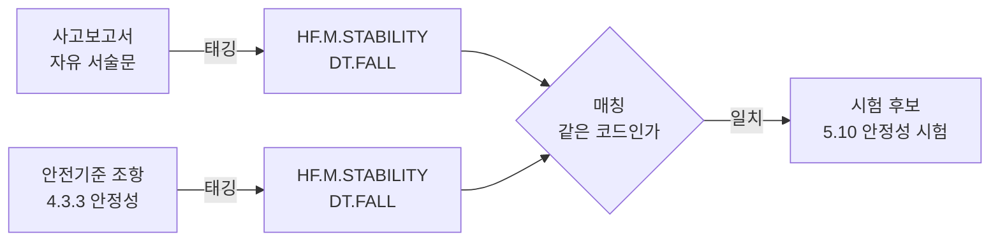

> **비유**: 짝 맞추기 카드 게임이다. 카드 뒷면에 그림을 그려 넣는 것이 태깅, 같은 그림을 찾아 뒤집는 것이 매칭이다. 그림이 없는 카드는 아무리 뒤집어도 짝을 찾을 수 없다.

### 0.5.3 그래서 시점이 갈린다

|          | 태깅                                       | 매칭                        |
| -------- | ---------------------------------------- | ------------------------- |
| 하는 일     | 라벨 붙이기                                   | 라벨 맞춰 보기                  |
| **시점**   | **미리** — 데이터가 들어올 때 1회                   | **그때그때** — 담당자가 물어볼 때마다   |
| 왜 그런가    | 한 번 붙이면 오래 쓰고, 사람이 검수해야 하며, 결과가 항상 같아야 함 | 질문이 매번 다르므로 미리 계산해 둘 수 없음 |
| 무엇으로 하는가 | LLM + 사람 검수                              | SQL 계산                    |
| 비용       | 크지만 1회성                                  | 거의 없음, 즉시                 |

- 핵심: **태깅은 준비, 매칭은 사용.** 준비를 미리 해 두었기 때문에 사용이 빠르고 매번 같다.
- 반대로 하면 어떻게 되는가 — 담당자가 조회할 때마다 LLM이 안전기준을 처음부터 읽는 방식이 되고, 어제 나온 조항이 오늘은 안 나올 수 있다(3.2 참조).

### 0.5.4 그런데 라벨만으로는 부족하다 — 세 갈래 매칭

- 코드 매칭만 쓰면 생기는 구멍
  - 코드 체계에 없는 위해요인은 표현할 방법이 없음
  - 조항에 태깅이 아직 안 된 품목은 결과가 0건
  - 같은 `HF.M.STABILITY`라도 "측방 전도"와 "발판 전도"를 구분하지 못함 — 코드는 굵고, 사고는 가늘다
- 그래서 매칭을 **세 갈래로 돌린다**

| 갈래 | 무엇을 맞춰 보는가 | 강점 | 약점 |
|---|---|---|---|
| ① 코드 매칭 | HF/DT 코드 | 근거가 명확, 통계 집계 가능 | 굵어서 세부 구분 못 함, 미태깅 시 0건 |
| ② 키워드 매칭 | "전도", "하네스", "용출" 같은 용어 | 전문 용어·수치를 정확히 잡음 | 표현이 다르면 못 잡음("넘어짐" ↔ "전도") |
| ③ 의미 매칭 | 문장의 뜻(벡터) | 표현이 달라도 잡음 | 왜 나왔는지 설명이 약함 |

> **비유**: 사람을 찾을 때 주민등록번호(①), 이름(②), 인상착의(③)를 함께 쓰는 것과 같다. 번호가 가장 확실하지만 번호를 모르는 사람도 있고, 인상착의만으로는 확신할 수 없다. 셋을 겹쳐 보면 놓치는 사람이 줄어든다.

- 세 갈래를 합치는 방식이 **하이브리드 검색(Hybrid Search)** 이며, 상세 설계는 5장에 둔다.

---

## 1. 전체 그림 — 다섯 개의 층


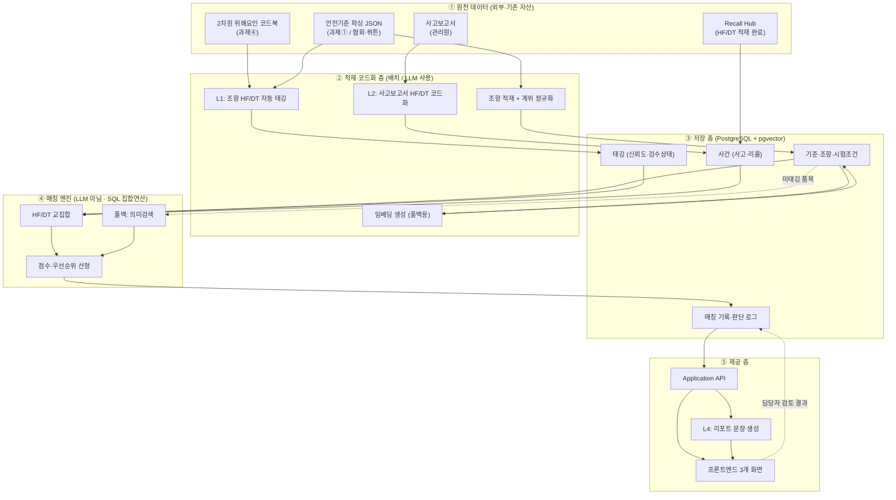


### 1.1 이 구조를 관통하는 세 가지 원칙

|  #  | 원칙                               | 한 줄 설명                                                | 비유                                              |
| :-: | -------------------------------- | ----------------------------------------------------- | ----------------------------------------------- |
|  1  | **태깅**은 들어올 때, <br>**매칭**은 물어볼 때 | HF/DT 부여는 데이터 적재 시점에 미리 끝내고, 조회 시점에는 이미 붙은 코드만 맞춰 본다  | 도서관은 책이 들어올 때 청구기호를 붙인다. 손님이 올 때마다 책을 다시 읽지 않는다 |
|  2  | **LLM은 번역**만, <br>**판단은 데이터베이스** | 자유 서술 → 코드 변환만 LLM이 하고, "어떤 조항이 걸리는가"는 SQL 집합연산으로 계산  | 통역사는 말을 옮기고, 판결은 판사가 한다. 통역사가 판결하면 재심이 불가능해진다   |
|  3  | **원본은 불변, <br>파생은 재생성 가능**       | 원천 데이터·판단 로그는 절대 덮어쓰지 않고, 태깅·매칭 결과는 언제든 다시 만들 수 있게 둔다 | 필름 원판은 금고에, 인화지는 얼마든지 다시 뽑는다                    |

> 참고 : 원칙 2
> 이 시스템의 성격을 결정한다. 컨셉 5.4의 "판정하지 않는다"는 **정책 선언이 아니라 아키텍처 제약**으로 구현되어야 한다. 
> LLM이 최종 목록을 만들면, 왜 그 조항이 나왔는지 사후에 재현할 수 없다. SQL이 만들면 같은 입력에 항상 같은 출력이 나오고, 근거를 행 단위로 제시할 수 있다.

### 1.2 왜 판단을 LLM이 아니라 SQL이 하는가 — 세 가지 안 비교

#### 세 가지 안

|           | **안 A — 전부 LLM**                                  | **안 B — 하이브리드**          | **안 C — 태깅 + SQL (권고)**                   |
| --------- | ------------------------------------------------- | ------------------------ | ----------------------------------------- |
| 작동 방식     | 사고 서술문과 기준 원문을 함께 LLM에 넣고 "어떤 시험이 필요한가"를 물음 (RAG) | LLM이 후보를 좁히고, 규칙으로 사후 검증 | 양쪽에 HF/DT 코드를 미리 붙이고, <br>코드 교집합을 SQL로 계산 |
| 개발 착수 속도  | **빠름** — 며칠이면 시연 가능                               | 중간                       | **느림** — 태깅 자산이 먼저 필요                     |
| 결과 재현성    | 낮음 — 같은 질문에 다른 답 가능                               | 중간                       | **높음** — 같은 입력에 항상 같은 출력                  |
| 근거 제시     | 모델의 설명문에 의존                                       | 부분적                      | **행 단위로 제시** — 어느 코드가 왜 걸렸는지 추적 가능        |
| 5.3 통계 집계 | **사실상 불가**                                        | 어려움                      | **가능** — 코드가 컬럼에 있어야 집계가 됨                |
| 조회 비용·속도  | 건당 LLM 호출                                         | 건당 호출                    | 거의 0, 즉시                                  |
| 미태깅 품목    | 바로 대응 가능                                          | 대응 가능                    | **약점** — 폴백 필요                            |
| 초기 구축 부담  | 작음                                                | 중간                       | **큼** — 태깅·검수가 병목                         |

#### 안 C를 고른 네 가지 이유

- **재현성** — 사업자 조치나 기준 개정의 근거로 쓰려면 "어제와 오늘 결과가 같아야" 함. 안 A는 이 조건을 만족하지 못함
- **설명 가능성** — 컨셉 5.4가 요구하는 것은 "후보 제시 + 근거 제공"인데, 근거가 모델의 서술문이면 담당자가 검증할 대상이 없음
- **집계 가능성** — 5.3의 세 산출물은 모두 `GROUP BY HF코드` 형태의 집계. 코드가 데이터베이스 컬럼으로 존재하지 않으면 통계 자체가 성립하지 않음
- **비용** — 조회는 반복되고 태깅은 1회성. 반복되는 쪽에서 LLM을 걷어내는 것이 총비용에 유리

#### 안 C의 약점과 보완

| 약점 | 보완 |
|---|---|
| 태깅 안 된 품목은 결과가 안 나옴 | 임베딩 의미검색으로 폴백하고 "폴백 결과"임을 명시 (컨셉 7장) |
| 초기 구축 기간이 김 | 사고다발 품목부터 순차 태깅, 0단계는 1개 품목으로 검증 |
| 코드 체계가 표현하지 못하는 사례 | 담당자 수동 추가 경로를 항상 열어 두고, 그 빈도를 코드 체계 개선 신호로 사용 |

> **결론**: 기본 경로는 안 C, 태깅이 없는 구간에만 안 A 방식을 폴백으로 쓴다. 두 경로의 결과는 화면에서 구분 표시한다.


> **비유 — 식당의 두 가지 방식**
> - **방식 A**: 손님이 올 때마다 요리사에게 "알아서 맞는 걸 차려 주세요"라고 부탁한다. 요리사 실력이 좋으면 훌륭하지만, 같은 손님이 내일 와도 같은 음식이 나온다는 보장이 없고, 왜 그 음식을 골랐는지 설명하기 어렵다.
> - **방식 C**: 재료마다 "매움/유제품 없음" 같은 라벨을 미리 붙여 두고, 손님의 조건표와 라벨을 대조해 메뉴를 뽑는다. 결과가 항상 같고, "이 조건에 이 라벨이 맞아서"라고 손가락으로 짚어 설명할 수 있다.
>
> 본 체계는 **행정 처분과 기준 개정의 근거**를 만드는 시스템이므로 방식 C를 기본으로 한다.


### 1.3 시스템 관계도 — 무엇이 어디에 사는가

#### 1.3.1 기관·시스템 경계

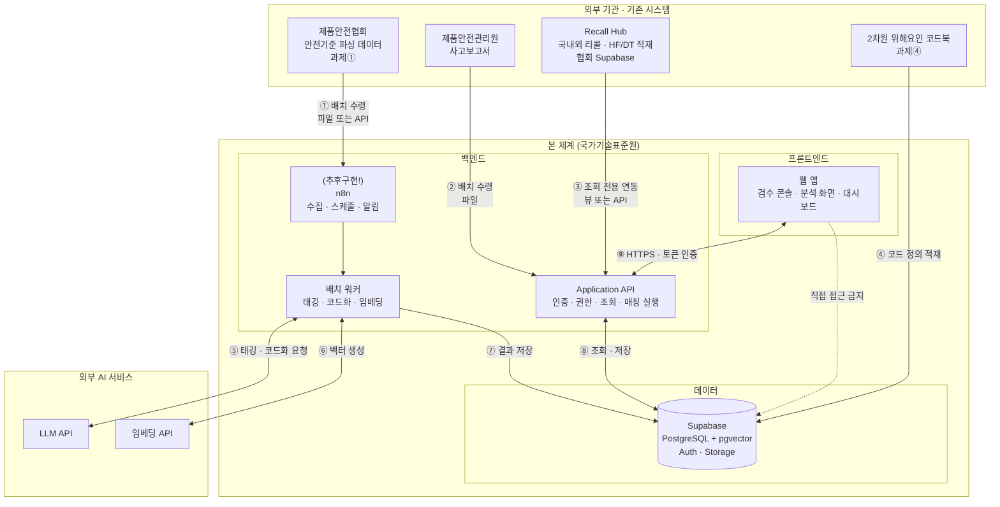

#### 1.3.2 무엇을 어디에 두는가

| 구성요소                      | 위치                            | 그렇게 두는 이유                                                    |
| ------------------------- | ----------------------------- | ------------------------------------------------------------ |
| **프론트엔드**                 | 정적 웹 호스팅 <br>(내부망 또는 업무포털 연계) | 화면은 데이터를 갖지 않음. <br>모든 요청은 백엔드 경유                            |
| **Application API**       | 백엔드 서버                        | **권한 판단을 한 곳에 모으기 위함.** <br>누가 어떤 품목을 검수·조회할 수 있는지가 여기서만 결정됨 |
| **배치 워커**                 | 백엔드(별도 프로세스)                  | LLM 호출은 수 초~수 분. <br>화면 요청과 같은 줄에 세우면 안 됨                    |
| **n8n**                   | 별도                            | 외부 기관 데이터 수집·스케줄·알림. <br>**업무 로직은 넣지 않음**(6.3)               |
| **Supabase (PostgreSQL)** | 데이터 계층                        | 조항·태깅·사건·판단기록. <br>pgvector로 폴백 검색까지 한 곳에서 처리                |
| **Supabase Storage**      | 데이터 계층                        | 원본 파일(파싱 JSON, 사고보고서 PDF) 보관 → 7.1 원본층                       |
| **LLM·임베딩 API**           | 외부                            | 태깅·코드화 시점에만 호출. <br>조회 시점에는 호출되지 않음                          |

#### 1.3.3 프론트엔드가 DB에 직접 붙지 않는 이유

- Supabase는 브라우저에서 DB를 직접 호출하는 방식(Auth + RLS)을 지원하지만, 본 체계에서는 **권장하지 않음**
- 이유
  - 권한 규칙이 DB 정책과 화면 코드 양쪽에 흩어지면, 감사 시 "누가 무엇을 볼 수 있었는가"를 한 번에 설명하기 어려움
  - 매칭 실행·리포트 생성처럼 여러 테이블을 함께 다루는 로직은 서버에 있어야 안전함
  - 외부 기관 연동(Recall Hub, 관리원)은 어차피 서버가 중개해야 함

> **비유**: 민원실 창구와 같다. 민원인이 서고에 직접 들어가 서류를 꺼내게 하지 않고, 창구 직원이 신분을 확인한 뒤 대신 꺼내 준다. 창구가 하나여야 출입 기록도 하나로 남는다.

#### 1.3.4 미리 확인해야 할 경계선

| 경계                | 확인/결정 사항                                                          |
| ----------------- | ----------------------------------------------------------------- |
| 사고보고서 → 외부 LLM    | **개인정보 포함 가능성이 있어** 비식별 처리 후 파일 전달<br>2025년 자료 PDF 형태로 제공(11장 3번) |
| 본 체계 ↔ Recall Hub | 같은 Supabase 계정 내 **별도 Project** → 직접 조인 불가.<br>**API 조회 + 사용분만 캐시 보관**(0.2 방안 A) |
| 협회 파싱 데이터 → 본 체계  | 파일 전달<br>추후 API 갱신 주기는 어떻게 되는가(컨셉 8장 1번)                          |
| 프론트엔드 배치          | 인터넷망                                                              |

---

## 2. 데이터 층 — DB 설계

### 2.1 개념 ERD

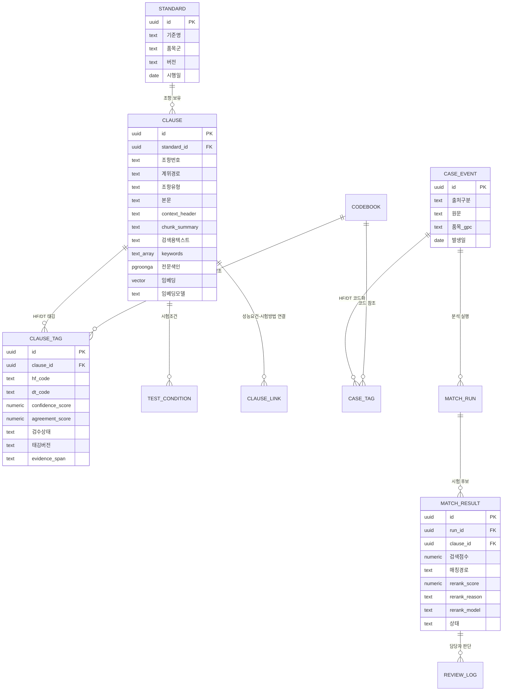

### 2.2 테이블별 역할

| 테이블                          | 역할                               | 설계상 유의점                                                                                                                    |
| ---------------------------- | -------------------------------- | -------------------------------------------------------------------------------------------------------------------------- |
| `standard` / `clause`        | 안전기준 원문의 구조화 형태                  | **기준 개정을 대비해 버전 컬럼 필수.** <br>조항은 개정되면 새 행을 만들고, 옛 행은 지우지 않음                                                                |
| `clause_tag`                 | 조항에 붙은 HF/DT 색인                  | **조항 1건에 태그 N개**(복수 코드 허용, 컨셉 3.2). `confidence_score`(자기보고)와 `agreement_score`(반복 일치율)를 **분리 저장**(5.2.3), 검수상태·태깅버전 함께 저장 |
| `test_condition`             | 하중값·방향·치수 등 시험 조건                | 컨셉 5.1의 핵심 산출 항목. <br>파싱 데이터의 표·그림 서술이 여기로 들어옴                                                                             |
| `clause_link`                | 성능요건 조항 ↔ 시험방법 조항 연결             | "4.3.3 → 5.10" 관계.<br>**파싱 데이터에 이 관계가 이미 있는지가 큰 분기점**(없으면 별도 구축 필요)                                                        |
| `case_event` / `case_tag`    | 사고·리콜을 하나의 형태로 통일                | 트랙 A·B가 같은 엔진을 쓰려면 **입력 테이블이 하나여야 함**. <br>출처만 컬럼으로 구분                                                                     |
| `match_run` / `match_result` | 분석 1회의 실행 기록과 후보 목록              | 재실행 시 덮어쓰지 않고 새 run을 쌓음. <br>검색점수·매칭경로에 더해 **`rerank_score`·`rerank_reason`·`rerank_model`** 저장(5.6.3). 탈락 후보도 보존          |
| `review_log`                 | 담당자의 채택·반려·수정 기록                 | 5장에서 다루듯 **이 테이블이 시스템의 자산 중 가장 값나가는 부분**                                                                                   |
| `recall_cache`               | Recall Hub에서 조회해 실제 분석에 사용한 리콜 건 | 0.2 방안 A. 원본은 협회, 우리는 **인용한 사본만** 보관                                                                                       |

#### 검색을 위해 `clause`에 추가되는 컬럼 (v0.4 신설)

| 컬럼 | 타입 | 용도 | 만드는 시점 |
|---|---|---|---|
| `context_header` | text | 품목·계위·분류명을 조합한 머리말 (5.2.4) | 적재 시 |
| `chunk_summary` | text | 검색용 한 줄 요약 (5.2.1) | L1 태깅 시 |
| `keywords` | text[] | LLM이 뽑은 용어·동의어 | L1 태깅 시 |
| `검색용텍스트` | text | 머리말 + 한 줄 요약 + 본문 + 시험조건을 결합한 색인 대상 | 위 3개 확정 후 |
| `전문색인` | PGroonga 인덱스 | 한국어 키워드 검색. **결합 텍스트를 대상으로** 생성 | 인덱스 생성 |
| `임베딩` | vector(1536) | 의미 검색. **결합 텍스트를 대상으로** 생성 | 적재 시 |
| `임베딩모델` | text | 어떤 모델·버전으로 만든 벡터인지 | 적재 시 |

> 순서에 유의. `검색용텍스트`는 태깅 결과(`chunk_summary`, 분류명)를 재료로 쓰므로 **태깅이 끝난 뒤에 조립**되고, 임베딩은 그다음이다. 태깅을 고치면 조립과 임베딩을 다시 해야 한다(3.4).

> `임베딩모델` 컬럼이 없으면 모델을 바꾼 뒤 **서로 다른 좌표계의 벡터가 한 테이블에 섞여** 검색 결과가 조용히 망가진다. 같은 지도인 줄 알았는데 하나는 위경도, 하나는 도로명 주소인 상황과 같다.

### 2.3 반드시 짚고 갈 설계 결정 두 가지

- **결정 A — 매칭 실패도 저장한다**
  - 보통 검색 시스템은 "찾은 것"만 남기지만, 이 체계는 **"대응 조항이 없음"이 그 자체로 산출물**(컨셉 1.3 세 번째 질문, 5.3 사각지대 목록)
  - 따라서 `match_result`에 결과 0건인 run도 기록하고, "어떤 HF/DT로 조회했는데 없었는지"를 남겨야 함
  - 이것을 초기에 빼면, 3단계(기준 개선 요인)에 가서 과거 데이터를 되살릴 수 없음
- **결정 B — 태깅에 '버전'을 붙인다**
  - 코드북 개정·프롬프트 변경·모델 교체 시 태깅 결과가 달라짐
  - 태깅버전을 남기면 "언제 어떤 방식으로 붙은 코드인가"를 추적할 수 있고, 부분 재태깅이 가능

> Recall Hub 연동 방식은 0.2에서 이미 정했다(API 조회 + 인용분 캐시).

### 2.4 위해요인 코드북은 독립 서비스로 만든다

#### 2.4.1 왜 따로 떼어 내는가

- 코드북은 본 체계만 쓰는 자산이 아니다. **Recall Hub, 향후 다른 시스템도 같은 코드를 참조**해야 한다
- 코드 정의를 시스템마다 복사해 두면, 코드북이 개정될 때 어느 시스템이 옛 정의를 쓰는지 알 수 없다
- 컨셉 3.2가 말하는 "공통 언어"는 **정의가 한 곳에만 있을 때** 성립한다

> 표준시계와 같다. 부서마다 시계를 두면 조금씩 어긋나지만, 표준시를 한 곳에서 배포하면 모두가 같은 시각을 본다.

#### 2.4.2 배치 구조

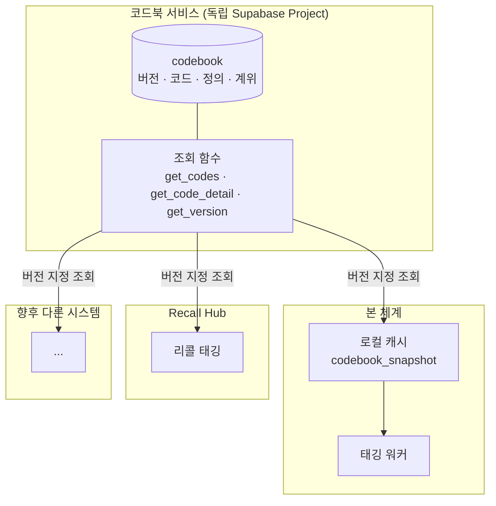

- 코드북을 **별도 Supabase Project**로 두고, 조회는 DB 함수(RPC)로 공개
- 이용 시스템은 각자 **로컬에 스냅샷을 캐시**하고, 버전이 바뀌었을 때만 다시 받음
  - 이유: 태깅 배치가 조항 수천 건을 돌 때 건별로 원격 조회를 하면 느리고 불안정함

#### 2.4.3 제공할 조회 함수 (초안)

| 함수 | 입력 | 반환 | 용도 |
|---|---|---|---|
| `get_current_version()` | 없음 | 현재 유효 버전, 시행일 | 캐시 갱신 필요 여부 판단 |
| `get_codes(version, axis)` | 버전, 축(HF/DT) | 코드 전체 목록 | 태깅 프롬프트의 enum 생성, 스냅샷 적재 |
| `get_code_detail(version, code)` | 버전, 코드값 | 정의·예시·상위코드 | 화면 툴팁, 검수 화면 |
| `resolve_code(version, code)` | 버전, 코드값 | 유효 여부, 대체 코드 | 저장 전 검증, 폐지 코드 자동 치환 |
| `diff_versions(v1, v2)` | 두 버전 | 신규·변경·폐지 목록 | 재태깅 대상 산정, 8.2 화면 |

- 모든 함수가 **버전을 입력받는 점**이 핵심. 버전 없이 "지금 코드 목록"만 주면, 과거 태깅이 어떤 정의로 붙었는지 되짚을 수 없음
- 접근 권한은 **조회 전용 키**로 분리. 이용 시스템이 코드북을 고칠 수 없게 함
- 코드 등록·수정은 8.2 화면에서만

#### 2.4.4 표 구조는 실물 MD를 보고 정한다

`codebook` 테이블 설계는 **코드북 MD 파일 실물을 열어 본 뒤 확정**한다.

| 확인할 것 | 표 구조에 미치는 영향 |
|---|---|
| 계위가 몇 단인가(HF.M.STABILITY는 3단) | 고정 컬럼으로 둘지, 상위코드 참조로 둘지 갈림 |
| 코드마다 정의·예시·제외규정이 다 있는가 | 없는 항목은 컬럼을 만들지 않음 |
| HF와 DT의 구조가 같은가 | 다르면 한 표에 담지 않고 축별로 분리 |
| 조합 제약이 명시돼 있는가(예: HF.L 단독 금지) | 제약을 표로 만들어 `resolve_code`가 검증하게 함 |
| MD의 제목 단계와 표가 코드 계위와 대응하는가 | 파싱 규칙 자체가 달라짐 |

- 우선 MD 원문을 그대로 보관하고(원본층), 파싱 결과를 파생층에 두면 파싱 규칙을 나중에 고쳐도 다시 만들 수 있다

---

## 3. 태깅 적용 시점

### 3.1 세 개의 부여 지점

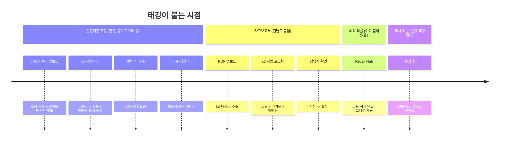

| 대상 | 부여 시점 | 처리 방식 | 빈도 |
|---|---|---|---|
| 안전기준 조항 | **적재 시 1회 + 개정 시** | 배치, LLM 자동(검수는 여력 시) | 품목 확대에 따라 순차 |
| 사고보고서 | **PDF 업로드 직후** | 건별, LLM 자동 + 담당자 확인 | 사고 접수 시마다 |
| 해외 리콜 | **이미 완료** | Recall Hub 파이프라인 | 신규 유입 시 |
| **국내 리콜** | **수집 시** | 사고와 동일 경로(신규 대상) | 신규 유입 시 |

> v0.4 변경점 두 가지: **국내 리콜이 태깅 대상에 추가**되었고(컨셉 v0.4 4장), **태깅 1회에 코드·키워드·임베딩 세 가지를 함께 생성**한다(5.2).

### 3.2 왜 '조회 시점 태깅'이면 안 되는가

조회할 때마다 LLM이 안전기준을 읽어 태깅하는 방식도 기술적으로는 가능하나, 세 가지가 무너진다(0.5.3의 시점 구분과 같은 이유).

| 문제 | 내용 |
|---|---|
| 재현성 | 같은 사고를 두 번 조회하면 다른 결과가 나올 수 있음 → 행정 근거로 못 씀 |
| 비용·속도 | 조회 1회에 수십~수백 조항을 매번 읽어야 함 |
| 검수 불가 | 사람이 확인한 태깅이 쌓이지 않음 → 기준 개선 요인 집계가 성립하지 않음 |

### 3.3 재태깅 트리거

- 2차원 위해요인 코드북 개정 → 영향 코드가 붙은 조항만 선별 재태깅
- 안전기준 개정 → 개정 조항만 신규 행 생성 후 태깅
- 프롬프트·모델 변경 → **검수 완료분으로 먼저 성능을 비교한 뒤** 전면 적용 여부 결정
- 원칙: 사람이 검수 확정한 태깅은 자동 재태깅으로 덮어쓰지 않고, 차이만 표시하여 담당자에게 확인 요청

### 3.4 세 가지 산출물의 재생성 비용이 다르다

| 산출물 | 다시 만들 때 드는 것 | 재생성 트리거 |
|---|---|---|
| HF/DT 코드 | LLM 호출 + 검수 시간(가장 비쌈) | 코드북 개정, 조항 개정 |
| 키워드 | LLM 호출(중간) | 프롬프트 변경, 조항 개정 |
| 임베딩 | 임베딩 API 호출(가장 쌈, 검수 불필요) | **검색용 텍스트 조립 규칙 변경, 임베딩 모델 교체** |

- 실무적 함의: **임베딩은 부담 없이 다시 만들 수 있으므로, 검색 품질이 낮으면 조립 규칙부터 손보는 것이 정답**
- 반대로 코드 재태깅은 검수 인력을 다시 쓰게 되므로 마지막 수단
- 비유: 사진의 색감이 마음에 안 들 때 다시 인화하면 되지만, 피사체를 다시 불러 촬영하는 것은 다른 차원의 일이다.

---

## 4. LLM 사용 지점 — 여섯 곳, 그리고 쓰지 않는 곳

### 4.1 사용 지점 한눈에

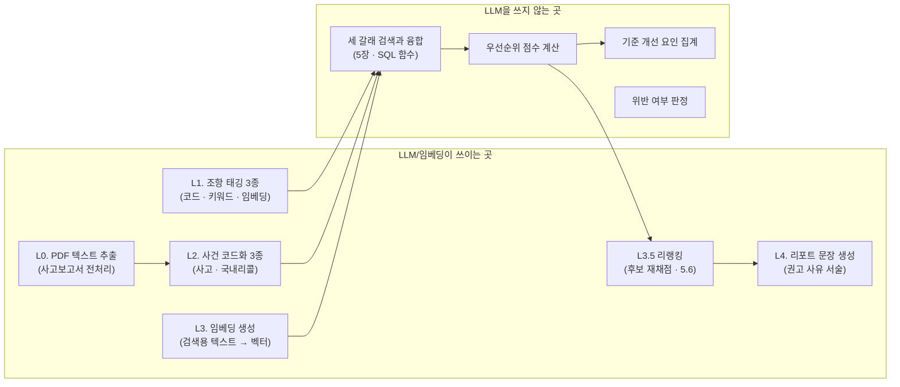

> v0.3까지는 L3를 "미태깅 품목 폴백"으로만 두었으나, v0.4에서는 **모든 조항·사건에 임베딩을 생성**한다(5.2). 폴백이 아니라 상시 갈래가 되었다.

### 4.2 지점별 설계

| 지점            | 입력                     | 출력                                         | 주된 실패 모드             | 방어 장치                                               |
| ------------- | ---------------------- | ------------------------------------------ | -------------------- | --------------------------------------------------- |
| **L0 PDF 추출** | 사고보고서 PDF              | 평문 텍스트 + 페이지 정보                            | 표·서식이 깨져 문장이 뒤엉킴     | 추출 결과를 화면에 노출해 담당자가 확인. 스캔본이면 OCR 필요(0.3 가정3)       |
| **L1 조항 태깅**  | 조항 본문 + 계위 경로 + 코드북 정의 | 5.2.1의 7개 필드 JSON (Structured Outputs로 강제) | 코드북에 없는 코드 창작, 과잉 부여 | 코드 목록을 **enum으로 고정**, 미존재 코드는 저장 단계에서 재검증           |
| **L2 사건 코드화** | 사고 서술문 / 국내 리콜 사유      | 동일 구조 JSON + 주·부 코드 구분                     | 원문에 없는 원인 추정         | `evidence_span`을 **required**로 지정, 스팬 없는 코드는 신뢰도 하향 |
| **L3 임베딩 생성** | 5.2의 검색용 텍스트           | vector(1536)                               | 모델 교체로 좌표계 불일치       | `임베딩모델` 컬럼 기록, 모델 변경 시 전량 재생성                       |
| **L3.5 리랭킹**  | 사건 요약 + 후보 조항 15건      | 후보별 관련성 점수 + 한 줄 이유                        | 검색에 없던 조항을 만들어 냄     | **후보 ID를 enum으로 제한**, 목록 밖 응답은 폐기(5.6.3)            |
| **L4 문장 생성**  | 매칭 결과(구조화 데이터)         | 권고 사유 서술문                                  | 단정 표현 사용("위반")       | 금지어 필터 + "관련될 수 있어 ~ 권고" 템플릿 고정                     |

#### L1·L2가 함께 뽑아야 할 키워드 (v0.4 추가)

- 요구 출력에 `keywords[]`를 포함시키고, 다음 세 종류를 뽑도록 지시
  - 핵심 용어: "전도", "안정성", "구속장치"
  - **동의어·구어 표현**: "넘어짐", "쓰러짐", "하네스"
  - 수치·단위: "150 N", "140 mm"
- 동의어를 함께 저장하는 것이 5.3 한국어 검색의 실질적 해법
  - 사고보고서는 "넘어졌다"로 쓰이고 기준은 "전도"로 쓰이는데, 이 둘을 이어 주는 것이 동의어 목록임
- 비유: 사전에 표제어만 있으면 못 찾는다. "넘어지다 → 전도" 같은 안내가 있어야 찾아간다.

### 4.3 신뢰도 — 반복 호출 비용

- 신뢰도를 두 가지로 나눠 재는 이유와 활용 규칙은 5.2.3에 정리
- 여기서 짚을 것은 비용. 반복 호출은 호출 수가 3~5배로 늘어난다
- 절충안: **조항 태깅(L1)처럼 1회성 배치에만 반복 호출을 적용**하고, 사건 코드화(L2)는 1회 호출 + 담당자 확인으로 갈음

### 4.4 L1 태깅 파이프라인 (시퀀스)

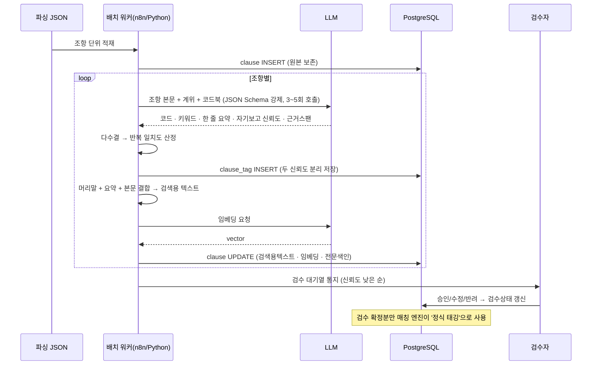

---

## 5. 매칭 엔진 — 하이브리드 검색 설계


세 갈래를 함께 돌리고 융합한다.
**태깅 단계에서 준비해야 할 것이 늘어난다.**

### 5.1 전체 흐름

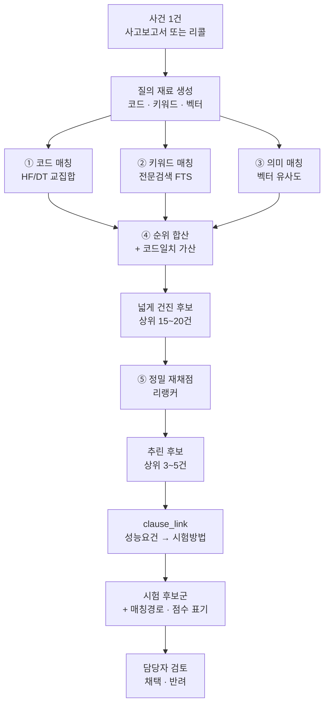

- 세 갈래는 **모두 같은 `clause` 테이블을 대상으로** 실행됨
- **넓게 건지고(①~④) 정밀하게 추린다(⑤)** 는 2단 구조가 v0.5의 핵심 변경
  - 앞 단계는 **놓치지 않는 것**이 목표(재현율)
  - 뒤 단계는 **틀린 것을 걸러내는 것**이 목표(정밀도)
- 결과에는 **어느 갈래에서 나왔는지(매칭 경로)와 재채점 점수**를 반드시 표기 → 담당자가 신뢰 수준을 스스로 판단

> **비유**: 서류 심사와 면접의 관계다. 서류 심사는 자격을 갖춘 사람을 폭넓게 통과시키고(놓치면 안 되니까), 면접은 실제로 이 자리에 맞는 사람인지 한 명씩 마주 앉아 확인한다. 면접을 100명에게 할 수는 없으므로 서류로 먼저 15명을 남긴다.

### 5.2 태깅 설계 — 무엇을, 어떻게 붙일 것인가

기존에는 태깅을 "코드 붙이기"로만 정의했지만, 하이브리드 검색을 하려면 **적재 시점에 여러 가지를 함께 만들어야** 한다.

#### 5.2.1 태깅 산출 항목 (v0.5 확정안)

| 필드 | 타입 | 내용 | 쓰이는 곳 |
|---|---|---|---|
| `hf_codes` | 코드 배열 | 위해요인(원인) 코드, 주·부 구분 | 코드 매칭, 기준 개선 요인 집계 |
| `dt_codes` | 코드 배열 | 피해유형(결과) 코드 | 코드 매칭 |
| `keywords` | 문자열 배열 | 핵심 용어 + 동의어·구어 표현 + 수치·단위 | 키워드 매칭 |
| **`chunk_summary`** | 문자열 | **검색용 한 줄 요약** — 이 조항이 무엇을 막으려는 규정인지 한 문장 | 임베딩·키워드 색인의 재료, 화면 미리보기 |
| **`context_header`** | 문자열 | **상위 맥락** — 상위 문서명·계위 경로·코드북 분류명을 조합한 머리말 | 임베딩·키워드 색인의 앞부분에 결합 |
| **`confidence_score`** | 0.0~1.0 | LLM이 스스로 매긴 태깅 확신도 | 검수 대기열 정렬, 결과 표시 |
| `evidence_span` | 문자열 | 그 코드를 붙인 근거가 된 원문 구절 | 검수 화면에서 하이라이트 |

- `chunk_summary`가 필요한 이유
  - 조항 본문은 규정 문체라 "측방·후방·발판·테이블 전도 방지"처럼 **명사 나열**로 끝나는 경우가 많음
  - 담당자가 들고 오는 문장("의자가 옆으로 넘어졌다")과 **문장 형태 자체가 달라** 벡터 거리가 멀어짐
  - 한 줄 요약을 만들어 두면 그 간극이 줄어듦 — 예: "유아용 의자가 옆·뒤로 넘어지지 않도록 하는 안정성 요건"
  - 부수 효과: 검수 화면과 결과 화면에서 담당자가 조항 원문을 펼치지 않고도 판단 가능

> **비유**: 논문 맨 앞의 초록(abstract)과 같다. 본문을 다 읽지 않아도 이 논문이 무엇을 다루는지 알 수 있고, 검색도 초록으로 먼저 걸러진다.

#### 5.2.2 Structured Outputs — 형식을 강제한다

- 방식: LLM에 **JSON Schema를 함께 넘겨 출력 형식을 강제**(Structured Outputs / Tool Calling)
- 자유 서술로 받고 나중에 파싱하는 방식과의 차이

| | 자유 서술 후 파싱 | **Structured Outputs (권고)** |
|---|---|---|
| 형식 오류 | 종종 발생 → 재시도 로직 필요 | 스키마가 강제되어 거의 없음 |
| 코드 창작 | "HF.M.TIP_OVER" 같은 없는 코드를 지어냄 | 코드 목록을 **enum으로 고정**하면 원천 차단 |
| 필드 누락 | 요약만 쓰고 근거를 빠뜨림 | `required` 지정으로 방지 |
| 배치 처리 | 실패 건 추적이 번거로움 | 실패 시점이 명확 |

- 스키마 설계 요령
  - `hf_codes`, `dt_codes`는 반드시 **코드북에서 뽑은 enum 목록**으로 제한
  - `evidence_span`을 `required`로 두어 **근거 없는 코드 부여를 구조적으로 막음**
  - 저장 단계에서 한 번 더 검증 — 스키마를 통과해도 코드북에 없는 조합이면 거부

> **비유**: 민원 서식과 같다. 백지에 자유롭게 쓰게 하면 빠뜨리는 항목이 생기지만, 칸이 정해진 서식을 주면 빈칸이 남았을 때 바로 보인다.

#### 5.2.3 confidence_score — 넣되, 혼자 믿지는 않는다

- 결론: **필드는 넣는다. 다만 이것만으로 검수 우선순위를 정하지 않는다.**
- 이유: LLM이 스스로 매긴 확신도는 **실제 정확도와 어긋나는 경향**이 있음(교정 문제). 틀린 답에도 0.9를 주는 경우가 흔함
- 따라서 신뢰도를 **두 개의 컬럼으로 분리해 저장**

| 컬럼 | 산출 방법 | 성격 |
|---|---|---|
| `confidence_score` | LLM 자기보고 | 참고용. 단독으로는 약함 |
| `agreement_score` | 같은 입력을 3~5회 돌려 같은 코드가 나온 비율(4.3) | **검수 정렬의 주 지표** |

- 실무 규칙(초안)

| 상황 | 처리 |
|---|---|
| 두 점수 모두 높음 | 자동 확정 후보, 검수 후순위 |
| 자기보고는 높은데 반복 결과가 갈림 | **가장 위험한 구간 — 검수 최우선** |
| 두 점수 모두 낮음 | 검수 필요하나, 애초에 코드로 표현 곤란한 조항일 수 있음 → 코드 체계 개선 신호 |

> **비유**: "자신 있습니다"라는 본인 진술과, 같은 문제를 다섯 번 풀렸을 때의 답 일치율은 다른 정보다. 채용에서 자기소개서만 보고 뽑지 않는 이유와 같다.

#### 5.2.4 맥락 결합(Contextual Retrieval) — 조각에 머리말을 붙인다

- 문제: 조항 하나를 떼어내면 **어느 품목의 몇 장 몇 절인지**가 사라짐. "4.3.3 안정성"만 남으면 유아용 의자인지 유모차인지 알 수 없음
- 해결: **색인하기 전에 상위 맥락을 조각 맨 앞에 결합**한 뒤, 그 합친 텍스트로 임베딩과 키워드 색인(희소 벡터)을 **둘 다** 생성

```
[색인 대상 텍스트 = context_header + chunk_summary + 본문]

context_header
  품목: 유아용 의자 (어린이제품 안전기준 부속서 8)
  위치: 제1부 > 4 성능요건 > 4.3 구조 > 4.3.3 안정성
  분류: 구조적 안정성 부족 / 낙상·충돌
chunk_summary
  유아용 의자가 옆·뒤로 넘어지지 않도록 하는 안정성 요건
본문
  측방·후방·발판·테이블 전도 방지 …
시험조건
  150 N 수직 하중, 안쪽 가장자리 중심에서 바깥쪽, 거리 a=140 mm
```

- 근거: Anthropic이 공개한 Contextual Retrieval 실험에서, 조각 앞에 맥락을 붙여 임베딩한 경우 상위 20건 검색 실패율이 5.7% → 3.7%로 약 35% 감소했고, **키워드 색인(BM25)에도 같은 맥락을 붙이자 2.9%까지(약 49% 감소)** 낮아졌다. 여기에 리랭킹을 더하면 1.9%(약 67% 감소)까지 내려갔다 (출처: Anthropic, "Contextual Retrieval in AI Systems", 2024)
- 본 체계에 주는 시사점
  - **임베딩에만 맥락을 붙이고 키워드 색인에는 안 붙이는 것은 절반만 하는 것** — 5.3의 PGroonga 색인 대상도 결합된 텍스트여야 함
  - 리랭킹까지 넣어야 효과가 온전해짐(5.6)
- 다만 **위 수치는 코드베이스·논문·소설 대상 실험치**이므로 안전기준 문서에 그대로 옮겨지지 않는다. 0단계에서 우리 데이터로 측정하는 것이 원칙(5.8)

#### 5.2.5 청킹(문서 자르기) 고민이 없다는 것이 이 사업의 이점

- 일반 RAG는 문서를 몇 글자로 자를지가 큰 고민거리이고, 맥락 결합 기법도 그 부작용을 메우려는 성격이 큼
- 본 체계는 **조항이 곧 자연스러운 단위**이며, 파싱 데이터가 이미 조항 단위로 쪼개져 있음
- 남들이 어림짐작으로 자르는 지점을 **표준 문서의 계위가 대신 정해 준다**

### 5.3 한국어 전문검색 — 그냥 두면 작동하지 않는다

- PostgreSQL 기본 전문검색(`to_tsvector`)은 알파벳·숫자 기반 언어를 전제로 하며, 한국어·일본어·중국어처럼 알파벳이 아닌 문자를 쓰는 언어에는 한계가 있다
- 조사가 붙는 한국어 특성 때문에 "전도가", "전도를", "전도됨"이 서로 다른 단어로 취급되어 검색이 어긋남
- 해결책

| 방안 | 내용 | 판단 |
|---|---|---|
| **A. PGroonga 확장** | Groonga 기반 전문검색 인덱스. Postgres 기본 전문검색이 다루지 못하는 언어까지 지원. Supabase 대시보드 `Database > Extensions`에서 `pgroonga` 검색 후 활성화 (출처: Supabase 공식 문서 PGroonga 페이지) | **권고** — 관리형 환경에서 별도 서버 없이 사용 가능 |
| B. pg_trgm 유사도 | 세 글자 단위 유사도 비교 | 보조 수단. 오탈자에는 강하나 의미는 못 잡음 |
| C. 키워드 배열 + 배열 연산 | LLM이 뽑은 `keywords[]`를 배열 포함 연산으로 검색 | **A와 병행 권고** — 태깅 단계 산출물을 그대로 활용 |

- 권고 조합: **PGroonga(본문) + keywords 배열(LLM 추출 용어)**
  - 본문 검색은 담당자가 임의 용어로 찾을 때, 키워드 배열은 사고↔조항 자동 대조에 사용
- 확인 필요: 사용할 Supabase 요금제·리전에서 PGroonga 활성화가 가능한지(11장 신규 항목)

### 5.4 융합 — 세 결과를 어떻게 하나로 합치나 (순위 합산법)

**쉬운 설명부터.** 세 갈래가 각각 "이 조항이 1등, 저 조항이 2등" 하고 순서를 매겨 온다. 이 세 개의 등수표를 하나로 합치는 방법이 필요하다.

- 쓰지 않는 방법 — **점수를 그대로 더하기**
  - 갈래마다 점수의 단위가 다름(의미 검색은 0~1의 유사도, 키워드 검색은 별도 척도)
  - 후하게 점수를 주는 갈래가 결과를 지배하게 됨
- 쓰는 방법 — **등수를 점수로 바꿔서 더하기**
  - 1등에게 큰 점수, 뒤로 갈수록 작은 점수를 주고, 세 갈래에서 받은 점수를 합산
  - 세 갈래가 **공통으로 상위에 꼽은 조항**이 자연스럽게 1등이 됨

> **비유**: 세 명의 심사위원이 서로 다른 척도로 점수를 매겼을 때, 점수를 합산하면 후하게 주는 심사위원이 결과를 좌우한다. 대신 각자가 매긴 등수를 합산하면 공정해지고, 세 명 모두가 상위에 꼽은 사람이 1등이 된다.

- 이 방식의 정식 명칭이 **RRF(Reciprocal Rank Fusion, 상호 순위 융합)** 이며, 계산식은 `점수 = Σ 1 / (k + 그 갈래에서의 등수)`, 보통 k=60을 쓴다
  - 식이 하는 일은 단순하다. 1등이면 1/61, 2등이면 1/62 … 뒤로 갈수록 점수가 완만하게 줄어든다
  - k=60은 "1등과 2등의 차이를 지나치게 벌리지 않기 위한 완충값"이며, 관행적으로 쓰이는 값이다
- 참고: [[n8n-Supabase 연동 RAG 구축 - Hybrid Search in Supabase (youtube)]]의 예시 함수도 이 방식을 쓴다

#### 본 체계의 변형 — 코드 일치에 가산점

- 순수한 순위 합산법은 세 갈래를 동등하게 취급하지만, 본 체계는 **코드 일치를 우대**해야 함
- 이유: 코드 일치만이 5.3 통계와 근거 제시에 쓸 수 있는 갈래이기 때문
- 규칙(초안)

| 조건 | 처리 |
|---|---|
| HF·DT 모두 일치 | 합산 점수에 가중치 부여, 매칭경로 `CODE` |
| HF 상위 계위만 일치 (`HF.M.*`) | 소폭 가중, 경로 `CODE-PARTIAL` |
| 코드 불일치, 키워드·의미만 일치 | 가중 없음, 경로 `HYBRID` — **결과에 "코드 근거 없음" 표시** |
| 미태깅 품목 | 코드 갈래 자체가 없음 → 경로 `FALLBACK` 명시 |
| 동일 GPC 품목의 과거 리콜·사고에서 나온 조항 | 보강 가산점 |
| `HF.L`(사용자 오용) 단독 | 컨셉 3.2 원칙에 따라 `HF.M.DES`/`HF.M.QMS`와 함께 처리 |

### 5.5 DB 함수로 구현한다

- 세 갈래 검색과 융합을 **하나의 SQL 함수**로 만들고, 애플리케이션은 그 함수만 호출
- 개념 구조

```sql
-- 개념 예시 (실제 구현 시 조정)
CREATE OR REPLACE FUNCTION clause_hybrid_search(
    query_text      text,          -- 사건 서술 요약
    query_keywords  text[],        -- LLM 추출 키워드
    query_embedding vector(1536),  -- 사건 임베딩
    hf_codes        text[],        -- 사건의 HF 코드
    dt_codes        text[],        -- 사건의 DT 코드
    target_item     text,          -- 품목 한정
    match_count     int
)
RETURNS TABLE (
    clause_id   uuid,
    score       float,
    match_path  text   -- CODE / CODE-PARTIAL / HYBRID / FALLBACK
)
-- ① 코드검색 ② 키워드검색(PGroonga) ③ 벡터검색을 각각 CTE로 실행
-- → FULL OUTER JOIN → RRF 합산 → 코드 가산 → ORDER BY score
```

- 장점
  - 세 번 왕복하지 않고 **DB 안에서 한 번에 계산** → 빠름
  - 매칭 규칙이 한 곳에 모여 있어 **감사·수정이 쉬움**
  - n8n을 도입하더라도 RPC 한 번만 호출하면 됨(6장)
- 참고: [[n8n-Supabase 연동 RAG 구축 - Hybrid Search in Supabase (youtube)]]의 `hybrid_search` 함수 구조를 코드 갈래가 추가된 형태로 확장한 것

> **주의**: 표준 참고 자료의 예시는 `to_tsquery('english', ...)`를 쓴다. 한국어에는 그대로 쓸 수 없으므로 5.3의 PGroonga 연산자로 바꿔야 한다. 그대로 복사하면 키워드 갈래가 조용히 0건을 반환한다.

### 5.6 정밀 재채점(리랭킹) — 넓게 건진 뒤 좁게 추린다

#### 5.6.1 왜 한 단계가 더 필요한가

- 5.4까지의 결과는 **"비슷해 보이는" 조항 15~20건**이다. 여기에는 세부 조건이 어긋난 것이 섞임
  - 예: 같은 안정성 조항이라도 **의자 본체의 전도**와 **발판 전도**는 다른 시험
  - 예: 같은 유해원소 조항이라도 **표면 코팅 용출**과 **부품 함유량**은 다른 시험
- 검색 단계는 원리상 이런 세부 구분에 약함
  - 벡터는 문장을 **한 덩어리 숫자로 압축**하므로 "본인/자녀", "본체/발판" 같은 좁은 차이가 뭉개짐
- 리랭커는 **질의와 후보를 한 쌍으로 놓고 처음부터 같이 읽어** 관련성을 0~1로 다시 채점

| | 검색 단계(벡터) | 리랭킹 단계 |
|---|---|---|
| 방식 | 미리 만든 벡터끼리 거리 비교 | 질의와 후보를 **함께 읽고** 채점 |
| 속도 | 매우 빠름 (수만 건 가능) | 느림 (수십 건이 한계) |
| 정확도 | 대략적 | 세부 조건까지 구분 |
| 역할 | **놓치지 않기** | **틀린 것 걸러내기** |

> **비유**: 도서관 사서가 서가에서 관련 있어 보이는 책 20권을 뽑아 오는 것이 검색이고, 그 20권을 한 권씩 펼쳐 목차를 확인해 3권으로 줄이는 것이 리랭킹이다. 20만 권을 다 펼칠 수는 없으니 순서가 이렇게 된다.

- 기대 효과의 근거: 5.2.4에 인용한 Anthropic 실험에서 **리랭킹을 더했을 때 검색 실패율이 2.9% → 1.9%로 추가 개선**되었다(전체 67% 감소)

#### 5.6.2 구현 기술 후보

리랭커는 크게 세 갈래다. 세 갈래의 성격이 다르므로 먼저 갈래를 고르고, 그 안에서 모델을 고른다.

| 갈래 | 작동 | 장점 | 단점 |
|---|---|---|---|
| **① 상용 리랭커 API** | 전용 모델에 질의+후보를 보내 점수 수신 | 성능 검증됨, 구현 간단, 응답 빠름(수백 ms), 저렴 | 본문이 외부로 나감, 계약 필요 |
| **② LLM 리랭커** | 이미 쓰는 LLM에 구조화 출력으로 점수를 요청 | 추가 계약 불필요, **판단 이유를 함께 받음** | 느리고 비쌈, 점수 일관성 관리 필요 |
| **③ 자체 호스팅 오픈 모델** | 오픈 가중치 모델을 내부 서버에 올림 | 외부 전송 없음, 비용 고정 | GPU·운영 부담, 초기 구축 시간 |

##### 갈래별 후보 모델 (2026년 기준)

| 갈래 | 후보 | 특징 | 한국어 |
|---|---|---|---|
| ① 상용 | **Cohere Rerank** (v4 계열) | 관리형 리랭커 중 가장 널리 쓰임. 정확도 우선·지연 우선 등급을 함께 제공 | 다국어 지원 |
| ① 상용 | **Voyage rerank-2.5** | 지연 대비 품질이 좋다고 평가됨 | 다국어 지원 |
| ① 상용 | Jina Reranker (API) | 여러 후보를 한 문맥에서 함께 비교하는 방식(listwise) | 다국어 지원 |
| ② LLM | **Claude 등 이미 쓰는 모델** | 구조화 출력으로 점수 + 한 줄 이유 | 우수 |
| ③ 자체 | **BGE-reranker-v2-m3** (BAAI) | 오픈소스 리랭커의 사실상 기본값. 가볍고 다국어 | 양호 |
| ③ 자체 | Qwen3-Reranker (0.6B/4B/8B) | 오픈 가중치 중 상위권 품질, 크기 선택 가능 | 양호 |
| ③ 자체 | jina-reranker-v3 | 0.6B 규모로 여러 후보를 한 번에 비교 | 양호 |

> 위 평가는 공개 벤치마크 기준이다. **안전기준 문서라는 좁은 영역에서 순위가 그대로 유지된다는 보장은 없다.** 벤치마크는 출발점이지, 선택 근거가 아니다.

##### 권고

- **초기: ② LLM 리랭커**
  - 외부 LLM 사용이 이미 확정(0.1-5)되어 **새 반출 경로가 생기지 않음** — 계약·보안 검토를 한 번 더 하지 않아도 됨
  - 후보가 15건 수준이라 비용·지연이 감당 가능
  - **"왜 이 조항이 더 관련 있는가"를 한 줄로 받을 수 있어** 컨셉 5.4의 근거 제공 요구와 맞음. 상용 리랭커는 점수만 준다
- **0단계 비교 대상: ① Cohere Rerank**
  - 정확도·지연·비용을 ②와 나란히 재 보고, 차이가 크면 전환을 검토
- **③은 조건부**
  - 개인정보 제약이 강해져 외부 전송이 막히면 그때 검토. GPU 서버가 필요하므로 지금 착수할 사안은 아님

##### 선택 기준

| 기준 | 확인 방법 |
|---|---|
| 정확도 | 상위 5건 내 정답 포함률(5.8) — 우리 데이터로 측정 |
| 지연 | 후보 15건 기준 응답 시간. 담당자 대기 3초 이내면 무난 |
| 근거 제공 | 점수만 주는가, 이유까지 주는가 |
| 데이터 반출 | 조항 본문·사건 요약이 어디로 나가는가 |
| 비용 | 건당 단가 × 예상 분석 건수 |

#### 5.6.3 리랭킹이 지켜야 할 규칙

- **후보를 새로 만들지 않는다.** 리랭커는 **순서만 바꾸고 걸러낼 뿐**, 검색에서 나오지 않은 조항을 추가하지 못하게 함
  - 이유: 근거 없는 조항이 목록에 끼어드는 것을 구조적으로 차단
- **점수와 모델 버전을 저장한다.** `match_result`에 `rerank_score`, `rerank_model` 컬럼 추가
- **탈락 건도 남긴다.** 15건 중 10건이 탈락해도 기록은 보존
  - 컨셉 5.3의 사각지대 분석에서 "검색에는 걸렸으나 관련성이 낮았던" 이력이 필요할 수 있음
- **최종 표시 건수는 고정하지 않는다.** 상위 3~5건을 기본으로 하되, 담당자가 "더 보기"로 나머지를 펼칠 수 있게 함
  - 이유: 시험 항목 누락은 사고조사에서 치명적이므로, 시스템이 임의로 감추면 안 됨

#### 5.6.4 처리 순서와 실행 위치

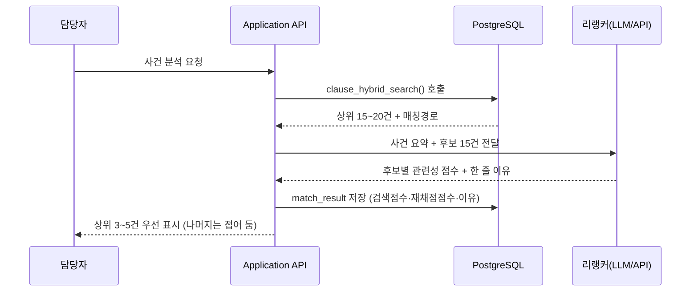

- 리랭킹은 **DB 함수 밖, API 계층**에서 수행 — 외부 호출이 필요하므로 DB 안에 두지 않음
- 결과는 저장본을 보여 주므로, 같은 분석을 다시 열어도 **점수가 바뀌지 않음**(재현성)

### 5.7 이것이 원칙 2를 어기지 않는 이유

- 1.1 원칙 2는 "판단은 데이터베이스가"였는데, 벡터 검색을 넣으면 이 원칙이 흔들리는 것처럼 보임
- 그러나 **벡터 검색은 LLM 생성과 성질이 다름**

| | LLM 생성 | 벡터 검색 | 리랭킹 |
|---|---|---|---|
| 같은 입력, 같은 출력인가 | 아니오(확률적) | **예** — 같은 벡터·같은 인덱스면 같은 결과 | 전용 API는 예 / LLM 방식은 흔들릴 수 있음 |
| 근거를 짚을 수 있는가 | 어려움 | 유사도 수치로 제시 가능 | 점수 + 한 줄 이유 제시 가능 |
| 사후 재현 | 불가 | **가능**(모델·파라미터 고정 시) | **저장본으로 보장** |

- 재현성 확보 조건
  - 임베딩 **모델·버전을 고정**하고 `임베딩모델` 컬럼에 기록
  - 벡터 인덱스는 HNSW 등 근사 방식이므로 **탐색 파라미터를 고정**하고, 분석 결과는 `match_result`에 저장(재계산하지 않고 저장본을 봄)
  - 매칭 경로를 함께 저장 → "이 후보는 의미 검색으로만 나왔다"를 나중에도 확인 가능
  - **리랭킹 결과도 점수·이유·모델명을 저장** → LLM 리랭커를 쓰더라도 화면은 저장본을 보여 주므로 담당자에게는 항상 같은 결과

> 핵심은 "확률적 요소를 아예 쓰지 않는다"가 아니라, **확률적 요소의 출력을 그 자리에서 확정해 저장한다**는 것이다. 판결문이 한 번 쓰이면 바뀌지 않는 것과 같다.

### 5.8 정확도를 어떻게 확인할 것인가 (0단계 평가)

- 하이브리드가 실제로 나은지는 **측정해야 알 수 있다.** 다음 표를 0단계에서 채우는 것이 검증의 실체

| 구성 | 재현율(담당자가 실제 의뢰한 시험을 몇 % 제시했나) | 오탐률(제시했으나 버려진 비율) | 상위 5건 내 정답 포함률 |
|---|---|---|---|
| ① 코드만 | | | |
| ①+② 코드+키워드 | | | |
| ①+②+③ 하이브리드 | | | |
| 하이브리드 + **맥락 결합**(5.2.4) | | | |
| 하이브리드 + 맥락 결합 + **리랭킹**(5.6) | | | |

- 각 행을 하나씩 켜면서 측정 — **한꺼번에 다 켜면 무엇이 효과를 냈는지 알 수 없다**
- 특히 상위 5건 내 정답 포함률이 리랭킹의 효과가 가장 잘 드러나는 지표
  - 리랭킹은 후보를 늘리지 않으므로 재현율은 그대로이고, **순서만 좋아지기 때문**

- 판단 기준
  - 하이브리드가 재현율을 크게 올리면서 오탐률이 감당할 수준이면 채택
  - **오탐이 급증하면 담당자가 목록을 신뢰하지 않게 되므로**, 재현율만 보고 결정하지 않음
- 정답지는 별도로 만들지 않음 — 담당자가 실제로 채택·반려한 기록(`review_log`)이 그대로 정답지가 됨(7.2)

## 6. API 설계

### 6.1 계층 분리

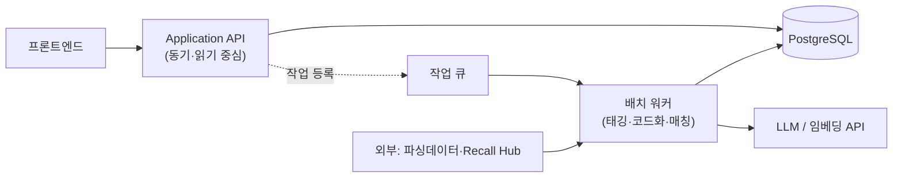

- **동기 처리**: 조회·검색·검수 저장 → 즉시 응답
- **비동기 처리**: 태깅, 사고 코드화, 매칭 실행 → 작업 등록 후 상태 조회(폴링)
  - 이유: LLM 호출은 수 초~수 분이 걸리며, 화면이 그동안 멈춰 있으면 안 됨

### 6.2 엔드포인트 초안

| 구분 | 엔드포인트 | 방식 | 설명 |
|---|---|:--:|---|
| 기준 | `GET /standards`, `GET /clauses/{id}` | 동기 | 조항·시험조건 조회 |
| 태깅 | `POST /tagging/jobs` | 비동기 | 품목 범위 지정 배치 태깅 |
| 태깅 | `GET /tagging/queue`, `PATCH /clause-tags/{id}` | 동기 | 검수 대기열 조회·확정 |
| 사건 | `POST /cases` | 비동기 | 사고보고서 등록 → 자동 코드화 |
| 분석 | `POST /analysis/runs` | 비동기 | 사건 ID로 매칭 실행 |
| 분석 | `GET /analysis/runs/{id}` | 동기 | 시험 후보군 결과 |
| 판단 | `POST /analysis/results/{id}/review` | 동기 | 채택·반려·수정 기록 |
| 집계 | `GET /insights/gaps`, `/insights/underused` | 동기 | 5.3 2차 산출물 |

### 6.3 n8n의 위치(추후 구현)

- 적합: 외부 데이터 수집, 정기 배치 실행, 알림, 기관 간 파일 연동
- 부적합: 사용자 요청을 직접 받는 애플리케이션 API, 트랜잭션이 필요한 저장 로직
- 권고: **n8n은 파이프라인 오케스트레이터로, 매칭·저장 로직은 API 서비스 내부에 둠**
  - 비유: n8n은 공장의 컨베이어벨트다. 컨베이어에 정밀 가공 기계를 얹으면 라인을 멈출 때마다 가공이 어긋난다.
- **현재 결정: n8n은 추후 구현**(0.1-9). 초기 배치는 API 서버 내 워커로 실행

#### 추후 n8n 도입 시 노드 선택 (참고 자료 반영)

| 작업 | 노드 | 이유 |
|---|---|---|
| 테이블·함수 생성(`CREATE TABLE`, `CREATE FUNCTION`) | **Postgres 노드** | Supabase 노드는 스키마 정의(DDL)를 지원하지 않음 |
| 데이터 적재·조회 | Supabase 노드 | UI 기반이라 SQL 없이 다루기 쉬움 |
| **하이브리드 검색 함수 호출** | Supabase 노드(RPC) 또는 HTTP Request | 5.5의 함수를 원격 호출(RPC)하는 방식 |

> 5.5처럼 검색 로직을 DB 함수 안에 넣어 두면, n8n을 도입하든 안 하든 **호출부는 한 줄로 동일**해진다. 로직을 워크플로 안에 흩어 두지 않는 것의 실익이 여기서 나온다.

---

## 7. 저장 전략

### 7.1 세 겹으로 나눈다

| 계층 | 내용 | 원칙 | 사라지면 |
|---|---|---|---|
| **원본층** | 파싱 JSON, 사고보고서 원문, 리콜 원문 | 불변, 덮어쓰기 금지 | 아무것도 재생성 못 함 |
| **파생층** | 태깅, 임베딩, 매칭 결과 | 언제든 재생성 가능 | 시간만 들이면 복구 가능 |
| **판단층** | 검수 결과, 채택·반려, 수정 사유 | 불변 + 이력 누적 | **사람의 판단이 사라짐 — 복구 불가** |

### 7.2 판단층이 핵심 자산인 이유

- 담당자가 시험 후보를 채택·반려한 기록은 세 가지로 재사용됨
  - 컨셉 7장 1단계 확인 사항("담당자가 실제로 채택하는가")의 **측정 데이터 그 자체**
  - 매칭 가중치 조정의 근거
  - LLM 프롬프트 개선 시 평가셋(정답지)
- 따라서 반려 시 **사유를 선택지로 받는 설계**가 필요(예: 관련 없음 / 이미 실시 / 조항 오류 / 우선순위 낮음)
  - 자유 텍스트만 받으면 나중에 집계가 안 됨

> 비유: 병원이 진료기록을 남기는 이유는 그 환자 때문만이 아니다. 기록이 쌓여야 진료 지침을 바꿀 수 있다.

---

## 8. 프론트엔드 — 화면 다섯 개

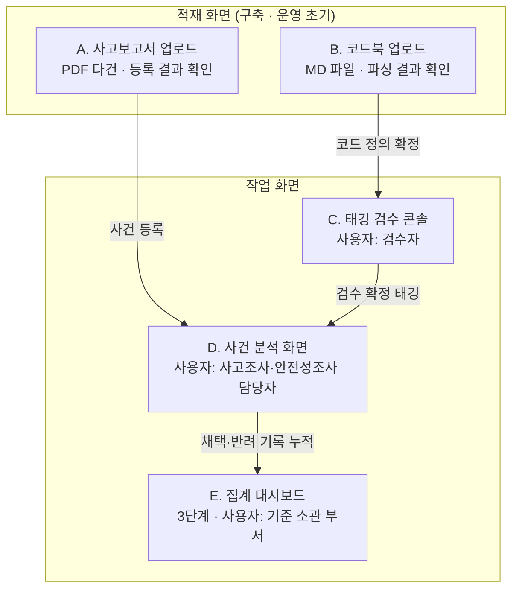

### 8.1 화면 A — 사고보고서 업로드·등록 결과

> 결정 6번(PDF 수기 업로드)에 따라 신설. **0단계에서 가장 먼저 필요한 화면**이다.

#### 화면 흐름

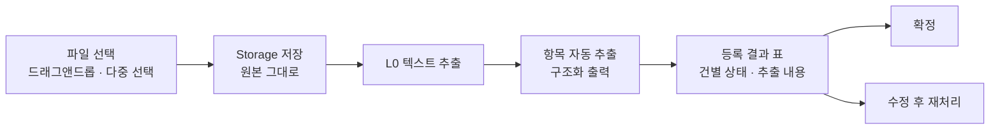

#### 다건 업로드 처리 규칙

| 항목 | 설계 |
|---|---|
| 선택 방식 | 드래그앤드롭 + 파일 선택. 한 번에 수십 건 |
| 처리 방식 | 파일별 독립 작업으로 큐에 등록. **한 건이 실패해도 나머지는 진행** |
| 진행 표시 | 파일별 상태(대기 → 추출 중 → 추출 완료 → 코드화 완료 → 오류) |
| 중복 방지 | 파일 해시로 판별. 같은 파일 재업로드 시 경고 후 사용자가 선택 |
| 실패 처리 | 오류 사유를 건별로 표시(스캔본, 암호 걸림, 텍스트 없음 등) → 해당 건만 재시도 |

#### 등록 결과 화면에 반드시 보여야 할 것

- 파일명 · 페이지 수 · 추출 글자 수(0에 가까우면 스캔본 신호)
- **추출된 원문 미리보기** — L0가 표를 뭉갰는지 담당자가 눈으로 확인
- 자동 추출된 항목(품목, 발생일, 위해 내용 등)과 그 근거 위치
- 부여된 위해요인 코드와 신뢰도 두 가지(5.2.3)
- 건별 확정 버튼. 확정 전에는 분석 대상에 들어가지 않음

#### 선결 과제 — 실물을 보고 표 구조를 정한다

`case_event` 테이블의 컬럼은 **사고보고서 실물을 검토한 뒤에 확정**한다. 지금 문서의 컬럼 목록은 자리표시용이다.

| 확인할 것 | 표 구조에 미치는 영향 |
|---|---|
| 보고서 서식이 통일되어 있는가 | 통일이면 항목별 컬럼, 제각각이면 JSONB 한 칸에 담고 자주 쓰는 항목만 컬럼으로 승격 |
| 한 파일에 사고 여러 건이 담기는가 | 담긴다면 파일과 사건이 1:N. 파일 테이블과 사건 테이블을 분리해야 함 |
| 제품 식별 정보가 어디까지 있는가 | 모델명·인증번호가 있으면 리콜 대조가 쉬워짐. 품목명만 있으면 GPC 매핑을 별도로 붙여야 함 |
| 개인정보가 어디에 박혀 있는가 | 제외 처리 지점을 업로드 전으로 둘지 후로 둘지 갈림 |
| 첨부 사진·도면이 있는가 | Storage 구조와 화면 미리보기 범위가 달라짐 |

> 표 구조를 먼저 그리고 실물을 나중에 보면, 안 쓰는 컬럼과 모자란 컬럼이 동시에 생긴다. 옷을 먼저 짓고 사람을 재는 격이다. **0단계 착수 시 첫 작업으로 사고보고서 5~10건을 함께 읽는 자리를 잡는다.**

### 8.2 화면 B — 위해요인 코드북 업로드·등록 결과

> 코드북(MD 파일)을 올려 코드 정의를 DB에 적재하는 화면. 자세한 구조는 2.4 참조.

#### 화면 요소

| 요소 | 설계 |
|---|---|
| 업로드 | MD 파일 1건 또는 여러 건. **버전명과 시행일을 함께 입력받음** |
| 파싱 결과 | 코드 목록을 표로 표시 — 코드값 · 계위 · 한글명 · 정의 · 예시 |
| 차이 비교 | 이전 버전과 비교해 **신규 · 변경 · 삭제** 코드를 색으로 구분 |
| 영향 범위 | 변경된 코드가 이미 붙어 있는 조항·사건 건수 표시 → 재태깅 대상 규모를 미리 확인 |
| 확정 | 확정 시 새 버전으로 등록. 기존 버전은 남김(덮어쓰지 않음) |

- 파싱 실패 항목은 목록으로 보여 주고, **화면에서 직접 수정 후 재적재**할 수 있게 함
- MD의 표·제목 구조가 코드 계위와 어떻게 대응하는지는 **실물 파일을 보고 확정**(2.4.4)

### 8.3 화면 C — 태깅 검수 콘솔

- 목적: 컨셉 7장이 지목한 **병목(태깅 검수)의 속도를 결정하는 화면**
- 핵심 요소
  - 좌: 조항 본문(근거 스팬 하이라이트) / 우: 제안된 코드 + 두 가지 신뢰도
  - 한 손 조작: 승인은 단축키 1회, 수정은 코드 검색 후 교체
  - 정렬은 반복 일치도가 낮은 순. 자기보고는 높은데 일치도가 낮은 건을 맨 위로(5.2.3)
  - 유사 조항 일괄 승인
- 한 줄 요약(`chunk_summary`)도 같은 화면에서 확인 — 별도 검수 공수가 들지 않음
- 판단 기준: **1건당 처리 시간 × 품목 수 = 전체 일정.** 이 화면의 생산성이 곧 사업 일정

### 8.4 화면 D — 사건 분석 화면

- 입력: 사고보고서 또는 리콜 건 선택
- 출력: 컨셉 5.1·5.2 표를 그대로 화면화
- **"판정하지 않는다"의 UI 번역**

| 컨셉 원칙 | 화면에서의 구현 |
|---|---|
| 위반 판정 금지 | 문구를 "관련될 수 있음 / 확인 권고"로 고정, 적색 경고 아이콘 미사용 |
| 근거 제시 | 각 후보에 조항 원문·시험조건·매칭 경로·재채점 이유를 펼쳐 보기로 제공 |
| HITL 확정 | 채택/반려 버튼이 기본 동작, 아무것도 안 하면 미확정 상태로 남음 |
| 폴백 명시 | 미태깅 품목 결과는 별도 배지로 구분 표시 |
| 누락 방지 | 상위 3~5건 우선 표시, 나머지는 '더 보기'로 항상 열어 둠(5.6.3) |

- 최종 산출: 웹 화면 우선, 시험 의뢰서 초안 내보내기는 후속(결정 8번)

### 8.5 화면 E — 집계 대시보드

- 3단계 산출물(사각지대·국내외 차이·저활용 시험항목)
- 초기에는 데이터가 없어 빈 화면 → **1·2단계에서는 만들지 않되, 데이터 구조만 대비**(컨셉 6장 각주와 동일 판단)

### 8.6 만드는 순서

| 단계 | 만드는 화면 | 구현 방식 |
|---|---|---|
| 0단계 | A(사고보고서 업로드), B(코드북 업로드) 최소형 | Streamlit 등 파이썬 기반 간이 화면. 담당자 확인용 |
| 1단계 | C(검수 콘솔), D(사건 분석) | 정식 웹. GitHub 저장 → Netlify 자동 배포 |
| 3단계 | E(집계 대시보드) | 데이터가 쌓인 뒤 |

- 0단계에서 정식 웹을 만들지 않는 이유: 매칭이 쓸 만한지 검증하기 전에 화면부터 만들면, 검증 결과에 따라 화면을 버리게 됨
- 백엔드는 별도 서버 임대 없이 Netlify Functions 또는 Supabase Edge Functions로 해결 가능

---

## 9. 0단계(개념검증) 최소 구현 범위

| 구분 | 만든다 | 만들지 않는다 |
|---|---|---|
| DB | `clause`(검색 컬럼 포함), `clause_tag`, `case_event`, `case_tag`, `match_result` | 버전관리·권한·감사로그 전체, `recall_cache` |
| LLM | L0(PDF 추출), L1·L2(**Structured Outputs 태깅** — 코드·키워드·한 줄 요약·신뢰도), L3(임베딩), **L3.5 리랭킹** | L4 문장 생성(수동 작성) |
| 검색 | **세 갈래 + 순위 합산 SQL 함수 + 맥락 결합 + 리랭킹** — 5.8 비교표를 채우는 것이 0단계의 목적 | 정교한 가중치 튜닝, 자동 확정 임계값 |
| API | 없음(스크립트 직접 실행) | REST 전체 |
| 코드북 | 독립 Project + 조회 함수 3종(`get_current_version`·`get_codes`·`resolve_code`) | 차이 비교·영향 범위 산정 |
| 프론트 | **A(사고보고서 업로드)·B(코드북 업로드) 간이형** — Streamlit 등 | 검수 콘솔·사건 분석·대시보드 정식 화면 |

> **v0.4~v0.5 변경**: 하이브리드 검색과 리랭킹을 1단계 이후로 미루지 않고 **0단계에 포함**한다. 이유는 5.8의 비교표가 0단계의 핵심 검증 질문이기 때문이다. 나중에 붙이면 "코드만으로 충분했는가"를 영영 알 수 없다.
>
> 다만 **켜는 순서를 지킨다.** 처음부터 전부 켜면 무엇이 효과를 냈는지 알 수 없고, 나중에 비용을 줄일 때 무엇을 꺼도 되는지 판단할 근거가 없어진다.

- 검증 질문(컨셉 7장 0단계 + v0.4 추가)
  - 사고 1~2건의 코드화 결과가 담당자 판단과 일치하는가
  - 도출된 시험 후보가 담당자가 실제로 의뢰했을 항목과 겹치는가
  - **어느 조합이 가장 나은가** — 세 갈래 / 맥락 결합 / 리랭킹을 하나씩 켜며 비교 (5.8)
- 판단 지표: **재현율**(담당자가 실제 의뢰한 시험 중 시스템이 제시한 비율), **오탐률**(제시했으나 버려진 비율)
- 이 숫자가 나오지 않으면 1단계로 넘어갈 근거가 없음

#### 0단계 최소 데이터 규모

| 항목 | 규모 | 비고 |
|---|---|---|
| 품목 | 1종(유아용 의자 부속서 8 + 어린이제품 공통안전기준) | 컨셉 7장 0단계와 동일 |
| 사고보고서 실물 | 5~10건 | **표 구조 확정을 위한 선행 검토**(8.1) |
| 코드북 MD | 1건 | **파싱 규칙·표 구조 확정을 위한 선행 검토**(2.4.4) |
| 조항 | 수십~수백 건 | 태깅·임베딩 비용이 작아 반복 실험 가능 |
| 사건 | 사고 1~2건 + 유사 해외 리콜 몇 건 | 정답지는 담당자 인터뷰로 확보 |

> 이 규모에서는 벡터 인덱스 없이 전체 스캔으로도 충분하다. **인덱스 튜닝은 0단계에서 할 일이 아니다.**

---

## 10. 일반적 설계와 다른 지점 (구분 정리)

> 아래는 이 분야의 통상적 접근과 **다르게 판단한 부분**과 그 근거다.

| # | 통상적 접근 | 본 설계의 선택 | 근거 |
|:--:|---|---|---|
| 1 | 문서 RAG — 질문을 던지면 LLM이 관련 조항을 찾아 답변 | **심볼릭 태깅 + 집합연산.** LLM은 코드 변환만 담당 | RAG는 매번 결과가 달라 행정 처분·기준 개정 근거로 재현성이 부족. 컨셉 5.4의 HITL 원칙은 결정 경로가 결정론적일 때만 실질적으로 성립 |
| 2 | 검색 결과 0건은 버림 | **0건(대응 조항 부재)을 1급 산출물로 저장** | 컨셉 1.3 세 번째 질문·5.3 사각지대 목록이 전적으로 이 데이터에 의존. 초기에 저장하지 않으면 소급 불가 |
| 3 | 모델이 출력한 확률을 신뢰도로 사용 | **동일 입력 반복 호출의 다수결(self-consistency)** | 언어모델의 자기보고 확률은 실제 정확도와 어긋나는 경향(교정 문제). 다수결 방식은 Wang et al., "Self-Consistency Improves Chain of Thought Reasoning in Language Models"(ICLR 2023, arXiv:2203.11171)에서 정확도 향상이 보고됨 |
| 4 | HITL은 품질 확인 절차 | **HITL 기록을 평가셋·가중치 조정 데이터로 재사용** | 능동학습(active learning)의 기본 구조. 검수 순서를 신뢰도 낮은 순으로 두면 같은 인력으로 더 많은 오류를 잡을 수 있음 |
| 5 | "사고 없음 = 안전함"으로 완화 판단 | **생존 편향 경고를 시스템 문구에 내장** | 2차 대전 중 통계학자 에이브러햄 왈드가 귀환한 폭격기의 피탄 부위가 아니라 **돌아오지 못한 기체의 피탄 부위**를 보강해야 한다고 지적한 사례와 동일 구조. 컨셉 1.4가 이미 지적한 문제를 UI·리포트 문구로 강제 |
| 6 | 코드 체계는 시스템별로 최적화 | **Recall Hub 코드 체계를 그대로 재사용** | 컨셉 3.2 원칙. 두 시스템이 다른 코드를 쓰면 교집합 연산 자체가 불가능. 표준의 가치는 정교함이 아니라 공유에서 나옴(전 세계 철도 궤간 통일 사례와 동일) |
| 7 | 하이브리드 검색 = 키워드 + 벡터 **2갈래** | **코드 갈래를 더한 3갈래 융합** | 일반 RAG에는 심볼릭 코드 축이 없지만, 본 체계에는 2차원 위해요인 분류 코드라는 **행정적으로 승인된 축**이 이미 존재. 이 축만이 기준 개선 요인 집계에 쓸 수 있으므로 융합 시 가중 우대 |
| 8 | 임베딩 대상 = 원문 청크 | **조립한 '검색용 텍스트'를 임베딩** | 조항은 계위에서 떨어져 나오면 문맥이 소실됨. 질문(사고 서술)과 같은 층위의 언어로 맞춰야 벡터가 가까워짐 |
| 9 | 청킹 크기를 실험으로 정함 | **조항이 곧 청크** | 표준 문서의 계위가 이미 의미 단위를 정의. 일반 RAG의 최대 난제가 본 사업에서는 발생하지 않음 |
| 10 | 벡터 검색은 비결정적이라 행정에 부적합 | **모델·파라미터 고정 + 결과 저장으로 재현성 확보** | 벡터 검색은 LLM 생성과 달리 같은 입력에 같은 출력을 냄(5.7). 재현 불가의 원인은 벡터가 아니라 생성 |
| 11 | LLM 신뢰도 = 모델이 말한 확률 | **자기보고와 반복 일치도를 분리 저장** | 자기보고 확신도는 실제 정확도와 어긋나기 쉬움. 두 값이 엇갈리는 구간(자신 있다는데 답이 흔들림)이 **가장 위험하며, 검수를 최우선 배치해야 할 지점** |
| 12 | 리랭커는 순위를 재조정하는 부품 | **후보를 새로 만들지 못하도록 구조적으로 제한** | 후보 ID를 enum으로 묶으면, 리랭커가 검색에 없던 조항을 끼워 넣을 수 없음. 근거 없는 시험 항목이 목록에 오르는 것을 원천 차단(5.6.3) |
| 13 | 상위 N건만 보여 주고 나머지는 감춤 | **탈락 후보도 저장하고 '더 보기'로 항상 열어 둠** | 사고조사에서 시험 항목 누락은 되돌릴 수 없는 손실. 시스템이 판단을 대신 내리지 않는다는 컨셉 5.4 원칙의 UI 구현 |

### 특이 관점 하나 더 — 이 시스템의 진짜 산출물

- 표면적 산출물은 시험 후보군이지만, **장기적으로 더 큰 가치는 `review_log`(판단 기록)**
- 지금까지 담당자 개인의 경험에 머물던 판단이 처음으로 **구조화된 데이터로 축적**되는 것
- 컨셉 6장 5번(기준 개선)이 "유일한 정책 환류 경로"인 이유도 여기에 있음
- 비유: 항공 사고 조사에서 블랙박스보다 값진 것은 수십 년치 사고 보고서가 쌓여 만들어진 안전 규정이다.

---

## 11. 기술 의사결정이 필요한 사항

|  #  | 결정 항목                                     | 왜 지금 정해야 하는가                                  | 관련         | 검토의견                           |
| :-: | ----------------------------------------- | --------------------------------------------- | ---------- | ------------------------------ |
|  1  | 파싱 데이터에 **성능요건↔시험방법 연결 정보**가 포함되는가        | 없으면 `clause_link`를 별도 구축해야 하며, 이는 태깅에 준하는 작업량 | 컨셉 8장 1·2번 | 안전기준을 보고 판단해야함!                |
|  2  | 신규 DB를 Recall Hub와 **같은 인스턴스**에 둘 것인가     | 조인 가능 여부가 트랙 B 구현 난이도를 좌우                     | 컨셉 8장 5번   | Supabase에 새로운 Project 생성 형태로   |
|  3  | LLM 호출을 **외부 API vs 내부망 모델** 중 무엇으로 할 것인가 | 사고보고서에 개인정보가 포함될 수 있어 사전 확인 필요                | 신규         | 외부 API                         |
|  4  | 태깅 검수 주체와 **1일 처리 가능 조항 수**               | 전체 일정 산정의 유일한 변수                              | 컨셉 8장 6번   | 우선 LLM이 자동으로 하고, 시간 있으면 검수 진행  |
|  5  | 시험 후보군 **내보내기 형식**(HWP 여부)                | 현업 채택률에 직결                                    | 신규         | 우선, 웹페이지 형태로 구현후, export 기능 추가 |
|  6  | 사고보고서의 **입력 경로**(수기 업로드 vs 관리원 시스템 연동)    | 연동이면 인터페이스 협의가 선행되어야 함                        | 컨셉 8장 3번   | PDF 파일을 수기 업로드(개인정보 제외)        |

### 11.1 하이브리드 검색 관련 결정 항목 (v0.4 신규)

|  #  | 결정 항목 | 왜 지금 정해야 하는가 | 관련 | 권고 |
| :-: | --- | --- | --- | --- |
|  7  | **PGroonga 활성화 가능 여부** | 한국어 키워드 검색의 전제. 불가하면 키워드 갈래를 `keywords[]` 배열 연산만으로 구성해야 함 | 5.3 | Supabase 대시보드에서 활성화 시도 후 판단 |
|  8  | **임베딩 모델 선정과 고정** | 모델을 바꾸면 전량 재생성이 필요하고, 섞이면 검색이 조용히 망가짐 | 5.6 | 초기에 1개 고정, `임베딩모델` 컬럼 기록 필수 |
|  9  | **검색용 텍스트 조립 규칙** | 하이브리드 품질의 8할이 여기서 결정됨 | 5.2 | 0단계에서 2~3개 안을 만들어 5.7 표로 비교 |
| 10  | **융합 가중치(코드 가산 폭)** | 코드를 너무 우대하면 하이브리드를 넣은 의미가 없고, 너무 약하면 근거 없는 후보가 상위에 옴 | 5.4 | 0단계 실측 후 결정, 하드코딩하지 말고 설정값으로 |
| 11  | **국내 리콜 태깅 주체·시점** | 컨셉 v0.4에서 신규로 드러난 대상. 누가 언제 붙이는지 미정 | 3.1 | 협회·관리원 협의 필요 |
| 12  | **사고보고서 PDF의 스캔 여부** | 스캔본이면 OCR 단계가 추가되어 L0 설계가 달라짐 | 0.3 가정3 | 2025년 자료 실물 확인 |

### 11.2 태깅·리랭킹 관련 결정 항목 (v0.5 신규)

|  #  | 결정 항목 | 왜 지금 정해야 하는가 | 관련 | 권고 |
| :-: | --- | --- | --- | --- |
| 13  | **리랭커 방식**(상용 API / LLM / 자체 호스팅) | 외부 데이터 반출 경로가 하나 더 생기는지가 갈림 | 5.6.2 | 초기 LLM 방식(반출 경로 추가 없음), 0단계에서 상용 API와 비교 |
| 14  | **반복 호출 횟수**(반복 일치도 산정용) | 비용이 횟수에 비례. 3회와 5회의 실익 차이를 확인해야 함 | 4.3 | 0단계에서 3회로 시작 |
| 15  | **한 줄 요약의 작성 주체** | LLM 생성분을 그대로 쓸지, 검수 대상에 포함할지 | 5.2.1 | LLM 생성 + 검수 시 함께 확인(별도 공수 없음) |
| 16  | **자동 확정 임계값** | 두 신뢰도가 얼마 이상이면 검수 없이 확정할 것인가 | 5.2.3 | 0단계 실측 전에는 정하지 않음. 초기에는 전건 '미검수' 표시 |
| 17  | **최종 노출 건수와 '더 보기' 정책** | 시험 항목 누락은 치명적이므로 시스템이 임의로 감추면 안 됨 | 5.6.3 | 상위 3~5건 기본 + 전체 펼치기 항상 제공 |

### 11.3 실물 확인이 선행되어야 하는 항목 (v0.6 신규)

|  #  | 결정 항목 | 왜 지금 정해야 하는가 | 관련 | 권고 |
| :-: | --- | --- | --- | --- |
| 18  | **사고보고서 실물 검토 → `case_event` 표 구조 확정** | 서식 통일 여부, 파일당 사건 수, 제품 식별 정보 범위에 따라 표 구조가 달라짐 | 8.1 | 0단계 첫 작업으로 5~10건을 담당자와 함께 읽는 자리 마련 |
| 19  | **코드북 MD 실물 검토 → `codebook` 표 구조 확정** | 계위 단수, 항목 구성, HF·DT 구조 동일 여부에 따라 파싱 규칙과 표가 갈림 | 2.4.4 | 실물 확보 후 파싱 시안 1건 작성 |
| 20  | **코드북을 독립 Project로 분리할 것인가** | Recall Hub 등 다른 시스템이 같은 코드를 참조해야 함. 나중에 분리하면 이용 시스템을 모두 고쳐야 함 | 2.4 | 처음부터 분리 권고. 조회 전용 함수로 공개 |
| 21  | **코드북 조회 함수의 인증 방식** | 외부 시스템이 호출하므로 권한 설계가 필요 | 2.4.3 | 조회 전용 키 발급, 수정 권한은 8.2 화면으로만 |

---

## 12. 용어 풀이 (비전문가용)

> 본문에 나오는 기술 용어를 일상어로 옮긴다. 회의 자리에서 설명이 필요할 때 이 표만 보면 된다.

| 용어 | 한 줄 뜻 | 비유 |
|---|---|---|
| **청크(chunk)** | 문서를 검색하기 좋게 자른 조각 | 책을 장·절 단위로 나눈 것. 본 체계에서는 **조항 하나가 한 조각** |
| **태깅** | 조각에 코드·키워드·요약을 붙이는 일 | 옷에 세탁 라벨 붙이기 |
| **임베딩 / 벡터** | 문장의 뜻을 숫자 목록으로 바꾼 것 | 지도 위의 좌표. 뜻이 비슷하면 좌표가 가깝다 |
| **의미 검색(벡터 검색)** | 좌표가 가까운 조각 찾기 | "넘어짐"으로 검색해도 "전도"가 나옴 |
| **전문검색(FTS) / 희소 벡터** | 단어가 실제로 들어 있는지로 찾기 | 책 뒤의 색인에서 단어 찾기 |
| **BM25** | 전문검색에서 널리 쓰는 점수 계산 방식 | 흔한 단어는 낮게, 드문 단어는 높게 쳐 주는 채점 규칙 |
| **하이브리드 검색** | 의미 검색과 전문검색을 함께 쓰는 것 | 이름과 인상착의를 함께 보고 사람 찾기 |
| **RRF(순위 합산법)** | 여러 검색이 매긴 **등수**를 합산해 최종 순위를 정하는 방법 | 심사위원 세 명의 등수를 합산해 1등을 뽑는 것 (5.4) |
| **리랭킹 / 크로스 인코더** | 후보를 질의와 한 쌍으로 다시 읽어 재채점하는 단계 | 서류 통과자 20명을 면접으로 3명까지 줄이기 (5.6) |
| **Structured Outputs** | LLM 답변의 형식(JSON)을 미리 정해 강제하는 기능 | 백지 대신 정해진 민원 서식을 주는 것 (5.2.2) |
| **JSON Schema** | 그 서식의 항목·타입을 정의한 규격서 | 서식의 칸 이름과 기입 요령 |
| **enum(열거형)** | 고를 수 있는 값을 목록으로 못박는 것 | 객관식 보기. 보기에 없는 답은 못 씀 |
| **자기보고 신뢰도** | LLM이 스스로 매긴 확신도 | 본인 진술 |
| **반복 일치도(self-consistency)** | 같은 질문을 여러 번 물어 답이 얼마나 같았는지 | 같은 문제를 다섯 번 풀렸을 때의 일치율 |
| **맥락 결합(Contextual Retrieval)** | 조각 앞에 상위 문서·위치·분류를 붙여 색인하는 기법 | 사진 뒷면에 "1985년 제주, 가족여행"이라고 적어 두는 것 (5.2.4) |
| **RAG** | 문서를 찾아와 LLM에게 읽히고 답하게 하는 방식 | 참고서를 펴 놓고 시험 보기 |
| **pgvector** | PostgreSQL에서 벡터를 저장·검색하게 해 주는 확장 기능 | 도서관에 좌표 검색대를 설치하는 것 |
| **PGroonga** | 한국어 등 비알파벳 언어의 전문검색을 지원하는 확장 기능 | 한글용 색인 카드 서랍 (5.3) |
| **HNSW** | 벡터를 빠르게 찾기 위한 색인 구조 | 전수 조사 대신 지름길로 가는 길찾기 |
| **RPC** | 데이터베이스에 만들어 둔 함수를 밖에서 호출하는 것 | 내선번호로 담당자를 바로 부르는 것 |
| **DDL / DML** | 표를 만드는 명령 / 자료를 넣고 빼는 명령 | 서류함 제작 / 서류 넣고 꺼내기 (6.3) |
| **재현율(recall)** | 정답 중 시스템이 찾아낸 비율 | 놓치지 않았는가 |
| **정밀도 / 오탐률** | 제시한 것 중 맞은 비율 / 헛다리 비율 | 헛되이 부르지 않았는가 |
| **HITL** | 사람이 최종 확인하는 절차 | 결재란 |

---

## 13. 참고 자료

| 구분 | 자료 | 본 문서에서의 쓰임 |
|---|---|---|
| 내부 | [[00. 컨셉_KC안전기준 기반 제품위해 심층분석 체계_v0.4]] | 무엇을 왜 만드는가 |
| 내부 | [[n8n-Supabase 연동 RAG 구축 - Hybrid Search in Supabase (youtube)]] | 5.4 순위 합산법, 5.5 하이브리드 SQL 함수 구조 |
| 내부 | [[n8n-Supabase 연동 RAG 구축 - 두개 DB tables + postgres 노드]] | 6.3 n8n 노드 선택(스키마 생성은 Postgres 노드, 데이터 조작은 Supabase 노드) |
| 외부 | Supabase 공식 문서 — PGroonga: Multilingual Full Text Search | 5.3 한국어 전문검색 |
| 외부 | Wang et al., Self-Consistency Improves Chain of Thought Reasoning in Language Models (ICLR 2023, arXiv:2203.11171) | 4.3 신뢰도 산정 |
| 외부 | 리랭커 모델 비교 자료(2026) — Cohere Rerank, Voyage rerank-2.5, BGE-reranker-v2-m3, Qwen3-Reranker, jina-reranker-v3 | 5.6.2 구현 기술 후보 |
| 외부 | Anthropic, "Contextual Retrieval in AI Systems" (2024) — 맥락 결합 시 검색 실패율 5.7%→3.7%(약 35% 감소), 키워드 색인까지 적용 시 2.9%(약 49% 감소), 리랭킹 추가 시 1.9%(약 67% 감소) | 5.2.4 맥락 결합, 5.6 리랭킹 |

---

*본 문서는 구현 착수 전 검토용 초안이며, 컨셉 8장 협의 결과에 따라 개정한다.*
