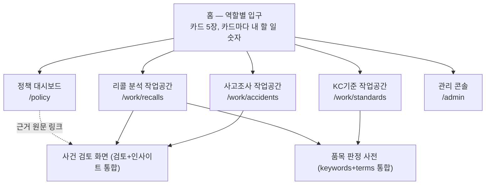

# 05. 이해관계자별 화면 재구성 및 알림 개선 방안

## 0. 한 쪽 요약

담당자 지적은 두 가지였다. 첫째, 화면이 불편하고 중복이 많으며, "검토하는 화면"과 "현황·인사이트를 보는 화면"이 섞여 복잡하다. 둘째, 텔레그램으로 오는 오류 알림 대부분이 진짜 오류가 아니다.

화면 17개의 코드를 전부 읽고 DB 수치를 직접 재 보니 원인은 하나로 모인다. **지금 화면은 "자료 종류별"(안전기준·사고·리콜)로 짜여 있고 "사람별"(누가 무엇을 결정하는가)로 짜여 있지 않다.** 그래서 같은 숫자가 여러 화면에 복사되고, 한 화면에 결정·현황·관리 정보가 함께 실리며, 정작 특정 담당자가 꼭 해야 하는 일은 누를 버튼이 없다.

실측으로 드러난 핵심 사실은 다섯 가지다.

| 사실 | 수치 (2026-10-07) | 뜻 |
|---|---|---|
| 담당자가 조항 후보를 채택·반려한 기록 | **0건** (`review_log`) | 검토 화면이 실제로 쓰이지 않고 있다 |
| 조항 코드 검수 기록 | **0건** (`clause_tag_review`) | KC기준 담당자 검수 화면이 메뉴에 없다 |
| 해외 리콜 중 품목(적용 기준)이 정해진 것 | **40 / 2,399건 (1.7%)** | 화면에서 품목을 정할 버튼이 없다 |
| 해외 리콜 중 국내 유통 여부를 확인한 것 | **0 / 2,399건** | 화면에서 입력할 버튼이 없다 (코드 전체에 갱신 경로 없음) |
| 원문 확인을 7일 넘게 기다리는 사고보고서 | **65 / 71건** | 확인용 미리보기가 420자뿐이다 |

반대로 **정책담당자에게 지금 바로 보여 줄 수 있는 통계는 이미 쌓여 있다.** 해외 리콜 2,399건 전부에 위해요인 코드(8,750개)·국가·월이 있고, 사고 71건에 병행 점검 소견 6,255건이 있다. 그런데 정책용 화면(`/insights`)은 "품목 미확정"이 98%라 거의 빈 표로 보인다 — 쓸 수 있는 자료를 안 쓰고, 아직 없는 자료에 기대고 있다.

텔레그램은 원인을 찾아 **이미 고쳐서 적용했다**(§9). 보낸 알림 151건 중 120건(79%)이 저절로 회복되는 일시적 시간초과였고, 그 과정에서 자동 재시도 기능이 9월 8일부터 한 달간 멈춰 있던 고장도 함께 찾아 고쳤다.

## 1. 지금 화면 지도 — 누가 무엇을 하러 오는가

| 화면 | 주 사용자 (실제) | 하는 일 | 문제 |
|---|---|---|---|
| `/` 개요 | 관리자 | 준비 상태 지표 12개 | 지표 8개가 `/standards`와 같다. 관리자 외에는 할 일이 없다 |
| `/accidents` | 사고조사 담당자 | 올리기·원문 확인·분석 실행 | 기술 지표(뽑아낸 글자 수, 의미 검색 준비)가 줄마다 붙는다. 원문 미리보기 420자 |
| `/accidents/status` | (관리자·정책) | 진척 숫자 | 흐름도와 지표 줄이 같은 숫자를 두 번 보여 준다. 결정할 버튼이 없다 |
| `/recalls` | 리콜 분석자 | 목록·분석 실행 | 국내 유통·품목을 볼 수만 있고 입력할 수 없다 |
| `/recalls/status` | (관리자·정책) | 진척 숫자 | `/accidents/status`와 같은 구조 |
| `/analysis/[id]` 검토 | 사고조사 담당자 | 조항 채택·반려, 병행 점검 판정 | 병행 점검(사건당 평균 88건)이 조항 후보 **위**에 있다. 점수·HyDE·모델명 노출 |
| `/analysis/[id]/insight` | 사고조사 담당자 | 보고서 기재 내용, GPC, 해외 리콜, 병행 점검 근거 | "인사이트"가 아니라 판정 근거다 — 판정 버튼과 다른 화면에 있다 |
| `/standards` | 관리자 | 기준별 준비도 | KC기준 담당자의 진짜 일(검수)은 따로 있다 |
| `/standards/review` | KC기준 담당자 | 조항 코드 확정·반려 | **좌측 메뉴에 없다** — 경고 상자 링크로만 들어간다 |
| `/keywords` | KC기준·리콜 | 일상어→법정 품목, 법정 품목→기준 | `/terms`와 같은 목적(어느 기준을 적용할지)을 나눠 가진다 |
| `/terms` | KC기준·리콜 | 서류 제품명→기준 | 위와 같음 |
| `/codebook` | 모두 (참고) | 코드 목록, 원인 추정표 | 버전 교체 절차(관리자용)가 섞여 있다 |
| `/insights` | 정책담당자 | 사각지대·국내외 대조·시험항목 사용 | 98%가 "품목 미확정" — 지금 쓸 수 있는 통계를 쓰지 않는다 |
| `/ops` | 관리자 | 상태·작업·알림·접속 | 1,249줄. AI 비용 요약이 `/llm`과 겹친다. 코드 부여 버튼(KC기준 담당자 몫)이 들어 있다 |
| `/llm` | 관리자 | AI 사용과 비용 | `/ops`와 부품·요약 중복 |

정책담당자를 위한 화면은 `/insights` 하나, 리콜 분석자가 결정을 내리는 화면은 **0개**다.

## 2. 문제 진단

### 2.1 같은 것이 여러 곳에 있다

| 요소 | 나오는 곳 |
|---|---|
| 「의미 검색 준비」 지표 | 개요, 사고 목록·현황, 리콜 목록·현황, 안전기준, 운영(한 화면에 3번) — 이름도 「뜻 검색 준비」「코드·검색 준비」로 제각각 |
| 머리말 흐름도(PageHead workflow) | `accidents/page.tsx:57-88` = `accidents/status/page.tsx:46-77`, `recalls/page.tsx:54-82` = `recalls/status/page.tsx:43-72` (복사본) |
| 흐름도 숫자 = 지표 줄 숫자 | `accidents/status` 46-77행과 92-120행, `recalls/status` 43-72행과 87-110행 |
| 안전기준 준비 지표 8개 | `page.tsx:130-161` = `standards/page.tsx:271-295` |
| AI 사용 요약 | `ops/page.tsx:1029-1099` = `llm/page.tsx:128-182`, 화면 부품 `Signal`·`Section`·`when`도 두 파일에 복사 |
| 「분석 실행 + 상세보기」 | 사고 목록, 리콜 목록, 사건 상세 |
| 병행 점검 목록 | 같은 파일 안에 미판정 큐(`SecondOpinion.tsx:341-378`)와 소견 목록(`:381-508`) 두 벌 |
| 품목→기준 사전 | `/keywords`(두 가지 표) + `/terms`(한 가지 표) — `resolve-scope.ts`는 셋을 차례로 써서 한 가지 답을 낸다 |

### 2.2 한 화면에 성격이 다른 정보가 섞인다

검토자에게 보이는 관리자용 정보: 검색 점수 4자리, 재채점 모델명, HyDE(AI가 지어낸 검색용 문장), 실행 경로, `SCOPE_UNRESOLVED` 같은 내부 코드, `npm run …` 명령, 뽑아낸 글자 수, 의미 검색 준비 상태.

검토 화면에 들어온 정책용 정보: 병행 점검 큐 안의 「기준 사각지대」(POLICY_SIGNAL). 이것은 사고조사 담당자가 아니라 KC기준·정책담당자가 볼 것이다.

관리 화면에 들어온 업무 정보: `/ops`의 위해요인 코드 부여(비용) 버튼은 KC기준 담당자의 일이다.

### 2.3 있어야 할 것이 없다

- **리콜 국내 유통 확인 입력**: 흐름도는 "사람이 할 일"로 표시하는데(`recalls/page.tsx:76-81`), 저장소 전체에 `domestic_check`을 바꾸는 코드가 없다. 2,399건 전부 미확인인 이유다.
- **품목(적용 기준) 수동 지정**: 화면에는 "품목 등록 후 재실행"이라고 안내하지만(`layout.tsx:272-277`), 품목을 쓰는 곳은 리콜 수집 배치(`lib/recall/load.ts:403`)뿐이다.
- **사건을 가로지르는 "내 할 일" 목록**: 한 건을 끝내도 다음 건으로 가는 길이 없다. 판정한 줄이 흐려질 뿐이다.
- **담당자 식별**: 판정 기록의 검토자가 `'담당자'`로 고정돼 있다(`analysis/[caseId]/actions.ts:42`, `:128`). 사이트 접속도 공용 ID/PW 하나다. 누가 무엇을 판단했는지 남지 않으면 정책 근거로 쓰기 어렵다.
- **사건 상세의 단축키**: 채택·반려 버튼에 단축키 표시는 붙어 있지만 `ReviewShortcuts`가 연결된 곳은 `/keywords`뿐이다.

### 2.4 왜 채택·반려가 0건인가 (가설과 확인 방법)

1. 분석까지 가는 사건 자체가 적다 — 원문 확인 6/71건, 분석 12건. 420자 미리보기로는 표가 뭉개졌는지 판단할 수 없다(`accidents/data.ts:164`).
2. 분석된 사건에서도 첫 화면이 조항 후보가 아니다 — 어린이제품 상자와 병행 점검 큐가 먼저 나온다(`analysis/[caseId]/page.tsx:438`). CLAUDE.md §13 원칙 2("병행 점검은 기본 목록 **아래**")와도 어긋난다.
3. 판정 근거(보고서가 실제로 한 시험)가 다른 화면(인사이트)에 있어 오가야 한다.
4. 할 일 목록·다음 건 이동이 없다.
5. 점수·HyDE 같은 문구가 "아직 시험 단계"라는 인상을 준다.

확인 방법: 병행 점검 판정(`second_opinion_review`) 건수와 조항 판정 건수를 함께 본다. 병행 점검은 판정했는데 조항은 0이면 가설 2·3이 맞다. 고친 뒤 2주간 두 수치가 어떻게 바뀌는지로 효과를 잰다.

## 3. 개선 원칙

1. **사람별로 나눈다.** 화면의 첫 질문은 "무슨 자료인가"가 아니라 "누가 무엇을 결정하러 왔는가"다.
2. **결정하는 화면에는 결정에 필요한 것만 둔다.** 현황·통계는 정책 화면으로, 시스템 상태는 관리 화면으로 보낸다. 기술 정보는 「근거 자세히」 접힘 칸에 넣는다.
3. **판정 근거와 판정 버튼은 한 화면에 둔다.**
4. **한 숫자는 한 곳에만 둔다.** 다른 화면에서는 이상이 있을 때만 경고 한 줄과 링크를 띄운다(예: "검색 준비 안 된 자료 3건 — 관리 화면").
5. **"0의 뜻"을 나눈다**(v0.7 §7.8, `insights/page.tsx:22-26`). 정책 화면의 모든 칸에 분모·덮은 범위·막힌 이유를 함께 적는다. 결론 문장을 자동으로 만들지 않는다.
6. **CLAUDE.md §10·§13을 화면 구조로 지킨다.** 불량(시험항목)과 불법(인증·표시 확인항목)은 표를 갈라 보여 주고, 병행 점검은 확정 태그·기본 검색 결과를 바꾸지 않는다.

## 4. 새 화면 구조

### 4.1 전체 구조

주소(`/work/...` 등)는 제안이다. 기존 주소는 옮긴 뒤에도 새 주소로 넘겨 주는 방식(redirect)으로 남겨, 담당자가 저장해 둔 링크가 깨지지 않게 한다.

### 4.2 사고조사 담당자 작업공간

**내 할 일 목록** (대분류 탭 = 내 품목군):

1. 원문 확인 대기 — PDF 원본과 뽑아낸 글자를 나란히 보는 확인 전용 화면. 420자 미리보기를 없앤다.
2. 분석 실행 대기 — 여러 건을 골라 한꺼번에 실행.
3. 조항 판정 대기 — 사건별 미판정 후보 수.
4. 병행 점검 미판정.

**사건 검토 화면** (지금의 검토·인사이트 두 화면을 하나로):

1. 맨 위: 사건 요약 한 덩어리(제목·품목·적용 기준·코드). 어린이제품 여부는 미확인일 때만 펼친다.
2. 왼쪽 또는 위: 「보고서가 실제로 한 시험」 — 지금은 인사이트 화면에만 있다.
3. 가운데: 기본 조항 후보, 채택·반려·수정. 단축키 연결.
4. 그 **아래**: 병행 점검 — 「시험하지 않은 구간」(불량·시험항목)과 「인증·표시 확인」(불법)을 다른 표로. 「기준 사각지대」는 접어 두고 "KC기준·정책 담당에게 넘어감"으로만 표시.
5. 맨 아래: 「다음 사건 →」.
6. 점수·모델·HyDE·실행 경로는 「근거 자세히」 접힘 칸으로.

### 4.3 리콜 분석자 작업공간

리콜 분석자의 일은 조항 채택이 아니라 **"이 해외 리콜이 국내와 관계있는가"를 가려내는 것**이다. 그런데 지금은 그 판정을 입력할 곳이 없다.

**내 할 일 목록**:

1. 품목 미확정 2,359건 — 줄마다 "품목 고르기"(검색어 사전·GPC 후보를 추천으로 띄움). **새 쓰기 기능이 필요하다.**
2. 국내 유통 확인 2,399건 — 줄 안에서 바로 누르는 버튼 4개(유통됨·유통 안 됨·알 수 없음·확인 취소). **새 쓰기 기능이 필요하다.**
3. 분석 실행 — 품목이 정해진 것만 대상.

국가·위해유형·심각도로 거르는 필터를 둔다(예: "미국 · 사망" 67건만 먼저 보기). 리콜 상세는 지금의 리콜 개요(표+사진)에 위 판정 버튼을 붙인 한 화면이다.

### 4.4 KC기준 담당자 작업공간

**내 할 일 목록**:

1. 조항 코드 검수 — 지금 메뉴에 없는 `/standards/review`를 앞으로 꺼낸다. 단축키 연결.
2. 법정 품목 → 기준 대응 검수 — 지금 `/keywords?view=link`에 숨어 있다.
3. 「적용 기준 없음」으로 확정된 품목 = 새로 적재할 기준 목록.
4. 병행 점검이 올린 기준 사각지대 후보 — 최신 실행 기준 8건.
5. 위해요인 코드 부여(비용 발생) 버튼 — `/ops`에서 옮긴다.

**품목 판정 사전**: `/keywords`와 `/terms`를 하나로 합친다. 줄마다 `서류 표기 → 검색어 → 법정 품목 → 적용 기준 [GPC]` 경로를 보여 주어 "이 제품이 왜 이 기준으로 갔는가"를 한 줄로 따라갈 수 있게 한다. 탭은 ① 충돌·위험 ② 품목→기준 ③ 서류 제품명 ④ 가져오기·내보내기.

`/standards`의 준비도 표는 기준 원문 열람용으로 줄이고, 수치는 관리 콘솔로 옮긴다.

### 4.5 좌측 메뉴

지금(`SideNav.tsx:23-54`)은 "업무 흐름 1·2·3 / 산출물 / 사전·참고 / 시스템"이다. 이것을 다음 네 묶음으로 바꾼다.

- **업무** — 사고조사 · 리콜 분석 · KC기준
- **현황·인사이트** — 정책 대시보드 · KC안전기준 개선 요인(지금의 `/insights`)
- **참고** — 품목 판정 사전 · 위해요인 코드
- **관리** — 관리 콘솔

### 4.6 지금 주소 → 새 자리

| 지금 | 새 자리 |
|---|---|
| `/` 지표 12개 | 홈은 역할별 카드. 지표는 관리 콘솔 |
| `/accidents` | 사고조사 작업공간 |
| `/accidents/status`, `/recalls/status` | 없앤다. 진척은 관리 콘솔, 위해 분포는 정책 대시보드 |
| `/recalls` | 리콜 분석 작업공간 |
| `/analysis/[id]` + `/insight` | 사건 검토 화면 하나 |
| `/standards/review`, `/keywords?view=link` | KC기준 작업공간 |
| `/standards` | KC기준 작업공간의 「기준 원문 보기」 |
| `/keywords` + `/terms` | 품목 판정 사전 |
| `/insights` | 정책 대시보드 아래쪽 「검토가 쌓이면 채워지는 표」 |
| `/ops` + `/llm` + 코드북 버전 교체 | 관리 콘솔 |
| `/codebook` | 참고 (코드 목록·원인 추정표만) |

## 5. 정책담당자 대시보드

정책담당자가 알고 싶은 것은 "어떤 위해가, 어디서, 얼마나 심각하게 나타나고, 국내 기준·제도가 그것을 덮고 있는가"다. 지금 자료로 답할 수 있는 것과 막힌 것을 실측으로 나누었다.

### 5.1 지금 답할 수 있는 질문

| 질문 | 실측 (해외 리콜 2,399건, 2026-01~09) | 주의 |
|---|---|---|
| 어떤 위해가 많은가 | 대표 피해유형: 질식 521 · 감전 412 · 화학 중독 370 · 화재 328 · 기계적 부상 238. 대표 원인: 전기 절연 394 · 작은 부품 269 · 원인 미상 237 | 코드는 AI가 붙이고 일부만 사람이 승인했다 — 화면에 그 비율을 적는다 (**정정 2026-10-07**: 실측해 보니 해외 리콜 대표 피해유형 2,399건은 Recall Hub 관리자가 분류했고 AI 보충은 2건, 대표 원인은 관리자 2,359 · AI 47건이다. 다만 `approved`는 이 체계 담당자의 검토가 아니다 — `/policy`가 그렇게 적는다) |
| 늘고 있는가 | 월별 건수 1~3월 34·18·36 → 4~8월 247·415·522·480·504 → 9월 143 | 건수 변화는 위해가 아니라 **수집량** 변화다. 반드시 월별 **비중**으로 보여 준다 |
| 어느 국가에서 | 독일 370 · 프랑스 368 · 영국 287 · 미국 267 · 중국 184. 영국은 화재 95건, 미국은 사망 67건이 가장 많은 피해유형이다 | 국가별 특징이 뚜렷하다 |
| 불량(시험)과 불법(인증·표시) 비중 | 사고 병행 점검: 시험항목 1,472행 · 인증·표시 확인 39행 (누적, 재실행 중복 포함) | 최신 실행만 세는 뷰가 필요하다 |
| 해외 근거 표준과 국내 기준 | 근거 표준이 적힌 리콜 676건 중 국내 기준과 번호로 이어진 것 93건 (EN 71-1 175건은 번호 체계가 달라 못 이음) | "못 이음"은 "국내 기준 없음"이 아니다 |
| 사각지대 후보 | 병행 점검 기준공백 신호 최신 8건 — "보고서가 적용 기준이 없다고 적음" 7건, "적합 판정인데 실제 피해" 2건(표면 64.9℃, 전열 소자 110.4℃) | 전문가 확인 전에는 "후보"로만 표시 |

(국가·월·품목군·심각도 세부 수치 일부는 서브에이전트 조회값이며, 이 가운데 월별 건수·국가별 상위 피해유형·근거 표준 676건은 직접 재조회로 확인했다.)

### 5.2 지금 막힌 질문 — 무엇이 쌓여야 풀리나

| 질문 | 막힌 이유 | 풀리는 조건 |
|---|---|---|
| 이 위해에 대응하는 국내 조항이 있는가 (사각지대 확정) | 채택·반려 0건, 품목 확정 1.7% | §4.2 사건 검토 화면, §4.3 품목 지정 |
| 국내에 풀린 해외 리콜 제품은 얼마인가 | 국내 유통 확인 0건 | §4.3 국내 유통 버튼 |
| 사고는 늘고 있는가 | 사고 71건 모두 발생일(`occurred_on`)이 비어 있다 | 사고보고서 적재 시 발생일 추출 |
| 행정조치(형사고발·지자체 통보·인증기관 통보·판매중지 요청)·리콜 이행과의 연결 | 그 결과를 담을 칸이 DB에 없다 | 별도 설계 필요 (`docs/wiki/개념/법령제도/` 근거) |

### 5.3 화면 구성

1. 맨 위 **덮은 범위 줄**: "해외 리콜 2,399건 중 원인 코드 100% · 품목 확정 1.7% · 국내 유통 확인 0% · 담당자 검토 0건". 이 줄이 아래 모든 숫자를 어떻게 읽어야 하는지 알려 준다.
2. 위해 분포 — 피해유형·원인을 국가별로 쌓은 막대, 월별 비중 추이.
3. 불량·불법 — 확인 경로 비중, 병행 점검 결과 종류별 건수.
4. 사각지대 후보 — 원문 근거 링크, "전문가 확인 필요" 꼬리표.
5. 기존 `/insights` 세 표 — "검토가 쌓이면 채워지는 표"로 맨 아래.
6. 보고용 내보내기 — 기준일을 박은 표(CSV)로. 결론 문장은 만들지 않는다.

## 6. 관리 콘솔

`/ops`(1,249줄)와 `/llm`을 하나로 모으고 탭 넷으로 나눈다.

1. **상태·알림** — 신호등, 최근 처리, 확인이 필요한 것, 알림 설정, 접속 관리.
2. **자동 작업** — 지금 하기, 자동 작업 목록, 의미 검색 준비 표. "의미 검색 준비"는 이 탭 한 곳에만 둔다.
3. **AI 사용과 비용** — 지금의 `/llm` 전체. 상태 탭에는 이상(실패·단가 없는 모델)이 있을 때만 신호를 띄운다.
4. **적재·코드북** — 코드북 버전 교체 절차, 처음 설치할 때 쓰는 명령(지금은 홈에 있다).

화면 부품 `Signal`·`Section`·`when`은 `src/components`의 공용 부품 하나로 합친다.

## 7. 실행 순서

담당자가 지금 막힌 일부터 푼다. 화면 이사(주소 옮기기)는 마지막이다 — 먼저 이사하면 겉모습만 바뀌고 0건은 그대로다.

| 단계 | 할 일 | 확인 방법 |
|---|---|---|
| **P0 (이번 라운드, 완료)** | 텔레그램 알림 정리, 자동 재시도 복구, `db:push` 줄바꿈 안전장치 | 새 `job_run`에 구간 기록 확인(완료). 2주 뒤 알림 건수·재시도 성공률 재측정 |
| **P1 막힌 입력 열기** | ① 리콜 국내 유통 버튼 ② 품목 수동 지정 ③ 원문 확인 화면(PDF 나란히) ④ `/standards/review`를 메뉴에 | 2주 뒤 국내 유통 확인 건수, 품목 확정률, 원문 확인 대기 65건의 변화 |
| **P2 검토 화면 통합** | 검토+인사이트 한 화면, 병행 점검을 조항 후보 아래로, 기술 정보 접기, 단축키 연결, 「다음 사건」 | `review_log`가 0에서 늘기 시작하는가, 병행 점검 판정 대비 조항 판정 비율 |
| **P3 사람별 작업공간·정책 대시보드** | 역할별 홈, 내 할 일 목록, 정책 대시보드(§5.1 항목부터), 관리 콘솔, 사전 통합, 좌측 메뉴 재편, 옛 주소 넘겨주기 | 화면마다 "같은 숫자가 두 곳 이상에 있는가" 점검표, 담당자 사용 확인 |
| **P4 담당자 식별** | 사람별 계정 또는 판정 시 이름 입력 | 판정 기록에 검토자가 남는가 |

P1·P2는 기존 데이터 구조로 가능하다(`case_event.domestic_check`, `product_scope_id` 칸이 이미 있다). P4는 접속 방식이 바뀌는 일이라 따로 결정이 필요하다.

## 8. 결정이 필요한 것

1. **담당자 식별** — 지금은 공용 ID/PW 하나다. 사람별 계정을 둘지, 판정할 때 이름만 적게 할지.
2. **사전 통합** — `/keywords`와 `/terms`를 정말 하나로 합칠지. 두 사전은 쓰임새(일상어 vs 서류 제품명)가 달라 나눠 둔 것이므로, 합치되 탭으로 갈래를 남기는 안을 권한다.
3. **리콜 분석자의 범위** — 리콜 분석자가 조항 채택까지 하는지, 국내 관련성 가려내기까지만 하는지.
4. **정책 대시보드의 공개 범위** — 내부 전용인지, 일부를 공개 소개페이지(`site/`)에 실을지. 공개 페이지의 해외 리콜 수는 지금 2,342건(기준일 2026-09-09)이고 실측은 2,399건이다.

## 9. 텔레그램 알림 개선 (적용 완료)

### 9.1 무엇이 오고 있었나

알림은 두 곳에서 나간다. 하나는 이 저장소의 DB 감시 함수(`ops_watch()`, 5분마다)이고, 다른 하나는 담당자의 n8n 「Error Trigger」 워크플로(n8n의 다른 워크플로가 실패할 때)다.

DB 쪽 실측 (`ops_alert`, 9월 3일~10월 7일):

| 알림 종류 | 건수 | 판정 |
|---|---|---|
| 정기 작업 실패 | 120 | **소음** — 대부분 저절로 회복된 504·502 |
| 리콜 수집(새 리콜 도착) | 13 | 좋은 소식. 들어온 것이 없으면 원래 보내지 않는다 |
| 원문 확인 대기 N건 | 10 | **소음** — 같은 65건을 3일마다 되풀이 |
| AI 호출 실패 | 6 | 진짜 오류 (9월 14일 연결 오류) |
| 기타 | 2 | 시험 알림 등 |

"정기 작업 실패"의 원인은 리콜 수집 504(배포 서버 30초 제한) 167회, 502 64회, 원천 서버 이상 500 7회였다. 그런데 지난 14일 동안 정기 작업 14,112회 중 **99.5%가 성공**했고, 리콜 수집은 26.7시간마다 전체를 다시 훑기 때문에 실패한 구간도 다음 바퀴에 저절로 채워진다. 사람이 할 일이 없는 알림이었다.

### 9.2 함께 찾은 고장 — 자동 재시도가 한 달간 멈춰 있었다

실패한 구간을 같은 범위로 다시 보내는 자동 재시도(035)는 작업 기록에 남은 구간(`offset=…&limit=…`)이 있어야 돈다. 그런데 9월 8일 `npm run db:push`가 줄바꿈(CRLF/LF)만 다른 옛 파일 025~034를 "내용이 바뀌었다"며 다시 실행했고, 027의 옛 함수가 035의 함수를 덮어썼다. 그 뒤 작업 기록 14,112건 전부 구간이 비어 있었고, 재시도 함수는 864번 돌면서 매번 0건을 보냈다.

지금도 장부에는 CRLF로 적용된 기록 40건이 남아 있어서, 그대로 `db:push`를 돌렸다면 **같은 사고가 또 일어날 뻔했다**(이번에 적용 직전 점검으로 발견). 40건 모두 줄바꿈만 다르고 내용은 같음을 해시로 확인했다.

### 9.3 무엇을 바꿨나

**`supabase/migrations/071_alert_noise_reduction.sql`** (DB에 적용 완료)

- 작업 기록에 구간을 다시 남기도록 되돌렸다 → 자동 재시도 복구. 적용 직후 새 기록에 `offset=2184&limit=3`이 남는 것을 확인했다.
- 정기 작업 알림을 다음 세 경우로만 좁혔다.
  1. 30분 넘게 한 번도 성공하지 못함 — 진짜 장애
  2. 같은 구간이 재시도까지 3번 모두 실패 — 그 자료에 문제가 있을 수 있음
  3. 401·404 같은 설정 오류 — 스스로 낫지 않음
- 원문 확인 대기는 건수가 **늘었을 때** 또는 마지막 알림 뒤 **14일**이 지났을 때만 보낸다.
- 오류 본문의 HTML을 걷어 내고 사람 말로 옮긴다(예: "504" → "응답 시간 초과(배포 서버 30초 제한)", 원천 서버 HTML → "원천 자료 서버 응답 이상").

새 규칙을 지난 14일 기록에 대 보면 옛 규칙은 159번 조건에 걸렸고(쿨다운 덕에 실제 발송 42건), 새 규칙은 **0번**이다. 그 기간에 30분 넘게 막힌 적은 실제로 없었다. 적용 전 트랜잭션 안에서 시험 실행해 문법·문구 변환을 확인하고 되돌린 뒤 적용했다.

**`scripts/db-push.ts`** — 해시를 줄바꿈을 맞춘 뒤 재고, CRLF로 남은 장부 기록도 "적용됨"으로 본다. 이제 `db:push`는 새 파일만 적용한다(이번에 071 한 건만 적용됨을 확인).

**`docs/n8n_Error_Trigger_필터판.json`** — n8n 쪽 오류 알림 개선판(아직 n8n에 넣지 않음).

- 「Error Trigger」와 텔레그램 사이에 「진짜 오류만」 단계를 넣었다. "no items / no data / 가져올 … 없 / 조회 결과 없" 같은 문구는 보내지 않는다.
- HTML을 걷고 300자로 자르며, 멈춘 단계 이름과 실행 링크를 함께 보낸다.
- `parse_mode: HTML`을 뺐다 — 오류 문구에 `<`·`&`가 섞이면 텔레그램이 메시지 자체를 버린다.
- 시험: "No items found", "가져올 데이터가 없습니다"는 걸러지고 "Inactivity Timeout", "401 Unauthorized"는 통과함을 확인했다.
- **n8n에 넣는 방법**: n8n에서 기존 Error Trigger 워크플로를 열고 이 파일을 가져오기(Import from file)한 뒤 저장·활성화한다. 실제로 받고 있는 "가져올 것이 없다" 메시지 문구를 알려 주면 걸러낼 목록을 정확히 맞출 수 있다 — 지금 목록은 흔한 문구를 추정해 넣은 것이다.

### 9.4 남은 일

- 2주 뒤(10월 21일 무렵) `ops_alert` 건수와 재시도 성공률을 다시 잰다.
- 정기 작업 실패를 하루 한 번 요약("어제 2,016회 중 실패 5회, 모두 재시도로 회복")으로 보낼지는 담당자 판단에 맡긴다. 지금은 보내지 않는다 — 알림이 시끄러우면 아무도 읽지 않는다는 023의 원칙을 따랐다.
- 리콜 수집 504 자체를 줄이는 근본 해법(바뀐 자료만 가져오는 증분 수집)은 034에 적힌 대로 아직 남아 있다.
