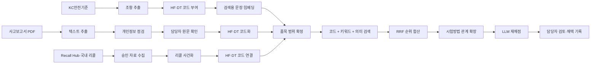
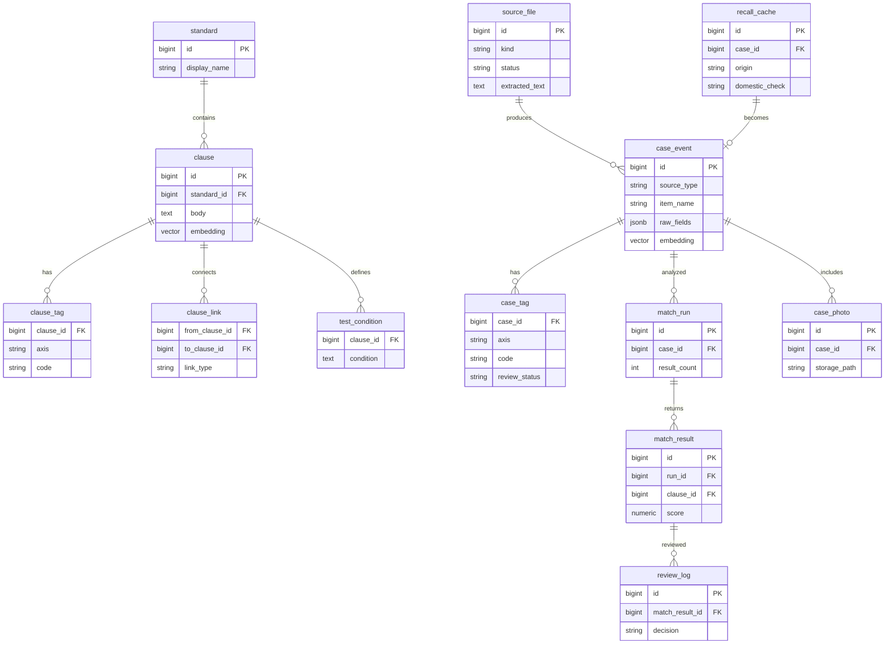

# KC안전기준 기반 제품 위해 심층분석

사고보고서와 리콜정보를 KC안전기준 조항에 연결해, 담당자가 **어떤 기준을 확인해야 하는지와 그 근거가 무엇인지** 빠르게 검토하도록 돕는 관리자용 분석 콘솔입니다.

이 시스템은 위해 여부를 자동 확정하지 않습니다. 원문, 위해요인 코드, 검색 경로, 안전기준 조항, 시험방법을 함께 보여 주고 담당자의 채택·반려 판단을 기록합니다.

> **처음 보신다면 → [전체 프로세스와 용어](docs/전체_프로세스와_용어.md)** — 무엇을 위해 어떤 순서로 도는지, 「검수」·「사전」처럼 여러 뜻으로 쓰이는 말을 하나로 맞춘 문서입니다.
>
> **AI를 어디에 쓰는지 → [AI 사용 관리](docs/AI_사용_관리.md)** — 부르는 자리 열한 곳, 답을 정해진 모양으로 받는 방법(자리별 감사표 포함), 판단 근거를 어디에 남기는지, 비용 보는 법입니다. 실제 사용·비용은 콘솔의 **🤖 AI 사용과 비용**(`/llm`) 화면에서 봅니다.

## 관리자 웹페이지

| 용도 | 주소 |
| --- | --- |
| KC 위해 분석 관리자 콘솔 | [https://kc-regulation-product-hazard-analysis.netlify.app](https://kc-regulation-product-hazard-analysis.netlify.app) |
| 해외 리콜 원본 관리 Recall Hub | [https://recall-hub-admin-dev.vercel.app/recalls](https://recall-hub-admin-dev.vercel.app/recalls) |
| 로컬 개발 서버 | `http://localhost:3000` |

> Recall Hub는 해외 리콜 원본을 승인·분류하는 별도 관리자 시스템입니다. 이 프로젝트는 그 DB와 직접 JOIN하지 않고, 서버 전용 인증으로 승인된 자료를 읽어 내부 `recall_cache`에 저장합니다.

## 한눈에 보는 서비스



## 기능과 서비스 흐름

### 1. KC안전기준 관리

KC안전기준 JSON 원문을 조항 단위로 적재하고, 기준명·조항 번호·본문·적용범위·시험조건을 관리합니다.

1. `KC안전기준/`의 추출 결과 JSON을 읽습니다.
2. 안전기준 문서를 조항으로 나누고, 조항 간 시험방법 연결을 저장합니다.
3. 실제 요건 조항에만 위해요인 코드를 붙입니다. 정의·적용범위·시험방법 자체는 코드 부여 대상에서 제외합니다.
4. 조항의 검색용 문장을 만들고 임베딩을 생성합니다.
5. 사고 또는 리콜 분석에서 품목에 맞는 기준 범위를 먼저 좁힌 뒤 관련 조항을 찾습니다.

주요 화면: [`/standards`](src/app/standards/page.tsx)

### 2. 사고보고서 처리

사고조사보고서 PDF를 사람이 올리고, 원문 확인을 거친 자료만 분석에 사용합니다.

```text
PDF 업로드 → 중복·개인정보 점검 → 텍스트 추출 → 담당자 확인
	   → HF·DT 코드 부여 → 임베딩 준비 → 안전기준 검색·분석
```

- 텍스트 레이어가 없거나 개인정보로 보이는 값이 있으면 AI 처리로 넘기지 않습니다.
- 한 파일에 여러 사고가 있을 수 있어 `source_file`과 `case_event`를 분리합니다.
- 분석 결과는 관련 가능성이 있는 조항과 근거를 제시하며, 법적 위반 판정은 담당자가 합니다.

주요 화면: [`/accidents`](src/app/accidents/page.tsx), [`/analysis/[caseId]`](src/app/analysis/[caseId]/page.tsx)

### 3. 리콜정보 처리

해외 리콜은 Recall Hub에서 승인된 자료를 수집하고, 국내 리콜은 별도 수집 경로로 적재합니다.

```text
Recall Hub 승인 자료 → 서버 수집 → 내부 recall_cache
국내 리콜 자료     → 수집·정제 → 내부 recall_cache
								  ↓
						 case_event로 사건화
								  ↓
					 국내 유통 여부 담당자 확인
								  ↓
						 안전기준 검색·분석
```

- 해외 리콜의 승인 상태와 위해요인 분류 결과를 신뢰하므로 같은 태깅을 중복 실행하지 않습니다.
- 해외 제품이 국내에 유통되었는지는 자동 추정하지 않고 담당자가 확인합니다.
- 원본 상세 주소와 수집 시각을 보존해 출처를 추적할 수 있습니다.

주요 화면: [`/recalls`](src/app/recalls/page.tsx)

### 4. 분석 결과 검토

분석은 다음 순서로 동작합니다.

```text
품목·적용 기준 확정
		↓
HF·DT 코드 매칭 ─┐
한국어 키워드 검색 ├─ RRF(순위 기반 결합) → 후보 조항
임베딩 의미 검색 ─┘                         ↓
							  성능요건 → 시험방법 연결
											 ↓
									  LLM 재채점(선택)
											 ↓
									 담당자 채택·반려
```

검색 결과가 0건이어도 버리지 않습니다. 기준 원문 누락, 코드 태깅 미완료, 시험방법 연결 누락, 실제 관련 조항 없음 등을 구분해 기록합니다.

## 2차원 위해요인 분류 코드의 역할

이 시스템은 위해를 한 줄의 제품 분류로 표현하지 않고, **원인과 피해 결과를 분리한 2차원 코드**로 표현합니다.

| 축 | 의미 | 예시 역할 |
| --- | --- | --- |
| `HF` (Hazard Factor) | 위해가 발생한 원인·위험요인 | 구조 결함, 전기적 위험, 과열 등 |
| `DT` (Damage Type) | 사람·재산에 발생한 피해 유형 | 베임, 화상, 감전, 질식 등 |

코드는 사고·리콜 사건과 KC 조항 양쪽에 같은 형태로 붙습니다. 따라서 “이 사건의 원인·피해와 같은 위해를 예방하는 기준 조항”을 코드 매칭으로 먼저 찾을 수 있습니다.

- `HF`는 원인 근거가 명확할 때 검색 범위를 좁히는 핵심 신호입니다.
- `DT`는 실제 피해 결과를 기준으로 관련 조항 후보를 보완합니다.
- 상위·하위 코드 간 겹침은 부분 일치로 처리해 분류 수준이 달라도 후보를 놓치지 않습니다.
- 원인 코드가 `HF.UNKNOWN`뿐이면 근거 없는 단정을 피하기 위해 폭넓은 후보 또는 수동 검토로 보냅니다.
- 코드에는 코드북 버전, 모델, 신뢰도, 원문 근거 구간, 검토 상태를 함께 저장합니다.

코드북 원문: [`codebook/제품_위해요인_분류체계_정립_PDR_v0_9_7.md`](codebook/제품_위해요인_분류체계_정립_PDR_v0_9_7.md)

## GPC의 역할

GPC(Global Product Classification)는 GS1의 국제 품목분류 체계입니다. 이 프로젝트에서 GPC는 위해요인 코드가 아니라 **제품이 무엇인지와 적용 범위를 맞추는 품목 식별 보조 정보**입니다.

```text
제품명·설명
	↓ 임베딩 후보 조회
GPC 후보 3~15개
	↓ LLM 검증
Brick → Class → Family → Segment 중 적합한 수준 확정
	↓
품목 기준 범위·리콜 품목 비교 보조
```

- 가장 구체적인 `Brick`이 맞으면 Brick을 사용합니다.
- Brick이 불확실하면 Class, Family, Segment 순으로 낮은 수준의 분류를 선택할 수 있습니다.
- 후보 목록에 없는 코드를 새로 만들지 않으며, 맞는 후보가 없으면 `NONE`을 기록합니다.
- GPC의 역할은 품목 범위를 돕는 것이며, GPC만으로 위해 원인이나 KC 적합·부적합을 판정하지 않습니다.
- GPC 검색 색인은 협회의 별도 Supabase 프로젝트를 사용하고, 우리 DB에는 검증된 결과를 저장합니다.

## 주요 DB와 연계도



### DB의 핵심 역할

| 영역 | 주요 테이블 | 하는 일 |
| --- | --- | --- |
| 기준 원문 | `standard`, `clause` | 현행 안전기준과 검색 가능한 조항 저장 |
| 기준 구조 | `clause_link`, `test_condition` | 성능요건과 시험방법·허용치 연결 |
| 기준 코드 | `clause_tag` | 조항의 HF·DT 코드와 검토 상태 저장 |
| 사건 원문 | `source_file`, `case_event` | PDF 원본·추출 텍스트와 사고·리콜 공통 사건 저장 |
| 사건 코드 | `case_tag` | 사건의 HF·DT 코드, 근거 구간, 모델·버전 저장 |
| 리콜 | `recall_cache` | 외부 리콜 자료의 내부 캐시와 국내 유통 확인 저장 |
| 분석 이력 | `match_run`, `match_result`, `review_log` | 검색 실행, 후보 점수, 담당자 채택·반려 이력 저장 |
| 비동기 처리 | `embed_queue`, `job_run`, `ops_alert` | 임베딩·수집 작업과 실패 상태 관리 |
| 코드 정의 | `codebook.hazard_factor`, `codebook.damage_type` | 위해요인·피해유형 코드의 정의를 판(version)별로 저장 |
| 코드 연결 | `codebook.cause_bridge`, `codebook.hf_route` | 피해유형 → 원인 후보 대응과, 원인별 확인 경로(시험/법령) 저장 |
| 품목 사전 | `item_keyword`, `item_keyword_stopword` | 일상어 → 법정 품목. 담당자가 만든 것과 AI 제안을 출처로 구분해 저장 |
| 품목 연결 | `product_taxonomy`, `taxonomy_standard` | 법정 품목 ↔ GPC 대응(협회 원본)과, 법정 품목 → KC기준 대응 저장 |

DB는 두 스키마로 나뉩니다. `codebook`은 코드의 정의를 판별로 관리하고, `public`은 기준 원문·사건·분석 이력을 담습니다. 각 표가 무엇을 담고 왜 그렇게 생겼는지는 별도 문서에 있습니다.

**→ [스키마 구조 상세](docs/스키마.md)**

## 사전을 다른 시스템에 넘기기

두 사전은 CSV로 내려받을 수 있고, 사람이 화면에서 누르는 것과 같은 주소를 다른 시스템이 그대로 불러도 됩니다. **검수 상태(확정·미검수·반려)가 칸으로 함께 나가므로**, 받는 쪽에서 확정된 것만 골라 쓸 수 있습니다.

| 사전 | 주소 | 담는 것 |
| --- | --- | --- |
| 품목 용어 사전 | `GET /api/terms/export` | 품목명 · 적용기준 · GPC · 출처 · 검수상태 · 근거 |
| 품목 검색어 사전 | `GET /api/keywords/export` | 품목군 · 품목 · 세부품목 · 검색어 · 출처 · 검수상태 · 확신도 · 근거 |
| 검색 제외어 | `GET /api/keywords/stopwords` | 제외어 · 출처 (검색어 사전과 **반드시 함께** 씁니다) |

인증은 사이트 접속과 같은 계정(HTTP Basic)을 씁니다. 별도의 API 키는 두지 않았습니다 — 읽기 전용이고 받는 쪽이 협회 내부 시스템이기 때문입니다.

```bash
curl -u "<아이디>:<비밀번호>" https://kc-regulation-product-hazard-analysis.netlify.app/api/terms/export
```

- 파일은 UTF-8 BOM이 붙은 CSV라 엑셀에서 한글이 깨지지 않습니다.
- 반려된 항목까지 모두 나갑니다. "왜 이건 반려했더라"를 되짚을 수 있어야 하기 때문입니다.
- **계정은 대화·메일·저장소에 남기지 말고 안전한 경로로 전달하세요.** 이 계정은 읽기 전용이 아니라 사이트 전체를 여는 열쇠입니다.

> **받는 쪽에 함께 알려야 할 것** — 이 시스템은 검색어를 쓸 때 네 조건을 함께 겁니다. **정확 일치만 · 여러 품목에 걸친 말은 제외 · 확정된 것만 · 제외어 제외.** 검색어 사전만 받아 이 규칙 없이 쓰면 우리보다 넓게 매칭되어 엉뚱한 품목이 걸립니다. 그래서 제외어도 함께 내려받을 수 있게 두었습니다.

내보내는 사전이 담긴 표와, 아직 API가 없는 나머지 표는 [전체 프로세스와 용어 §4](docs/전체_프로세스와_용어.md)에 정리해 두었습니다.

## 하이브리드 검색과 임베딩

### Hybrid search

세 검색 결과를 한 번에 DB 함수에서 계산합니다.

1. **코드 검색**: HF·DT가 일치하는 조항. 근거와 통계 집계에 가장 강합니다.
2. **키워드 검색**: 한국어 원문·검색어를 PGroonga로 찾습니다.
3. **의미 검색**: 임베딩 벡터로 표현이 달라도 의미가 가까운 조항을 찾습니다.

각 검색 갈래의 점수 단위가 다르므로 원점수를 단순 합산하지 않고, 등수를 `1 / (k + 등수)`로 바꾸는 RRF(Reciprocal Rank Fusion)로 합칩니다. 코드가 일치하면 추가 가중치를 주되, 가중치는 환경변수로 조정할 수 있습니다.

구현: [`src/lib/search/match.ts`](src/lib/search/match.ts), [`007_clause_hybrid_search.sql`](supabase/migrations/007_clause_hybrid_search.sql)

### Embedding

임베딩은 문장을 숫자 벡터로 바꿔 “표현은 다르지만 의미가 가까운 문장”을 찾는 재료입니다.

- KC 조항과 사고·리콜 사건을 각각 검색용 텍스트로 조립합니다.
- 기본 조항 임베딩 모델은 `text-embedding-3-large`, 저장 차원은 `1536`입니다.
- GPC 외부 색인은 색인을 만들 때 사용한 `text-embedding-3-small`과 동일한 모델을 사용합니다.
- 새 자료는 `embed_queue`를 통해 백그라운드로 준비하고, 준비 전에는 의미 검색 미완료 상태로 표시합니다.

구현: [`src/lib/env.ts`](src/lib/env.ts), [`src/lib/search/run.ts`](src/lib/search/run.ts)

## 폴더 구조와 주요 코드

```text
.
├─ src/app/                 관리자 화면과 서버 액션
│  ├─ page.tsx              전체 준비 상태 개요
│  ├─ standards/            KC안전기준 조회·상태
│  ├─ accidents/            사고보고서 업로드·확정
│  ├─ recalls/              리콜 수집 결과·국내 유통 확인
│  ├─ analysis/[caseId]/    사건별 분석·검토
│  ├─ codebook/             위해요인 코드북 조회
│  ├─ llm/                  🤖 AI 사용과 비용 — 부르는 자리·모델·단가·추이
│  └─ ops/                  작업·임베딩·오류 운영 화면
├─ src/components/          공통 상태바·목록·패널·입력 UI
├─ src/lib/
│  ├─ cases/                PDF 추출, 품목·적용 기준 확정
│  ├─ recall/               Recall Hub 수집·리콜 정제·연계
│  ├─ standards/            기준 적재·조항 역할·태깅
│  ├─ search/               하이브리드 검색·결과 저장
│  ├─ gpc/                  GPC 후보 조회·계층 검증
│  ├─ llm/                  태깅·리랭킹·사진 분석·호출 기록·단가
│  └─ supabase/              서버 전용 Storage 접근
├─ scripts/                 적재·태깅·임베딩·수집 CLI
├─ supabase/migrations/     번호순 DB 스키마·함수·권한 변경
├─ codebook/                HF·DT 코드북 원문·적재 도구
├─ KC안전기준/              KC 기준 추출 JSON 원문
├─ 사고조사보고서/           사고보고서 원본 자료
└─ docs/                    설계문서·운영 워크플로·평가자료
```

주요 처리 진입점은 [`src/lib/search/run.ts`](src/lib/search/run.ts)의 분석 실행, [`src/lib/cases/extract-pdf.ts`](src/lib/cases/extract-pdf.ts)의 PDF 추출, [`src/lib/recall/load.ts`](src/lib/recall/load.ts)의 리콜 적재, [`src/lib/gpc/assign.ts`](src/lib/gpc/assign.ts)의 GPC 부여입니다.

## 사용 기술

| 기술 | 사용 목적 |
| --- | --- |
| Next.js 15 · React 19 · TypeScript | 관리자 웹페이지와 서버 액션 |
| Supabase · PostgreSQL | 핵심 데이터베이스, Storage, pgvector, PGroonga |
| `postgres` | 서버 전용 SQL·대량 적재·하이브리드 검색 함수 호출 |
| OpenAI | HF·DT 구조화 태깅, 임베딩, 후보 리랭킹, 사고사진 분석 |
| `unpdf` · `sharp` | PDF 텍스트 추출과 이미지 처리 |
| `zod` | 외부 자료·구조화 응답 검증 |
| Netlify | 관리자 콘솔 배포 |

## 시작하기

```bash
npm install
copy .env.example .env.local
npm run dev
```

`.env.local`에는 `DATABASE_URL`, `OPENAI_API_KEY`, `RECALL_SOURCE_SUPABASE_URL`, `RECALL_SOURCE_SUPABASE_SECRET_KEY`, `GPC_LOOKUP_ANON_KEY` 등을 설정합니다. 실제 키와 개인정보가 포함된 원본은 커밋하지 않습니다.

초기 데이터 준비 명령은 다음 순서로 실행합니다.

```bash
npm run db:push
npm run codebook:load -- --activate
npm run standards:load
npm run tag
npm run embed
```

리콜 수집과 운영 작업은 환경변수와 외부 시스템 권한을 확인한 뒤 실행합니다.

```bash
npm run recalls:fetch
npm run recalls:analyze
npm run embed:status
npm run typecheck
```

## 운영 원칙

- 시스템은 관련 가능성이 있는 기준을 제시하며 KC 적합·부적합을 자동 판정하지 않습니다.
- 담당자가 원문을 확인하고 채택·반려한 이력을 남겨야 분석 결과를 근거로 사용할 수 있습니다.
- 코드·검색·임베딩의 버전과 모델을 기록해 같은 결과를 다시 설명할 수 있게 합니다.
- `0건`은 “기준이 없다”가 아니라 데이터 준비 상태를 먼저 확인해야 하는 결과일 수 있습니다.