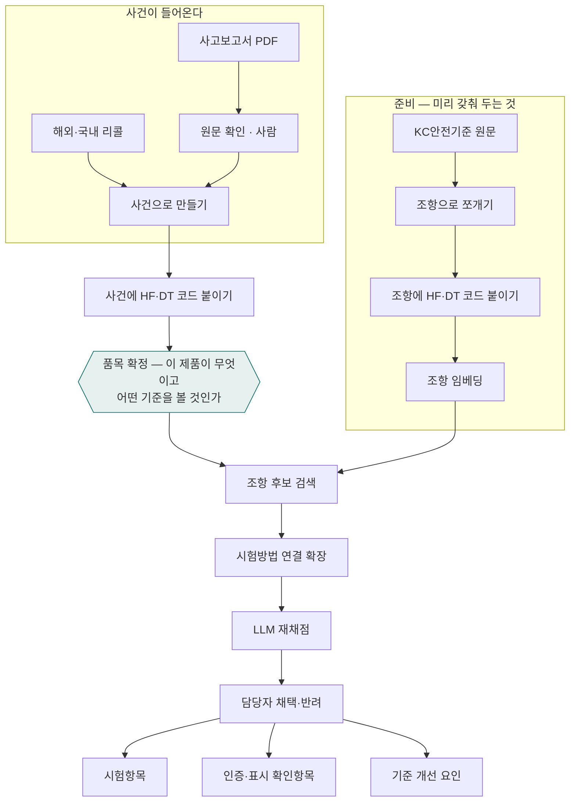
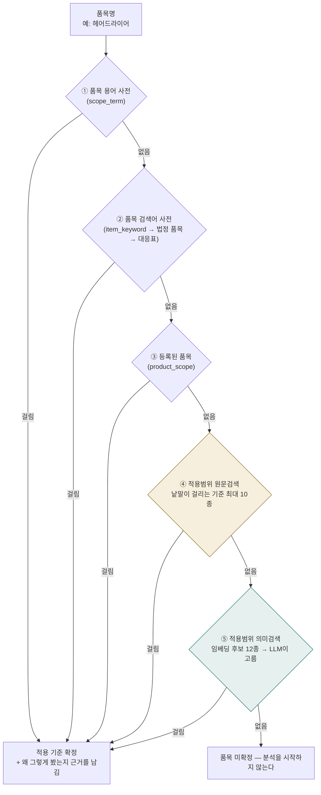

# 전체 프로세스와 용어

이 문서는 두 가지를 위해 있다. 하나는 **이 시스템이 무엇을 위해 어떤 순서로 돌아가는지**를 코드를 읽지 않고 이해하는 것이고, 다른 하나는 **같은 것을 서로 다른 이름으로 부르지 않도록 말을 맞추는 것**이다. 「검수」라는 한 낱말이 다섯 군데에서 서로 다른 뜻으로 쓰이고 있었고, 「사전」이라 부르는 것이 셋이라 대화가 자주 어긋났다.

## 0. 이 문서의 출처

여기 적은 낱말과 수치가 어디서 왔는지 밝힌다. 뜻이 흔들릴 때 이 표를 따라 원자료로 되짚는다.

| 무엇 | 어디서 왔나 |
| --- | --- |
| 목적·두 트랙·산출물 3종 | `00. 컨셉_KC안전기준 기반 제품위해 심층분석 체계_v0.4.md` (관계기관 협의용 기획 문서) |
| 처리 순서·품목 확정 다섯 갈래·검색 두 단계 | `01_사전분석_구현설계_..._v0.6.md`, `01_보완_...v0.7`. 버전이 엇갈리는 지점은 CLAUDE.md §6 규칙대로 실측으로 판정한다 |
| 불량과 불법의 구분 | `docs/raw/제품안전법제도/★★★★업무이해 20230405.xlsx`(담당자 작성)와 CLAUDE.md §10 |
| 어린이제품 관련 규칙 | `docs/wiki/개념/법령제도/` 아래 고시 정리 문서 넷. 각 문서 머리에 고시 번호와 행정규칙일련번호가 있다 |
| 품목분류(GPC·K-GPC) | `docs/wiki/개념/GPC/표준제품분류체계_K-GPC.md`. 그 문서 §0에 출처표가 따로 있다 |
| 제13조 보고 의무 | `docs/wiki/개념/법령제도/해외리콜_국내유통_확인.md` — 법령 원문 인용 |
| 표 이름·행수·검수 대기 건수 등 모든 숫자 | 우리 DB 실측. 잰 날짜를 함께 적는다 — 검수가 진행되면 달라진다 |

## 1. 무엇을 위해 만드는가

**목적** — 사고보고서와 해외 리콜을 받았을 때, 담당자가 **「이 제품의 어떤 KC안전기준 조항을 확인해야 하는가」와 「그 근거가 무엇인가」**를 빠르게 검토할 수 있게 한다.

**하지 않는 것** — 위해 여부를 자동으로 판정하지 않는다. 「이 제품은 부적합」이라고 말하지 않는다. 시스템은 후보와 근거를 제시하고, 판단과 그 기록은 사람이 한다. 이 경계는 취향이 아니라 설계 제약이다 — 시스템이 판정하는 것처럼 보이는 순간 담당자가 그것을 근거로 행정 조치를 하게 되고, 틀리면 되돌릴 수 없다.

**결과물 셋**

| 결과물 | 무엇인가 | 어디서 보나 |
| --- | --- | --- |
| 시험항목 후보 | 이 사건과 관련될 수 있는 기준 조항과 그 시험방법·허용치 | `/analysis/[caseId]` |
| 인증·표시 확인항목 | 시험이 아니라 법령을 보면 판정되는 것(인증·표시 의무 위반) | 원인 다리 CSV |
| 기준 개선 요인 | 사고·리콜은 있는데 대응할 조항이 없는 자리(사각지대), 국내외 기준 대조 | `/insights` |

세 번째가 중요한 이유는 앞의 둘과 방향이 반대이기 때문이다. 앞의 둘은 「가진 기준으로 이 사건을 본다」이고, 세 번째는 「이 사건들이 우리 기준에 없는 것을 가리킨다」이다.

## 2. 불량과 불법을 먼저 가른다

이 갈림이 산출물을 나누므로 제일 앞에 둔다.

| | 불량 | 불법 |
| --- | --- | --- |
| 무엇 | 안전기준의 기능·성능에 불합격 | 법령이 정한 의무 위반(인증·표시·부품변경 재인증 등) |
| 어떻게 아나 | **시험을 해야 안다** | **법령을 보면 판정된다** |
| 산출물 | 시험항목 | 인증·표시 확인항목 |

표시사항이 KC안전기준 문서 **안에** 적혀 있더라도, 그것을 지키지 않은 것은 표시 의무 위반이므로 **불법**이다. 시험항목으로 내보내지 않는다. 조항 쪽은 `clause_role`이 `REQUIREMENT`(불량)와 `MARKING`(불법)으로 이미 나뉘어 있다.

## 3. 전체 순서



**품목 확정(B2)이 이 그림의 목이다.** 여기서 품목이 정해지지 않으면 뒤가 시작되지 않는다. 위해요인 코드가 같아도 제품이 다르면 봐야 할 시험이 다르기 때문이다 — 유아용 의자 사고에 전기다리미 조항이 섞이면 안 된다. 그래서 품목을 못 정하면 전 품목을 뒤지는 대신 **멈춘다.**

### 화면이 각각 어느 걸음을 맡는가

위 그림의 걸음을 사람이 만나는 자리는 화면이다. 어느 화면이 어느 걸음을 맡는지 흩어져 있어서, 담당자가 「지금 내가 할 일이 어느 화면에 있는지」를 찾지 못하는 일이 있었다(2026-09-09 지적). 그래서 화면마다 머리에 그 화면이 맡은 걸음을 순서도로 띄우기로 했다. **이 표가 그 순서도의 원본이다 — 화면과 이 문서가 어긋나면 이 문서를 먼저 고치고 화면을 맞춘다.**

| 화면 | 맡는 걸음 | 사람이 하는 일 | 사람이 안 하면 |
| --- | --- | --- | --- |
| `/` 개요 | 전체 | 없음(보기만) | — |
| `/standards` 안전기준 | 준비 S1~S4 | 기준 문서를 넣으라고 명령 | 분석할 기준이 없다 |
| `/standards/review` 코드 검수 | 준비 S3 뒤 | 조항에 붙은 HF·DT 코드 확인 | 근거등급 A가 안 나오고 「확정분만 사용」을 못 켠다 |
| `/terms` 품목 용어 사전 | 품목 확정 ① | 사전 검수 | ⑤(AI 호출)로 매번 다시 푼다 |
| `/keywords` 품목 검색어 사전 | 품목 확정 ② | 사전 검수 | 리콜에서 기준까지 가는 다리가 끊긴다 |
| `/accidents` 사고보고서 | 들어옴 A1·A2 | 올리기, 원문 확인 | 원문 확인 전에는 분석이 시작되지 않는다 |
| `/recalls` 리콜 | 들어옴 R1 | 분석 실행, 국내 유통 확인 | 제13조 보고 의무 판단이 밀린다 |
| `/analysis/[caseId]` 분석 | C1~D1 | 조항 채택·반려 | 산출물이 만들어지지 않는다 |
| `/codebook` 위해요인 코드 | 코드 뜻 | 없음(조회 전용) | — |
| `/insights` 통찰 | E3 | 사각지대 확인 | — |
| `/ops` 운영 · `/llm` AI 사용 | 전 구간 감시 | 문제 확인 | 막힌 것을 모른 채 지나간다 |

**사람이 반드시 손을 대야 통과하는 걸음은 넷이다** — 원문 확인 · 사전 검수 · 코드 검수 · 결과 판단. 나머지는 기다리면 된다. 화면 순서도에서 「사람」 표가 붙은 상자가 이 넷이고, 표가 없는 상자는 자동이다.

## 3.2 대분류와 인증구분 — 축이 둘이다

담당자 지적으로 2026-09-09에 정리한 것이다. "전기용품·생활용품·어린이제품과 안전확인·안전인증·공급자적합성확인·안전기준준수·안전성검사(폐배터리)는 별개의 결이다."

| | 대분류 (`standard.item_group`) | 인증구분 (`standard.cert_types`) |
| --- | --- | --- |
| 무엇을 나누나 | 어느 법의 어느 품목군인가 | 팔기 전에 무엇을 거쳐야 하는가 |
| 값 | 전기용품 · 생활용품 · 어린이제품 · 기타 | 안전인증 · 안전확인 · 공급자적합성확인 · 안전기준준수 · 안전성검사 |
| 무엇에 붙나 | 기준 하나에 하나 | 품목에 붙는다 — 기준 하나가 여러 구분에 걸린다 |
| 쓰는 곳 | 목록을 나누고 정렬한다 | 그 품목이 어떤 절차를 거쳤어야 하는가를 본다 |

**둘은 서로를 결정하지 않는다.** 같은 전기용품 안에도 안전인증 품목과 공급자적합성확인 품목이 함께 있다. 예를 들어 KC 62368-1 하나가 안전인증 품목(오디오·비디오 응용기기 일부)과 공급자적합성확인 품목에 함께 걸린다.

058 이전에는 `standard.cert_scheme` 한 칸에 이 둘이 섞여 있었다. 파일명에서 뽑는 칸이라 「안전확인 부속서 6(완구)」에서는 인증구분이, 「KC 60335-2-15」처럼 번호뿐인 파일에서는 대분류가 들어갔다. 축이 다른 값이 한 칸에 있으니 어느 쪽으로도 정렬하거나 셀 수 없었다. 지금 `cert_scheme`은 「파일명이 무엇이라고 했는지」의 기록으로만 남기고, 판단에는 쓰지 않는다.

근거 자료는 `docs/raw/제품안전법제도/안전기준목록조사 취합(전기 생활 어린이).xlsx`를 옮겨 놓은 `product_taxonomy`다. 두 축이 이미 따로 들어 있다.

**실측 (2026-09-09)** — 기준 76종의 대분류는 전기용품 43 · 생활용품 17 · 어린이제품 16 · 기타 0이다. 근거는 품목표 대응 53건, 인증구분에서 추정 21건, 이름에서 추정 2건이다. 인증구분은 21종이 미상인데, 모두 품목표 대응이 없는 전기용품 계열이다 — 대응을 채우면 함께 채워진다.

**사건(사고보고서·리콜)에도 대분류를 붙인다(059).** 사건 자체에는 대분류가 없고 서류에 적힌 제품 이름만 있으므로, 그 이름을 품목 용어 사전으로 옮겨 기준을 얻고 기준의 대분류를 가져온다(`case_event_group` 뷰). 사고보고서 71건 중 55건(77%), 해외 리콜 2,338건 중 765건(33%)이 이렇게 채워진다. 나머지는 아직 사전에 없는 이름이라 화면에서 「기타」로 둔다 — **사전이 자라면 이 숫자도 함께 자란다.** `product_scope.category`를 쓰지 않는 이유는 그 칸이 2,342건 중 48건에만 있어서, 그것으로 나누면 목록의 98%가 「기타」가 되기 때문이다.

## 4. 품목 확정 — 다섯 갈래를 순서대로 시도한다

「안전 조끼」, 「토끼 나무 기차」처럼 사람이 적은 일상어를 받아 **어느 KC기준을 볼지** 정하는 일이다. 값이 싸고 확실한 것부터 시도하고, 걸리면 거기서 멈춘다.



| 갈래 | 무엇으로 잇나 | AI를 부르나 | 리콜 2,299건에서 |
| --- | --- | --- | --- |
| ① 품목 용어 사전 | 품목명이 사전에 그대로 있음 | 아니오 | 358건 |
| ② 품목 검색어 사전 | 일상어 → 법정 품목 → 기준 대응표 | 아니오 | 6건 |
| ③ 등록된 품목 | 등록해 둔 품목 이름·별칭 | 아니오 | 40건 |
| ④ 적용범위 원문검색 | 낱말이 적용범위 원문에 나오는 기준 | 아니오 | **1,406건** |
| ⑤ 적용범위 의미검색 | 뜻이 가까운 후보 12종 중 LLM이 하나 고름 | **예** | 12건 |
| — | 어느 것도 못 찾음 | — | 477건 |

①②③은 **사람이 한 번 정해 둔 지식**을 꺼내 쓰는 것이라 싸고, 같은 품목에 늘 같은 답이 나온다. ⑤는 매번 AI를 부르므로 비싸고, 모델이 흔들리면 답도 흔들린다. 그래서 ⑤로 찾아낸 것은 사전에 **미검수로 저장해 두고**, 담당자가 확인하면 다음부터는 ①에서 공짜로 걸린다. **사전을 채우는 일이 곧 AI 호출을 줄이는 일이다.**

> **여기에는 하이브리드 검색도 HyDE도 쓰지 않는다.** 그 둘은 품목이 정해진 **뒤** 조항을 찾을 때 쓰는 장치다. 왜 여기서는 안 쓰는지는 [5장](#5-검색이-두-군데에서-일어난다--여기가-가장-헷갈리는-자리)에 있다. 이 장에서 임베딩이 쓰이는 곳은 ⑤ 하나뿐이고, 그것도 후보를 좁히는 데만 쓰고 고르는 일은 LLM이 한다.

### 각 사전이 어디서 왔는가

무엇을 믿고 쓸 수 있는지가 출처에 달려 있으므로 함께 적는다. 협회·담당자가 준 것은 근거가 확실하고, AI가 만든 것은 검수를 거쳐야 한다.

| 갈래·사전 | 표 | 원본 출처 | 적재 방법 | 처음 상태 |
| --- | --- | --- | --- | --- |
| ① 품목 용어 사전 | `scope_term` | 담당자 엑셀 「사고조사 건별 결함조사 항목」 — 실제 사고를 조사하며 정한 "이 품목엔 이 기준" | `npm run scopes:seed-terms` | **확정**(사람이 정한 것) |
| ① 〃 (AI가 보탠 것) | `scope_term` | ⑤ 의미검색이 찾아낸 결과를 그대로 쌓음 | 분석 중 자동 | 미검수 |
| ② 품목 검색어 사전 | `item_keyword` | 담당자 엑셀 「일일동향보고 검색용 데이터」 1,039개 — 뉴스를 훑을 때 실제로 쓰는 검색 그물 | `npm run keywords:load` | **확정** |
| ② 〃 (AI가 보탠 것) | `item_keyword` | 법정 품목을 일상에서 뭐라 부르는지 LLM이 지어냄 4,943개 | `npm run alias:build` | 미검수 |
| ②의 법정 품목표 | `product_taxonomy` | 협회 「품목별 세분류 매칭 DB」 2,148행 (법정 품목 ↔ GPC) | `npm run taxonomy:load` | 원본(검수 대상 아님) |
| ②의 기준 대응표 | `taxonomy_standard` | 적용범위·제목을 임베딩해 좁힌 뒤 LLM이 고름 502건 | `npm run taxonomy:link` | 미검수 |
| ③ 등록된 품목 | `product_scope` | 어린이제품 부속서에서 품목명을 직접 뽑아 등록 | `npm run scopes:seed` | 원본 |
| ④의 적용범위 원문 | `standard.scope_text` | KC안전기준 원문의 「적용범위」 조항 본문 | `npm run scopes:seed` | 원본 |
| ⑤의 적용범위 임베딩 | `standard.scope_embedding` | 위 적용범위 원문을 임베딩해 저장(76/76종) | `npm run scopes:embed` | 원본 |

**엑셀에서 온 것은 처음부터 확정 상태**이고, **AI가 지어낸 것은 미검수**다. 지금 검수 대기 5,445건은 전부 뒤쪽이다.

### 한 표에 모여 있지 않다 — 표가 일곱이다

담는 것의 모양이 서로 달라 한 표에 넣을 수 없다. 어떤 것은 「품목명 → 기준」이고 어떤 것은 「일상어 → 법정 품목」이며, 법정 품목표는 협회 원본이라 우리가 고치지 않는다.

| 표 | 무엇을 담나 | 행수 | 외부 API |
| --- | --- | --- | --- |
| `scope_term` | 품목명 → KC기준 (①) | 198 | **`/api/terms/export`** |
| `item_keyword` | 일상어 → 법정 품목 (②) | 5,982 | **`/api/keywords/export`** |
| `item_keyword_stopword` | 검색어로 쓰면 안 되는 말(협회 제외어) | 124 | **`/api/keywords/stopwords`** |
| `product_taxonomy` | 법정 품목 ↔ GPC (협회 원본) | 2,148 | 없음 |
| `taxonomy_standard` | 법정 품목 → KC기준 대응 (②의 둘째 다리) | 502 | 없음 |
| `product_scope` | 등록된 품목 (③) | 33 | 없음 |
| `standard_applicability` | 등록된 품목 ↔ 기준 연결 | 65 | 없음 |

여기에 더해 `standard` 표에 `scope_text`(적용범위 원문, 73종)와 `scope_embedding`(그 임베딩, 76종)이 칸으로 붙어 있다. 이 둘은 사전이 아니라 기준 원문의 일부다.

### 외부로 나가는 것은 둘뿐이다

**일곱 표 중 세 개에 API가 있다.** `scope_term`, `item_keyword`, 그리고 제외어다. 나머지는 화면에서만 볼 수 있다.

**제외어를 검색어 사전과 함께 내보내는 이유** — 우리 코드는 검색어를 쓸 때 네 조건을 함께 건다(정확 일치만 · 여러 품목에 걸친 말 제외 · 확정된 것만 · 제외어 제외). 밖에서 검색어만 받아 가면 마지막 규칙을 모른 채 쓰게 되어 **받는 쪽이 우리보다 넓게 매칭한다.** 그래서 짝으로 내려받을 수 있게 두었다(2026-09-07).

**아직 안 나가는 것 중 하나는 나중에 필요해진다** — `taxonomy_standard`(법정 품목 → 기준 대응 502건)는 「이 법정 품목은 어떤 KC기준을 봐야 하는가」라는, 이 체계가 만드는 답 중 가장 값어치 있는 것이다. 다만 지금은 확정이 0건이라 내보내도 쓸 것이 없다 — 사전 검수가 끝나면 그때 열면 된다.

## 5. 검색이 두 군데에서 일어난다 — 여기가 가장 헷갈리는 자리

「검색」이라는 말도 두 단계에서 쓰이는데, **찾는 대상이 다르다.** 하이브리드 검색과 HyDE는 뒤쪽에만 쓰인다.

| | 품목 확정 (4장) | 조항 검색 |
| --- | --- | --- |
| 무엇을 찾나 | 이 제품에 적용할 **기준 76종 중 몇 종** | 그 기준 안의 **조항 13,501개 중 후보** |
| 언제 | 분석 시작 전 | 품목이 정해진 뒤 |
| 쓰는 방법 | 사전 대조 → 원문검색 → 임베딩+LLM (다섯 갈래) | **하이브리드 검색(HF·DT 코드 + 한국어 키워드 + 임베딩) → RRF → 절 묶음 → HyDE → 리랭킹** |
| 못 찾으면 | **멈춘다** (분석을 시작하지 않는다) | 0건도 결과로 남긴다 |

### 하이브리드 검색 — 조항 찾기에만 쓴다

세 갈래를 한 번에 계산해 **RRF**(순위 기반 결합)로 합친다. 점수의 단위가 서로 달라 그대로 더할 수 없으므로 순위로 바꿔 합친다.

```
HF·DT 코드 일치  ─┐
한국어 키워드 검색 ├─ RRF 합산 → 후보 조항 → 시험방법 연결 확장 → LLM 재채점
임베딩 의미 검색  ─┘
```

### HyDE — 사고의 말과 기준의 말이 너무 달라서 쓴다

사고 서술과 기준 조항은 문체가 아예 달라 겹치는 낱말이 거의 없다.

```
사고   "가습기를 켜 두고 자는데 타는 냄새가 나서 보니 불이 붙어 있었다"
조항   "이상운전 시 온도 상승은 표 9에서 정한 값을 초과하여서는 안 된다"
```

그래서 사고 서술로 **「답에 해당할 법한 가상의 조항」을 LLM에게 지어내게 해서**, 그 가상 조항을 의미 검색의 질의로 쓴다. 실물 조항과 문체가 같아지므로 임베딩이 훨씬 잘 걸린다. 실측 결과는 이렇다.

```
절 묶음 + 리랭킹              재현율 23.8%   오탐 87.9%   상위5 33.5%
절 묶음 + HyDE + 리랭킹        재현율 25.2%   오탐 86.3%   상위5 36.5%
```

**리랭킹과 함께 써야 값어치가 난다.** HyDE만 켜면 재현율이 되레 23.2%로 내려가고, 리랭킹을 얹어야 25.2%로 오른다 — HyDE가 만든 후보가 리랭커에게 더 나은 재료가 되는 구조다. 실패하면 원래 임베딩으로 되돌아간다.

**품목 확정(4장)에는 HyDE를 쓰지 않는다.** 거기서 견주는 상대는 기준이 스스로 적어 놓은 적용범위 원문이라 문체 간극이 크지 않고, 무엇보다 품목을 틀리면 뒤가 전부 어긋나므로 지어낸 문장을 근거로 삼지 않는다.

## 6. 말 맞추기

### 「검수」가 가리키던 다섯 가지

같은 낱말을 쓰다 보니 "검수가 병목"이라고 해도 어느 검수인지 알 수 없었다. 앞으로는 아래 이름으로 부른다.

| 이 문서에서 쓰는 이름 | 무엇을 보나 | 어디서 | 표 |
| --- | --- | --- | --- |
| **원문 확인** | PDF에서 뽑은 글이 실제 보고서와 맞는가 | `/accidents` | `case_event.is_confirmed` |
| **코드 검수** | 사건·조항에 붙은 HF·DT 코드가 맞는가 | `/standards/review` | `case_tag`, `clause_tag` |
| **사전 검수** | 품목과 기준의 대응이 맞는가 | `/terms`, `/keywords` | `scope_term`, `item_keyword`, `taxonomy_standard` |
| **결과 판단** | 제시된 조항을 시험항목으로 채택할 것인가 | `/analysis/[caseId]` | `review_log` |
| **국내 유통 확인** | 해외 리콜 제품이 국내에도 유통됐는가 | `/recalls` | `recall_cache.domestic_check` |

지금 병목은 **사전 검수**다. 다른 넷이 아니다.

### 「사전」이 셋

이름이 비슷해서 가장 많이 헷갈리는 자리다.

| 화면 이름 | 표 | 무엇 → 무엇 | 예 |
| --- | --- | --- | --- |
| **품목 용어 사전** | `scope_term` | 품목명 → **KC기준** (한 번에) | 전기요 → KC 60335-2-17 |
| **품목 검색어 사전** | `item_keyword` | 일상어 → **법정 품목** | 천장등 → 조명기기 > 일반조명기구 > LED등기구 |
| **법정 품목 → 기준 대응표** | `taxonomy_standard` | 법정 품목 → **KC기준** | LED등기구 → KC 60598-2-4 |

뒤의 둘은 이어져야 쓸모가 있다. 「천장등」에서 출발해 KC기준까지 가려면 **두 다리를 모두 건너야** 한다.

```
"천장등"  →[품목 검색어 사전]→  법정 품목 「LED등기구」  →[대응표]→  KC 60598-2-4
             다리 1                                      다리 2
```

이것이 대화에서 「**리콜에서 기준까지 가는 길**」이라고 부른 것이다. 다리가 둘이라 **하나라도 미검수면 통과하지 못한다.**

### 검수 상태 세 가지

세 사전과 코드가 모두 같은 세 상태를 쓴다.

| 상태 | 뜻 | 분석에 쓰이나 |
| --- | --- | --- |
| **확정**(`approved`) | 담당자가 맞다고 했다 | 쓰인다 |
| **미검수**(`auto_unreviewed`) | AI가 제안했고 아직 아무도 안 봤다 | 원칙적으로 안 쓰인다 |
| **반려**(`rejected`) | 담당자가 아니라고 했다 | 안 쓰인다 |

미검수에 예외가 하나 있다. 의미검색(⑤)이 만든 것은 미검수라도 쓴다 — 근거가 **기준 자신이 적어 놓은 적용범위 원문**과의 유사도라서 한 겹 더 단단하기 때문이다. 반면 LLM이 일반 지식으로 미룬 제안은 확정 전에는 쓰지 않는다.

### 대화에서 임시로 썼던 말

| 임시로 쓴 말 | 정확한 뜻 |
| --- | --- |
| 관리 대상 | Recall Hub 화면의 토글. 코드에서는 `korea_relevance`다. 「승인」(`approval_status`)과 **다른 칸**이며, 리콜을 받아 올 때 둘을 AND로 함께 건다 |
| 값싼 경로 | **AI를 부르지 않는 갈래**(①②③④). 사전과 글자 대조로만 찾는다 |
| 리콜 배치 | **품목 재확정 일괄 작업**(`npm run cases:rescope`). 품목이 안 붙은 사건들을 모아 4장의 다섯 갈래를 다시 태우는 일 |
| 1번 / 2번 / 3번 | 담당자가 준 우선순위 — 1 사전 검수, 2 사전 외부 공유, 3 리콜에 법정 품목 연결 |

## 7. 「품목이 붙었다」를 세는 칸이 둘이다

여기서 실제로 잘못 읽은 일이 있었으므로 남긴다(라운드 53).

| 칸 | 무엇을 담나 | 함정 |
| --- | --- | --- |
| `case_event.product_scope_id` | ③ 등록된 품목으로 찾았을 때만 채워지는 번호 | **비어 있어도 품목이 붙어 있을 수 있다** |
| `case_event.scope_evidence` | 어느 갈래로 어떻게 찾았는지 적은 **문장** | 문장이라 세려면 글자를 잘라 봐야 한다 |

`product_scope_id`만 보고 「리콜 2,299건 중 40건만 품목이 붙었다」고 읽었는데, `scope_evidence`로 다시 세니 **1,822건(79%)에 붙어 있었다.** ①②④⑤로 찾은 것은 `product_scope_id`를 채우지 않기 때문이다.

**고칠 것** — 「어느 갈래로 찾았나」를 문장에서 잘라 읽지 않아도 되게 `scope_method` 칸(①~⑤ 중 하나)을 두는 편이 낫다. 지금은 화면·집계·배치가 저마다 다른 방법으로 이 문장을 해석하고 있어 또 어긋날 수 있다.

## 8. 지금 어디가 막혀 있나 (2026-09-07 실측)

```
사전 검수 대기      품목 검색어 4,942개 · 법정 품목 대응 502건(확정 0)

리콜에서 기준까지            리콜        품목명
  지금 (확정된 것만)          99건        35종
  사전 검수를 마치면         362건       162종      3.7배
  다리 2(대응표) 확정         0 / 285              지금은 완전히 막힘
```

**다리 2가 0건이라 리콜에서 기준까지 가는 길은 지금 끊겨 있다.** 그래서 「3번(리콜 연결)은 1번(사전 검수)이 끝나야 열린다」고 적은 것이다. 검수 자체를 AI가 대신할 수는 없다 — 대응이 틀리면 그 품목으로 이어지는 **모든** 사고·리콜에 엉뚱한 기준의 시험이 근거로 제시되고, 그럴듯한 오답은 나중에 걸러내기가 특히 어렵다. 대신 검수 화면에 키보드 단축키를 붙여 손동작만 줄였다(`j`·`k` 이동, `a` 확정, `r` 반려).

## 9. AI에게 물을 때 지키는 것 — 정해진 모양으로 받고, 근거를 남긴다

AI를 부르는 자리가 여덟 곳이다. 모두 두 가지를 지킨다.

1. **정해진 모양으로 받는다**(structured output) — 스키마를 주고 `strict: true`로 강제한다. 모델이 형식을 어기거나 목록에 없는 값을 지어낼 수 없다. 예를 들어 기준을 고르라고 할 때는 후보 id 목록을 `enum`으로 못박아, 존재하지 않는 기준을 만들어 내는 일이 구조적으로 불가능하다.
2. **왜 그렇게 판단했는지를 함께 받아 DB에 남긴다** — 담당자가 확정·반려를 판단하려면 답만으로는 부족하다. 근거가 없으면 검수는 그저 AI를 믿는 일이 된다.

| 무엇을 묻나 | 근거 필드 | 어디에 남나 |
| --- | --- | --- |
| 적용범위 의미검색 — 이 제품에 맞는 기준은 (④⑤) | `reasoning` | `scope_term.evidence` · `case_event.scope_evidence` |
| 원문검색 후보 거르기 — 이 중 실제로 맞는 것은 (④) | `reasoning` | `case_event.scope_evidence` |
| 품목 기준 제안 | `reason` | `scope_term.evidence` |
| GPC 검증 — 어느 계위까지 내려갈까 | `reasoning` | `standard.gpc_verification` |
| 조항 재채점 — 이 조항이 이 사고와 관련 있나 | `reason` | `match_result.rerank_reason` |
| 코드 부여 — 이 사건의 HF·DT는 | `evidence_span` | `case_tag` · `clause_tag` |
| 법정 품목 → 기준 잇기 | `reasoning` | `taxonomy_standard.evidence` |
| HyDE — 답에 해당할 법한 가상 조항 | (문단 자체가 근거) | `match_run.hyde_text` |

코드 부여의 `evidence_span`은 **원문에서 그대로 인용한 구간**이어야 하고 스키마에서 필수다. 요약만 쓰고 근거를 빠뜨리는 일을 구조로 막는다.

맨 아래 HyDE는 2026-09-07까지 저장되지 않고 있었다. 지어낸 문단이 남지 않으면 「왜 이 조항이 후보로 떠올랐나」를 되짚을 때 그 자리가 빈칸이 된다. 이 단계가 실제로 어떤 조항이 떠오르는지를 바꾸므로(재현율 23.8% → 25.2%) 남겨야 한다.

**지어낸 문단은 기준 원문이 아니다.** 저장은 하되 화면에 보일 때는 「AI가 지어낸 검색용 문장」임을 반드시 밝힌다.

부르는 자리별 모델, 비용 보는 법, 모델을 바꿀 때 지킬 것은 **[AI 사용 관리](AI_사용_관리.md)**에 따로 정리해 두었다.

## 10. 발견된 문제 — 넷째 갈래에 검증이 없다

다섯 갈래 중 **④ 적용범위 원문검색만 아무 검증 없이** 최대 10종을 그대로 담는다. 정작 더 조심스러운 ⑤ 의미검색은 LLM에게 되물어 확인하는데, 훨씬 넓게 걸리는 ④는 그냥 통과한다. 순서가 뒤집혀 있다.

실측하니 이렇게 나왔다.

```
④로 붙은 리콜 1,406건 · 평균 4.2종 · 상한(10종)까지 붙은 것 229건

  "안전 조끼"         → KC 60335-2-44(전기다리미) · 60335-2-27(피부미용기) · 60335-2-5(식기세척기) 외 7건
  "안전 카시트 어댑터"  → 같은 목록
```

원인은 **품목명을 낱말로 쪼개 OR로 묶어 던지는 것**이다. 「안전 조끼」는 `안전 조끼 OR 안전 OR 조끼`가 되고, 「안전」 하나가 73종 중 56종에 걸리므로 나머지 조각이 무의미해진다.

### 낱말을 빼는 문제가 아니었다 — 실측으로 갈렸다

처음에는 「안전」·「전기」 같은 흔한 말을 빼자고 했는데, 담당자가 **"전기는 빼면 안 된다. 전기요·전기자전거에서 쓰인다"**고 짚었다. 세어 보니 그 말이 맞았고, 동시에 더 나은 고침이 드러났다.

```
낱말 하나가 걸리는 기준 (적용범위가 있는 73종 중)
  안전 56종(77%)   사용 56종(77%)   기기 41종(56%)   전기 40종(55%)   제품 22종(30%)
  어린이 17종(23%)  자전거 3종(4%)   전기요 0종        조끼 0종

같은 품목명을 두 방식으로 던져 보면
  "안전 조끼"     조각 OR: 56종   /   전체 구만: 0종
  "전기 자전거"   조각 OR: 42종   /   전체 구만: 1종    ← 정확히 맞는 1종
  "전기요"        조각 OR:  0종   /   전체 구만: 0종
```

「전기」는 단독으로 던지면 40종에 걸리지만 「전기 자전거」라는 **구 전체로 던지면 정확히 1종**을 집는다. 즉 문제는 낱말 자체가 아니라 **구를 쪼개 OR로 붙이는 순서**다. 낱말 목록을 만들어 관리할 필요가 없다는 뜻이기도 하다 — 목록은 언젠가 반드시 틀린 낱말을 빼먹거나 넣는다.

**고칠 방향** (판단 필요)

1. **구를 먼저 던지고, 걸리면 거기서 멈춘다.** 조각 OR은 전체 구가 0건일 때만 쓰고, 그때도 변별력 있는 조각(걸리는 기준이 절반 미만)만 쓴다. 낱말 목록을 두지 않아도 되고 즉시 듣는다
2. **④에도 LLM을 되묻는다** — 걸린 것이 2종 이상이면 ⑤가 이미 쓰는 확인 절차를 그대로 태운다. 담당자가 말한 「중간 점검」이 이것이다
3. **④의 결과를 「확정」으로 치지 않는다** — 후보로만 두고 사전 검수 대상으로 보낸다

지금 1,406건이 이 상태로 「품목 확정됨」으로 기록돼 있으므로, 고치면 다시 돌려야 한다.

## 11. 발견된 문제 — ⑤가 저장된 임베딩을 안 쓰고 매번 다시 만든다

라운드 50에서 적용범위 임베딩을 미리 계산해 `standard.scope_embedding`에 저장했고(048), **76종 전부 채워져 있다.** 대응표를 만드는 `link-standards.ts`는 그것을 제대로 꺼내 쓴다.

그런데 ⑤ 의미검색(`scope-semantic.ts`)은 **한 번 불릴 때마다 기준 73종의 적용범위 27,985자를 통째로 다시 임베딩한다.** 저장된 것을 쓰지 않는다. 라운드 50에서 컬럼을 만들면서 이쪽을 함께 고치지 않은 것이다.

```
지금      한 건 처리에 27,985자 임베딩 (73종 전부) + 질의 1건
고치면    질의 1건만 임베딩 (수십 자), 후보 좁히기는 DB 안에서
```

리콜 471건에 돌린다면 지금 방식은 **1,300만 자**를 임베딩하게 된다. 저장된 것을 쓰면 그 부분이 사라진다. 남는 비용은 LLM 확인 한 번뿐이다.

이것을 먼저 고치면 **9장의 2번(④에도 LLM 되묻기)이 훨씬 싸진다.** 후보를 좁히는 일이 공짜에 가까워지기 때문이다.
